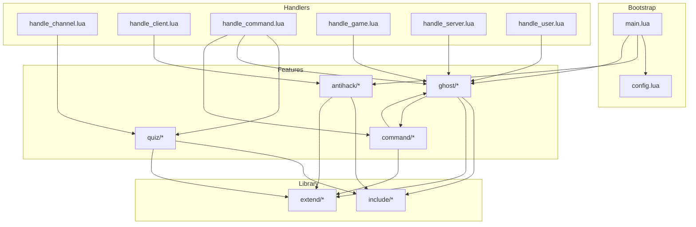
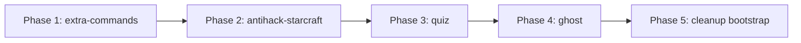

# 14 — Migration Plan: `scripts/lua/` → `plugins/`

## Summary

Refactor the legacy v1 Lua scripts in `scripts/lua/` into self-contained plugins under `plugins/`, following the plugin architecture established by `plugins/example-quiz/`. Core infrastructure files remain in `scripts/lua/` as the Lua runtime bootstrap layer.

## Current State Analysis

### File Inventory — `scripts/lua/` (42 files)

| Category | Files | Role |
|----------|-------|------|
| **Bootstrap** | `main.lua`, `config.lua` | Entry point + global config table |
| **Handlers** | `handle_channel.lua`, `handle_client.lua`, `handle_command.lua`, `handle_game.lua`, `handle_server.lua`, `handle_user.lua` | v1 global hook dispatch functions |
| **Feature: Quiz** | `quiz/quiz.lua`, `quiz/command.lua`, `quiz/helper.lua`, `quiz/records.lua`, `quiz/questions/*.txt` (3 files) | Channel quiz game |
| **Feature: Ghost** | `ghost/ghost.lua`, `ghost/command.lua`, `ghost/command_callback.lua`, `ghost/handle.lua`, `ghost/helper.lua`, `ghost/maplist.txt` | GHost++ bot integration |
| **Feature: Antihack** | `antihack/starcraft.lua` | SC:BW memory-scan anti-cheat |
| **Feature: Commands** | `command/ping.lua`, `command/redirect.lua`, `command/stats.lua`, `command/w3motd.lua` | Standalone slash commands |
| **Library: extend** | `extend/account.lua`, `extend/account_wrap.lua`, `extend/channel.lua`, `extend/eventlog.lua`, `extend/game.lua`, `extend/message.lua`, `extend/enum/*.lua` (6 files) | v1 API wrappers + enum constants |
| **Library: include** | `include/bitwise.lua`, `include/common.lua`, `include/convert.lua`, `include/file.lua`, `include/math.lua`, `include/string.lua`, `include/table.lua`, `include/timer.lua` | Utility library |
| **Build** | `CMakeLists.txt` | Install rules |

### Dependency Graph



**Key observations:**
- `command/ping.lua` and `command/stats.lua` delegate to Ghost functions — they are Ghost-specific commands
- `command/redirect.lua` and `command/w3motd.lua` are standalone
- All features depend on `include/*` and `extend/*` for utility functions
- Handlers act as a dispatch layer routing events to features
- The v1 API uses global functions (`api.*`, `config.*`) not the v2 `pvpgn.*` namespace

## Migration Design

### Classification: What Becomes a Plugin vs What Stays

#### → Become Plugins (4 new plugin directories)

| Plugin | Source | Rationale |
|--------|--------|-----------|
| `quiz` | `scripts/lua/quiz/*` | Self-contained feature; channel quiz game with questions, records, scoring |
| `ghost` | `scripts/lua/ghost/*` + `command/ping.lua` + `command/stats.lua` | Self-contained GHost++ integration; ping/stats commands are Ghost-specific |
| `antihack-starcraft` | `scripts/lua/antihack/starcraft.lua` | Self-contained SC:BW anti-cheat module |
| `extra-commands` | `command/redirect.lua` + `command/w3motd.lua` | Standalone utility commands not tied to any feature |

#### → Stay in `scripts/lua/` (core bootstrap)

| File | Reason |
|------|--------|
| `main.lua` | Lua VM entry point called by C++ engine; becomes thin v2 bootstrap |
| `config.lua` | Global config table populated from `bnetd.toml`; becomes v2 config bridge |
| `handle_*.lua` (6 files) | v1 global hook dispatch; becomes v2 event router that delegates to plugins |
| `extend/*` (8 files) | v1 API wrappers + enum constants; shared infrastructure used by all scripts |
| `include/*` (8 files) | Utility library; shared infrastructure used by all scripts |
| `CMakeLists.txt` | Build/install rules for the bootstrap layer |

> **Note:** Plan 04 Phase 4.2 already proposes reorganizing these into `boot/`, `handlers/`, `lib/` subdirectories. This migration plan is compatible with that — the bootstrap layer stays in `scripts/lua/` regardless of its internal reorganization.

### Target Directory Structure

```
plugins/
├── README.md                          # (existing, update with new plugins)
├── example-quiz/                      # (existing example — keep as-is)
│   ├── plugin.toml
│   ├── main.lua
│   └── native/
│       ├── CMakeLists.txt
│       └── main.c
│
├── quiz/                              # NEW — migrated from scripts/lua/quiz/
│   ├── plugin.toml
│   ├── main.lua                       # entry point, registers commands + events
│   ├── quiz.lua                       # core quiz logic
│   ├── command.lua                    # /quiz command handler
│   ├── helper.lua                     # utility functions
│   ├── records.lua                    # records persistence
│   └── questions/                     # data files
│       ├── dota.txt
│       ├── misc.txt
│       └── warcraft.txt
│
├── ghost/                             # NEW — migrated from scripts/lua/ghost/
│   ├── plugin.toml
│   ├── main.lua                       # entry point, registers commands + events
│   ├── ghost.lua                      # core ghost logic
│   ├── command.lua                    # user→ghost commands
│   ├── command_callback.lua           # ghost→pvpgn callbacks
│   ├── handle.lua                     # event handlers
│   ├── helper.lua                     # utility functions
│   ├── ping.lua                       # /ping command (from command/ping.lua)
│   ├── stats.lua                      # /stats command (from command/stats.lua)
│   └── resources/
│       └── maplist.txt                # data file
│
├── antihack-starcraft/                # NEW — migrated from scripts/lua/antihack/
│   ├── plugin.toml
│   ├── main.lua                       # entry point, registers timer + handler
│   └── starcraft.lua                  # anti-cheat logic
│
└── extra-commands/                    # NEW — migrated from scripts/lua/command/
    ├── plugin.toml
    ├── main.lua                       # entry point, registers commands
    ├── redirect.lua                   # /redirect command
    └── w3motd.lua                     # /w3motd command

scripts/lua/                           # REMAINS — core bootstrap layer
├── CMakeLists.txt                     # updated: no longer installs feature dirs
├── main.lua                           # updated: thin v2 bootstrap
├── config.lua                         # updated: bridge to pvpgn.config
├── handle_channel.lua                 # updated: delegates to plugin events
├── handle_client.lua                  # updated: delegates to plugin events
├── handle_command.lua                 # updated: delegates to plugin commands
├── handle_game.lua                    # updated: delegates to plugin events
├── handle_server.lua                  # updated: delegates to plugin events
├── handle_user.lua                    # updated: delegates to plugin events
├── extend/                            # unchanged — shared v1 API wrappers
│   ├── account.lua
│   ├── account_wrap.lua
│   ├── channel.lua
│   ├── eventlog.lua
│   ├── game.lua
│   ├── message.lua
│   └── enum/
│       ├── attr.lua
│       ├── eventlog.lua
│       ├── game.lua
│       ├── message.lua
│       ├── messagebox.lua
│       └── tag.lua
└── include/                           # unchanged — shared utility library
    ├── bitwise.lua
    ├── common.lua
    ├── convert.lua
    ├── file.lua
    ├── math.lua
    ├── string.lua
    ├── table.lua
    └── timer.lua
```

## Detailed File Mapping

### Plugin: `quiz`

| Source | Destination | Notes |
|--------|------------|-------|
| `scripts/lua/quiz/quiz.lua` | `plugins/quiz/quiz.lua` | Port `config.*` refs to `pvpgn.config` or plugin config |
| `scripts/lua/quiz/command.lua` | `plugins/quiz/command.lua` | Port `api.*` calls to `pvpgn.*` API |
| `scripts/lua/quiz/helper.lua` | `plugins/quiz/helper.lua` | Port `config.scriptdir` to plugin-relative path |
| `scripts/lua/quiz/records.lua` | `plugins/quiz/records.lua` | Port file I/O to `pvpgn.store` or `pvpgn.fs` |
| `scripts/lua/quiz/questions/dota.txt` | `plugins/quiz/questions/dota.txt` | Data file, no changes |
| `scripts/lua/quiz/questions/misc.txt` | `plugins/quiz/questions/misc.txt` | Data file, no changes |
| `scripts/lua/quiz/questions/warcraft.txt` | `plugins/quiz/questions/warcraft.txt` | Data file, no changes |
| *(new)* | `plugins/quiz/main.lua` | New entry point using `pvpgn.commands.register` and `pvpgn.events.on` |
| *(new)* | `plugins/quiz/plugin.toml` | New manifest |

**`plugins/quiz/plugin.toml`:**
```toml
[plugin]
id = "com.pvpgn.quiz"
name = "Quiz"
version = "1.0.0"
description = "Channel quiz game with leaderboard and competitive mode"
author = "HarpyWar, PvPGN Team"
license = "GPL-2.0"
entry_point = "main.lua"
api_version_req = ">=3.0.0"
provides = ["game.quiz"]
conflicts = ["com.pvpgn.example.quiz"]

[config]
quiz_filelist = "misc, dota, warcraft"
competitive_mode = true
max_questions = 100
question_delay = 5
hint_delay = 20
users_in_top = 15

[[dependencies]]
plugin_id = "com.pvpgn.core.chat"
version_req = ">=3.0.0"
optional = false
```

**Capabilities required:** `chat.send`, `commands.register`, `events.subscribe`, `store.read`, `store.write`, `fs.read`

---

### Plugin: `ghost`

| Source | Destination | Notes |
|--------|------------|-------|
| `scripts/lua/ghost/ghost.lua` | `plugins/ghost/ghost.lua` | Port `config.*` and `file_*` calls |
| `scripts/lua/ghost/command.lua` | `plugins/ghost/command.lua` | Port `api.*` to `pvpgn.*` |
| `scripts/lua/ghost/command_callback.lua` | `plugins/ghost/command_callback.lua` | Port `api.*` to `pvpgn.*` |
| `scripts/lua/ghost/handle.lua` | `plugins/ghost/handle.lua` | Port to `pvpgn.events.on` |
| `scripts/lua/ghost/helper.lua` | `plugins/ghost/helper.lua` | Port `table.save`/`table.load` to `pvpgn.store` |
| `scripts/lua/ghost/maplist.txt` | `plugins/ghost/resources/maplist.txt` | Data file, no changes |
| `scripts/lua/command/ping.lua` | `plugins/ghost/ping.lua` | Ghost-specific; delegates to `gh_command_ping` |
| `scripts/lua/command/stats.lua` | `plugins/ghost/stats.lua` | Ghost-specific; delegates to `gh_command_stats` |
| *(new)* | `plugins/ghost/main.lua` | New entry point |
| *(new)* | `plugins/ghost/plugin.toml` | New manifest |

**`plugins/ghost/plugin.toml`:**
```toml
[plugin]
id = "com.pvpgn.ghost"
name = "GHost++ Integration"
version = "1.0.0"
description = "GHost++ bot integration for Warcraft III game hosting"
author = "HarpyWar, PvPGN Team"
license = "GPL-2.0"
entry_point = "main.lua"
api_version_req = ">=3.0.0"
provides = ["integration.ghost"]
conflicts = []

[config]
bots = ["hostbot1", "hostbot2"]
dota_server = true
ping_expire = 90

[[dependencies]]
plugin_id = "com.pvpgn.core.chat"
version_req = ">=3.0.0"
optional = false
```

**Capabilities required:** `chat.send`, `commands.register`, `events.subscribe`, `db.read`, `store.read`, `store.write`, `fs.read`, `fs.write`

---

### Plugin: `antihack-starcraft`

| Source | Destination | Notes |
|--------|------------|-------|
| `scripts/lua/antihack/starcraft.lua` | `plugins/antihack-starcraft/starcraft.lua` | Port `timer_add` to plugin timer API, port `api.*` to `pvpgn.*` |
| *(new)* | `plugins/antihack-starcraft/main.lua` | New entry point |
| *(new)* | `plugins/antihack-starcraft/plugin.toml` | New manifest |

**`plugins/antihack-starcraft/plugin.toml`:**
```toml
[plugin]
id = "com.pvpgn.antihack.starcraft"
name = "Starcraft Anti-Hack"
version = "1.0.0"
description = "Memory-scan based anti-maphack for Starcraft: Brood War"
author = "HarpyWar, PvPGN Team"
license = "GPL-2.0"
entry_point = "main.lua"
api_version_req = ">=3.0.0"
provides = ["antihack.starcraft"]
conflicts = []

[config]
check_interval = 60

[[dependencies]]
plugin_id = "com.pvpgn.core.chat"
version_req = ">=3.0.0"
optional = false
```

**Capabilities required:** `chat.send`, `events.subscribe`, `moderation.ban`, `moderation.kick`, `db.read`

---

### Plugin: `extra-commands`

| Source | Destination | Notes |
|--------|------------|-------|
| `scripts/lua/command/redirect.lua` | `plugins/extra-commands/redirect.lua` | Port `api.*` to `pvpgn.*` |
| `scripts/lua/command/w3motd.lua` | `plugins/extra-commands/w3motd.lua` | Port `file_load` to `pvpgn.fs`, port `api.*` to `pvpgn.*` |
| *(new)* | `plugins/extra-commands/main.lua` | New entry point |
| *(new)* | `plugins/extra-commands/plugin.toml` | New manifest |

**`plugins/extra-commands/plugin.toml`:**
```toml
[plugin]
id = "com.pvpgn.extra-commands"
name = "Extra Commands"
version = "1.0.0"
description = "Additional utility commands: /redirect, /w3motd"
author = "HarpyWar, PvPGN Team"
license = "GPL-2.0"
entry_point = "main.lua"
api_version_req = ">=3.0.0"
provides = ["commands.redirect", "commands.w3motd"]
conflicts = []

[[dependencies]]
plugin_id = "com.pvpgn.core.chat"
version_req = ">=3.0.0"
optional = false
```

**Capabilities required:** `chat.send`, `commands.register`, `db.read`, `fs.read`

---

### Files Staying in `scripts/lua/`

| File | Reason |
|------|--------|
| `main.lua` | C++ engine entry point; calls `main()` on Lua VM boot |
| `config.lua` | Global config table populated from `bnetd.conf`/`bnetd.toml` |
| `handle_channel.lua` | v1 hook: `handle_channel_message()`, `handle_channel_userjoin()`, `handle_channel_userleft()` |
| `handle_client.lua` | v1 hook: `handle_client_readmemory()`, `handle_client_extrawork()` |
| `handle_command.lua` | v1 hook: `handle_command()`, `handle_command_before()`, `split_command()` |
| `handle_game.lua` | v1 hook: `handle_game_create()`, `handle_game_userjoin()`, etc. |
| `handle_server.lua` | v1 hook: `handle_server_mainloop()`, `handle_server_rehash()` |
| `handle_user.lua` | v1 hook: `handle_user_login()`, `handle_user_disconnect()`, etc. |
| `extend/*` (8 files) | Shared v1 API wrappers: logging, channel helpers, account helpers, enums |
| `include/*` (8 files) | Shared utility library: file I/O, string ops, timer, table serialization |
| `CMakeLists.txt` | Install rules for the bootstrap layer |

**Total: 26 files stay, 16 files migrate (+ 8 new files created = 24 files in plugins)**

## Required Code Changes

### Phase 1: Create Plugin Skeletons

For each new plugin, create:
1. Directory under `plugins/`
2. `plugin.toml` manifest (as specified above)
3. `main.lua` entry point that uses `pvpgn.*` v2 API

### Phase 2: Port Feature Code

Each migrated `.lua` file needs these transformations:

#### API Migration Table

| v1 Pattern | v2 Replacement |
|-----------|----------------|
| `api.message_send_text(name, type, src, text)` | `pvpgn.chat.send_whisper(from, to, text)` or `pvpgn.chat.send_channel(ch, text)` |
| `api.account_get_by_name(name)` | `pvpgn.account.find_by_name(name)` |
| `api.describe_command(name, cmd)` | `pvpgn.commands.describe(cmd)` |
| `api.channel_get_by_id(id)` | `pvpgn.channel.get(id)` |
| `api.server_get_games()` | `pvpgn.server.games()` |
| `api.server_get_users()` | `pvpgn.server.users()` |
| `api.server_get_channels()` | `pvpgn.server.channels()` |
| `api.client_readmemory(name, id, off, len)` | `pvpgn.client.read_memory(name, id, off, len)` |
| `api.client_kill(name)` | `pvpgn.moderation.kick_connection(session_id)` |
| `api.game_get_by_name(name, tag, type)` | `pvpgn.game.find_by_name(name, tag)` |
| `api.eventlog(level, src, text)` | `pvpgn.log(level_str, text)` |
| `api.localize(user, fmt, ...)` | `pvpgn.i18n.localize(user, fmt, ...)` |
| `config.xyz` | `pvpgn.config.get("xyz")` or plugin-local config from `plugin.toml` |
| `timer_add(id, interval, cb)` | `pvpgn.timer.add(id, interval, cb)` *(if available)* |
| `file_load(path, cb1, cb2)` | `pvpgn.fs.read(path)` or inline Lua `io.open` within sandbox |
| `file_exists(path)` | `pvpgn.fs.exists(path)` |

#### `require()` Path Changes

Plugins run in an isolated sandbox where `require()` is restricted to the plugin directory. Current v1 scripts use implicit global loading (all `.lua` files are preloaded by the C++ engine). The migration must:

1. **Replace implicit globals with explicit `require()`** — each plugin file that depends on another must use `local helper = require("helper")` (relative to plugin root)
2. **Return module tables** — each `.lua` file must end with `return M` where `M` is the module table
3. **No cross-plugin `require()`** — plugins cannot require files from `scripts/lua/include/` or `scripts/lua/extend/`. Any needed utility functions must be:
   - Copied into the plugin (for small helpers)
   - Provided by the `pvpgn.*` v2 API (preferred)
   - Provided by a shared `core-lib` plugin with `provides = ["lib.core"]` (if many plugins need the same utilities)

### Phase 3: Update Bootstrap Layer

The `scripts/lua/` handler files must be updated to remove direct feature calls:

**`handle_command.lua`** — Remove quiz/ghost/command entries from `lua_command_table`:
```lua
-- BEFORE: direct function references
["/quiz"] = command_quiz,
["/ghost"] = command_ghost,
["/host"] = command_host,
-- ...

-- AFTER: empty table (commands registered by plugins via pvpgn.commands.register)
local lua_command_table = {}
```

**`handle_channel.lua`** — Remove quiz dispatch:
```lua
-- BEFORE
function handle_channel_message(channel, account, text, message_type)
    if config.quiz and channel.name == config.quiz_channel then
        quiz_handle_message(account.name, text)
    end
end

-- AFTER
function handle_channel_message(channel, account, text, message_type)
    -- Plugins handle channel messages via pvpgn.events.on("channel_message_sent")
end
```

**`handle_game.lua`** — Remove ghost dispatch:
```lua
-- BEFORE
function handle_game_userjoin(game, account)
    if config.ghost then gh_handle_game_userjoin(game, account) end
end

-- AFTER
function handle_game_userjoin(game, account)
    -- Plugins handle via pvpgn.events.on("game_user_joined")
end
```

**`handle_user.lua`** — Remove ghost dispatch:
```lua
-- BEFORE
function handle_user_login(account)
    if config.ghost then gh_handle_user_login(account) end
end

-- AFTER
function handle_user_login(account)
    -- Plugins handle via pvpgn.events.on("user_logged_in")
end
```

**`handle_client.lua`** — Remove antihack dispatch:
```lua
-- BEFORE
function handle_client_readmemory(account, request_id, data)
    if config.ah then ah_handle_client(account, request_id, data) end
end

-- AFTER
function handle_client_readmemory(account, request_id, data)
    -- Plugins handle via pvpgn.events.on("client_readmemory")
end
```

**`handle_server.lua`** — Remove ghost unload:
```lua
-- BEFORE
function handle_server_rehash()
    if config.ghost then gh_unload() end
end

-- AFTER
function handle_server_rehash()
    -- Plugin lifecycle managed by plugin loader (shutdown() called automatically)
end
```

**`main.lua`** — Remove feature initialization:
```lua
-- BEFORE
function main()
    if config.ah then ah_init() end
    if config.ghost then gh_load() end
end

-- AFTER
function main()
    -- Plugins are loaded by the plugin loader, not by main.lua
    -- This file becomes a no-op or thin v2 bootstrap
end
```

**`config.lua`** — Remove feature-specific config:
```lua
-- BEFORE: quiz, ah, ghost settings in global config table
-- AFTER: Only core settings remain; feature config moves to each plugin.toml [config] section
```

### Phase 4: CMake Changes

**`scripts/lua/CMakeLists.txt`** — Update to exclude migrated directories:

```cmake
# Install core bootstrap files only (features moved to plugins/)
file(GLOB LUA_CORE_FILES "${PROJECT_SOURCE_DIR}/scripts/lua/*.lua")
list(FILTER LUA_CORE_FILES EXCLUDE REGEX "CMakeLists\\.txt$")

INSTALL(FILES ${LUA_CORE_FILES} DESTINATION ${LOCALSTATEDIR}/lua)
INSTALL(DIRECTORY
    "${PROJECT_SOURCE_DIR}/scripts/lua/extend"
    "${PROJECT_SOURCE_DIR}/scripts/lua/include"
    DESTINATION ${LOCALSTATEDIR}/lua
)

# Feature directories (quiz/, ghost/, antihack/, command/) are NO LONGER installed
# They have been migrated to plugins/
```

**New: `plugins/CMakeLists.txt`** (or update top-level CMake):

```cmake
# Install plugin directories
set(PLUGIN_DIRS
    example-quiz
    quiz
    ghost
    antihack-starcraft
    extra-commands
)

foreach(PLUGIN ${PLUGIN_DIRS})
    install(DIRECTORY "${PROJECT_SOURCE_DIR}/plugins/${PLUGIN}/"
        DESTINATION ${LOCALSTATEDIR}/plugins/${PLUGIN}
        PATTERN "native" EXCLUDE
    )
endforeach()
```

## Migration Order

The plugins should be migrated in this order based on complexity and dependency:



1. **`extra-commands`** — Simplest; 2 standalone commands, no state, no timers
2. **`antihack-starcraft`** — Single file, uses timer + client memory API
3. **`quiz`** — Medium complexity; file I/O, records, timers, channel messaging
4. **`ghost`** — Most complex; state management, bot communication, multiple commands, cross-references with ping/stats
5. **Cleanup bootstrap** — Strip migrated code from `handle_*.lua`, `main.lua`, `config.lua`

## Risks and Mitigations

| Risk | Mitigation |
|------|-----------|
| v2 Lua API may not cover all v1 hooks (e.g., `client_readmemory`, `timer_add`) | Audit `pvpgn.*` API coverage before migration; add missing bindings as needed |
| Plugin sandbox blocks `io.open` used by quiz records and ghost state | Use `pvpgn.store` for persistence or grant `fs.read`/`fs.write` capabilities |
| `include/` utilities not available inside plugin sandbox | Copy essential helpers into plugins or expose via `pvpgn.*` API |
| Ghost plugin needs `split_command()` from `handle_command.lua` | Copy `split_command()` into ghost plugin as a local utility |
| Operators have customized `scripts/lua/` files | Document migration path; install does not overwrite existing files |
| `example-quiz` plugin conflicts with migrated `quiz` plugin | Mark `conflicts = ["com.pvpgn.example.quiz"]` in quiz `plugin.toml` |

## Acceptance Criteria

- [ ] Each new plugin loads successfully via the plugin loader
- [ ] Each new plugin has a valid `plugin.toml` manifest
- [ ] Each new plugin uses `pvpgn.*` v2 API (no `api.*` v1 calls)
- [ ] `scripts/lua/handle_*.lua` files no longer reference feature-specific functions
- [ ] `scripts/lua/main.lua` no longer calls `ah_init()` or `gh_load()`
- [ ] `scripts/lua/config.lua` no longer contains quiz/ghost/antihack settings
- [ ] `scripts/lua/CMakeLists.txt` no longer installs `quiz/`, `ghost/`, `antihack/`, `command/`
- [ ] `plugins/README.md` updated to list all new plugins
- [ ] No `require()` crosses the `plugins/` ↔ `scripts/lua/` boundary
- [ ] All `.lua` files pass `luacheck --std=lua54 --no-self`

## Out of Scope

- Rewriting `extend/` or `include/` as a shared plugin (future work)
- Porting the bootstrap layer itself to v2 API (covered by Plan 04 Phase 4.2)
- Adding new v2 API bindings (tracked separately per missing hook)
- Removing `plugins/example-quiz/` (kept as a reference/template)
