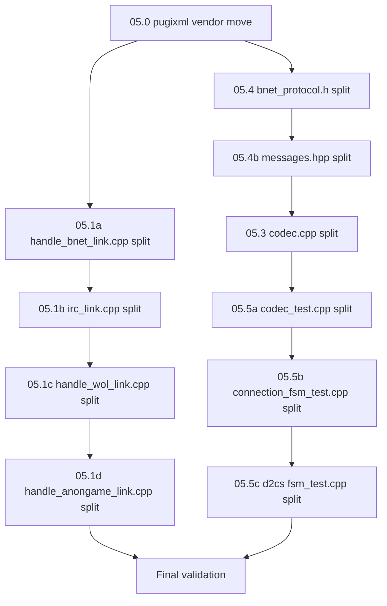

# 15 — Large File Decomposition: Detailed Implementation Plan

> Implements [plan 05](05-large-file-decomposition.md). Every file in `src/` and `tests/` must
> be ≤ 1 500 LOC after this plan completes (hard cap from plan 01).
> Vendored code under `vendor/` is exempt.

---

## Table of Contents

1. [Inventory & Current LOC](#1-inventory--current-loc)
2. [Decomposition 05.0 — pugixml vendor move](#2-decomposition-050--pugixml-vendor-move)
3. [Decomposition 05.1a — handle\_bnet\_link.cpp](#3-decomposition-051a--handle_bnet_linkcpp)
4. [Decomposition 05.1b — irc\_link.cpp](#4-decomposition-051b--irc_linkcpp)
5. [Decomposition 05.1c — handle\_wol\_link.cpp](#5-decomposition-051c--handle_wol_linkcpp)
6. [Decomposition 05.1d — handle\_anongame\_link.cpp](#6-decomposition-051d--handle_anongame_linkcpp)
7. [Decomposition 05.1e — handle\_apireg\_link.cpp](#7-decomposition-051e--handle_apireg_linkcpp)
8. [Decomposition 05.3 — codec.cpp](#8-decomposition-053--codeccpp)
9. [Decomposition 05.4 — bnet\_protocol.h](#9-decomposition-054--bnet_protocolh)
10. [Decomposition 05.4b — messages.hpp](#10-decomposition-054b--messageshpp)
11. [Decomposition 05.5a — codec\_test.cpp](#11-decomposition-055a--codec_testcpp)
12. [Decomposition 05.5b — connection\_fsm\_test.cpp](#12-decomposition-055b--connection_fsm_testcpp)
13. [Decomposition 05.5c — d2cs fsm\_test.cpp](#13-decomposition-055c--d2cs-fsm_testcpp)
14. [Decomposition 05.6 — protocol/bnet/fsm.cpp](#14-decomposition-056--protocolbnetfsmcpp)
15. [Decomposition 05.7 — application/connection/connection\_fsm.cpp](#15-decomposition-057--applicationconnectionconnection_fsmcpp)
16. [Decomposition 05.8 — protocol/d2cs/fsm.cpp](#16-decomposition-058--protocold2csfsmcpp)
17. [Decomposition 05.9 — protocol/bnet/anongame.cpp](#17-decomposition-059--protocolbnetanongamecpp)
18. [Decomposition 05.10 — tools/bntrackd/bntrackd.cpp](#18-decomposition-0510--toolsbntrackdbntrackdcpp)
19. [Decomposition 05.11 — infra/config/server\_config.cpp](#19-decomposition-0511--infraconfigserver_configcpp)
20. [CMake Changes Summary](#20-cmake-changes-summary)
21. [Execution Order & Dependencies](#21-execution-order--dependencies)
22. [Acceptance Criteria](#22-acceptance-criteria)

---

## 1. Inventory & Current LOC

| LOC   | File | Target |
|-------|------|--------|
| 8 771 | `src/common/pugixml.cpp` | Move to `vendor/` — exempt |
| 6 947 | `src/integration/legacy_bnetd/src/handle_bnet_link.cpp` | Split → 10 files |
| 4 319 | `src/protocol/bnet/src/codec.cpp` | Split → 10 files |
| 4 101 | `src/common/bnet_protocol.h` | Split → 10 headers |
| 2 776 | `tests/unit/protocol/bnet/codec_test.cpp` | Split → 10 test files |
| 2 526 | `src/integration/legacy_bnetd/src/irc_link.cpp` | Split → 5 files |
| 1 922 | `src/protocol/bnet/include/protocol/bnet/messages.hpp` | Split → 9 headers |
| 1 894 | `src/integration/legacy_bnetd/src/handle_wol_link.cpp` | Split → 4 files |
| 1 570 | `tests/unit/domain/connection/connection_fsm_test.cpp` | Split → 4 test files |
| 1 165 | `tests/unit/protocol/d2cs/fsm_test.cpp` | Split → 3 test files |
| 1 140 | `src/integration/legacy_bnetd/src/handle_anongame_link.cpp` | Split → 2 files |
| 1 013 | `src/application/connection/src/connection_fsm.cpp` | Split → 3 files |
| 936  | `src/integration/legacy_bnetd/src/handle_apireg_link.cpp` | OK as-is (< 1 500) |
| 915  | `src/protocol/bnet/src/fsm.cpp` | OK as-is (< 1 500) |
| 841  | `src/protocol/d2cs/src/fsm.cpp` | OK as-is (< 1 500) |
| 771  | `src/tools/bntrackd/bntrackd.cpp` | OK as-is (< 1 500) |
| 647  | `src/protocol/bnet/src/anongame.cpp` | OK as-is (< 1 500) |
| 540  | `src/infra/config/src/server_config.cpp` | OK as-is (< 1 500) |

> **Note:** Files already under 1 500 LOC are listed for completeness but require
> no action under the hard cap. Plan 05 mentions some of these with a soft-cap
> target; those are deferred to a follow-up PR if desired.

---

## 2. Decomposition 05.0 — pugixml vendor move

**Current:** `src/common/pugixml.cpp` (8 771 LOC), `src/common/pugixml.h`, `src/common/pugiconfig.h`

**Action:** Move all three files to `vendor/pugixml/` unchanged. This is a pure file-move; the vendored v1.4 code is not modified. The v3 tree already uses FetchContent for pugixml v1.14 via `src/CMakeLists.txt`; only the legacy `bnetd_legacy` target references the in-tree copy.

**New layout:**

```
vendor/pugixml/
  pugixml.cpp      # 8 771 LOC — exempt from cap
  pugixml.h
  pugiconfig.h
```

**CMake:** Update `src/common/CMakeLists.txt` (or wherever `bnetd_legacy` picks up pugixml sources) to reference `${CMAKE_SOURCE_DIR}/vendor/pugixml/` instead of `src/common/`.

**Shared header:** `src/infra/xml/` already wraps pugixml as a thin C++20 interface (`xml_document.hpp`). No new wrapper needed.

---

## 3. Decomposition 05.1a — handle\_bnet\_link.cpp

**Current:** 6 947 LOC — the single largest code file.

**Structure discovered:**
- Lines 1–729: ~50 `extern "C"` strangler-fig bridge declarations + includes
- Line 730: `handle_bnet_packet()` — main entry dispatching via `bnet_htable_con` / `bnet_htable_log` handler tables
- Line 779: `handle()` — table lookup dispatcher
- Lines 797–6 944: ~80 individual `static int _client_*()` handler functions

**Split strategy:** Extract handler functions into per-family files under a new subdirectory. The dispatcher file retains only the handler tables and dispatch logic.

### New file layout

```
src/integration/legacy_bnetd/src/
  handle_bnet_link.cpp              # dispatcher only (~250 LOC)
  handle_bnet/
    handle_bnet_internal.h          # shared forward decls, common includes (~80 LOC)
    handshake.cpp                   # ~500 LOC
    auth.cpp                        # ~1 200 LOC
    chat.cpp                        # ~400 LOC
    game.cpp                        # ~900 LOC
    friends.cpp                     # ~700 LOC
    clan.cpp                        # ~900 LOC
    ladder.cpp                      # ~400 LOC
    realm.cpp                       # ~500 LOC
    file.cpp                        # ~300 LOC
    misc.cpp                        # ~700 LOC
```

### Function-to-file mapping

**`handle_bnet/handle_bnet_internal.h`** — shared header:
- Forward-declare all `extern "C"` bridge functions used by handlers
- Common includes: `common/packet.h`, `common/eventlog.h`, `bnetd/connection.h`, etc.
- Namespace open/close macros or inline namespace block

**`handle_bnet/handshake.cpp`** (~500 LOC):
- `_client_unknown_1b` (lines 797–821)
- `_client_compinfo1` (lines 823–870)
- `_client_compinfo2` (lines 872–924)
- `_client_countryinfo1` (lines 926–965)
- `_client_auth_info` (lines 967–1110)
- `_client_unknown2b` (lines 1112–1120)
- `_client_progident` (lines 1122–1181)

**`handle_bnet/auth.cpp`** (~1 200 LOC):
- `_client_createaccountw3` (lines 1183–1314)
- `_client_createacctreq1` (lines 1316–1371)
- `_client_createacctreq2` (lines 1373–1435)
- `_client_changepassreq` (lines 1437–1546)
- `_client_echoreply` (lines 1548–1569)
- `_client_authreq1` (lines 1571–1728)
- `_client_authreq109` (lines 1730–1873)
- `_client_regsnoopreply` (lines 1875–1883)
- `_client_iconreq` (lines 1885–1936)
- `_client_cdkey` (lines 1938–1989)
- `_client_cdkey2` (lines 1991–2025)
- `_client_cdkey3` (lines 2027–2061)
- `_client_loginreq1` (lines 2244–2390)
- `client_init_email` (lines 2392–2408)
- `_client_loginreq2` (lines 2410–2593)
- `_client_loginreqw3` (lines 2595–2730)
- `_client_passchangereq` (lines 2732–2854)
- `_client_passchangeproofreq` (lines 2856–2946)
- `_client_pingreq` (lines 2948–2967)
- `_client_logonproofreq` (lines 2969–3110)

> **Note:** auth.cpp at ~1 200 LOC is under the 1 500 cap. If it grows, split further into `auth_ols.cpp` (OLS login path) and `auth_nls.cpp` (NLS/W3 login path).

**`handle_bnet/chat.cpp`** (~400 LOC):
- `_client_joinchannel` (lines 4810–4891)
- `_client_message` (lines 4893–4942)
- `_client_leavechannel` (lines 5682–5690)
- `_client_changegameport` (lines 3112–3130)

**`handle_bnet/game.cpp`** (~900 LOC):
- `_glist_cb` (lines 4944–5025)
- `_client_gamelistreq` (lines 5027–5163)
- `_client_joingame` (lines 5165–5230)
- `_client_startgame1` (lines 5232–5325)
- `_client_startgame3` (lines 5327–5418)
- `_client_startgame4` (lines 5420–5560)
- `_client_closegame` (lines 5562–5573)
- `_client_gamereport` (lines 5575–5680)

**`handle_bnet/friends.cpp`** (~700 LOC):
- `_client_friendslistreq` (lines 3132–3279)
- `_client_friendinforeq` (lines 3281–3406)
- `_client_atfriendscreen` (lines 3408–3589)
- `_client_atinvitefriend` (lines 3591–3756)
- `_client_atacceptdeclineinvite` (lines 3758–3808)
- `_client_atacceptinvite` (lines 3810–3820)

**`handle_bnet/clan.cpp`** (~900 LOC):
- `_client_claninforeq` (lines 4019–4094)
- `_client_clanmemberlistreq` (lines 6134–6144)
- `_client_clan_motdreq` (lines 6146–6156)
- `_client_clan_motdchg` (lines 6158–6168)
- `_client_clan_disbandreq` (lines 6170–6222)
- `_client_clan_createreq` (lines 6224–6235)
- `_client_clan_createinvitereq` (lines 6237–6330)
- `_client_clan_createinvitereply` (lines 6332–6417)
- `_client_clanmember_rankupdatereq` (lines 6419–6497)
- `_client_clanmember_removereq` (lines 6499–6558)
- `_client_clan_membernewchiefreq` (lines 6560–6602)
- `_client_clan_invitereq` (lines 6604–6692)
- `_client_clan_invitereply` (lines 6694–6793)

**`handle_bnet/ladder.cpp`** (~400 LOC):
- `_client_ladderreq` (lines 5692–5867)
- `_client_laddersearchreq` (lines 5869–5966)
- `_client_mapauthreq1` (lines 5968–6037)
- `_client_mapauthreq2` (lines 6039–6108)

**`handle_bnet/realm.cpp`** (~500 LOC):
- `_client_realmlistreq` (lines 3967–3993)
- `_client_realmlistreq110` (lines 3995–4017)
- `_client_realmjoinreq109` (lines 4159–4336)
- `_client_charlistreq` (lines 4338–4438)
- `_client_unknown39` (lines 4440–4448)

**`handle_bnet/file.cpp`** (~300 LOC):
- `_client_udpok` (lines 2063–2074)
- `_client_fileinforeq` (lines 2076–2129)
- `_client_statsreq` (lines 2149–2242)
- `_client_readmemory` (lines 4593–4619)

**`handle_bnet/misc.cpp`** (~700 LOC):
- `_client_adreq` (lines 4450–4512)
- `_client_adack` (lines 4514–4531)
- `_client_adclick` (lines 4533–4544)
- `_client_adclick2` (lines 4546–4591)
- `_client_statsupdate` (lines 4621–4680)
- `_client_playerinforeq` (lines 4682–4744)
- `_client_progident2` (lines 4746–4808)
- `_client_profilereq` (lines 4096–4156)
- `_news_cb` + `_client_motdw3` (lines 3822–3965)
- `_client_crashdump` (lines 6795–6799)
- `_client_setemailreply` (lines 6801–6826)
- `_client_changeemailreq` (lines 6828–6872)
- `_client_getpasswordreq` (lines 6874–6909)
- `_client_extrawork` (lines 6913–6942)
- `_client_changeclient` (lines 6110–6132)

**`handle_bnet_link.cpp`** (dispatcher, ~250 LOC):
- All `extern "C"` bridge declarations (moved to `handle_bnet_internal.h`)
- `handle_bnet_packet()` — main entry
- `handle()` — table lookup
- `bnet_htable_con[]` and `bnet_htable_log[]` handler table arrays
- Each table entry references functions from the split files (no longer `static`)

### Visibility change

All `_client_*` functions change from `static` to namespace-scoped (non-static) with declarations in `handle_bnet_internal.h`. The dispatcher includes the internal header and populates the handler tables.

---

## 4. Decomposition 05.1b — irc\_link.cpp

**Current:** 2 526 LOC

**Structure discovered:**
- Lines 94–528: Types, send utilities, element parsing
- Lines 530–1004: Message formatting (`irc_message_preformat`, `irc_message_postformat`, `irc_message_format`)
- Lines 1006–1352: Channel/user operations (`irc_send_rpl_namreply`, `irc_who`, `irc_send_motd`, `irc_welcome`)
- Lines 1354–1757: Shared command handlers (`_handle_nick_command`, `_handle_ping_command`, `_handle_join_command`, `_handle_topic_command`, `_handle_kick_command`, `_handle_mode_command`, `_handle_time_command`)
- Lines 1764–2521: IRC-specific handlers + dispatch (`_handle_user_command`, `_handle_privmsg_command`, `_handle_list_command`, `irc_dispatch_con_command`, `irc_common_line`, `handle_irc_common_packet`)

### New file layout

```
src/integration/legacy_bnetd/src/
  irc_link.cpp                      # dispatch + packet entry (~300 LOC)
  irc/
    irc_internal.h                  # shared forward decls (~60 LOC)
    irc_send.cpp                    # send utilities (~450 LOC)
    irc_format.cpp                  # message formatting (~500 LOC)
    irc_channel.cpp                 # channel/user ops (~350 LOC)
    irc_commands.cpp                # shared command handlers (~400 LOC)
    irc_handlers.cpp                # IRC-specific handlers (~500 LOC)
```

### Function-to-file mapping

**`irc/irc_send.cpp`** (~450 LOC):
- `irc_send_cmd` (lines 105–147)
- `irc_send` (lines 149–163)
- `irc_send_ping` (lines 165–205)
- `irc_send_pong` (lines 207–242)
- `irc_authenticate` (lines 244–299)
- Element split/unget helpers (lines 300–538)

**`irc/irc_format.cpp`** (~500 LOC):
- `irc_message_preformat` (around line 540)
- `irc_message_postformat` (lines 581–671)
- `irc_message_format` (lines 673–1004)

**`irc/irc_channel.cpp`** (~350 LOC):
- `irc_send_rpl_namreply_internal` (lines 1006–1101)
- `irc_send_rpl_namreply` (lines 1103–1132)
- `irc_who_connection` (lines 1134–1187)
- `irc_who` (lines 1189–1233)
- `irc_send_motd` (lines 1235–1285)
- `irc_welcome` (lines 1287–1352)

**`irc/irc_commands.cpp`** (~400 LOC):
- `_handle_nick_command` (lines 1354–1386)
- `_handle_ping_command` (lines 1388–1397)
- `_handle_pong_command` (lines 1399–1434)
- `_handle_join_command` (lines 1436–1487)
- `irc_send_topic` (lines 1489–1507)
- `_handle_topic_command` (lines 1509–1557)
- `_handle_kick_command` (lines 1559–1591)
- `irc_send_banlist` (lines 1593–1614)
- `_handle_mode_command` (lines 1616–1729)
- `_handle_time_command` (lines 1731–1757)

**`irc/irc_handlers.cpp`** (~500 LOC):
- `_handle_user_command` (lines 1764–1788)
- `_handle_pass_command` (lines 1790–1806)
- `_handle_privmsg_command` (lines 1808–1932)
- `_handle_notice_command` (lines 1934–1960)
- `_handle_quit_command` (lines 1962–1967)
- `_handle_who_command` (lines 1969–1986)
- `_handle_list_command` (lines 1988–2045)
- `_handle_names_command` (lines 2047–2074)
- `_handle_userhost_command` (lines 2076–2080)
- `_handle_ison_command` (lines 2082–2105)
- `_handle_whois_command` (lines 2107–2158)
- `_handle_part_command` (lines 2160–2164)

**`irc_link.cpp`** (dispatcher, ~300 LOC):
- Command table definitions (`irc_con_command_table`, `irc_log_command_table`)
- `irc_dispatch_con_command` (lines 2210–2220)
- `irc_dispatch_log_command` (lines 2222–2232)
- `irc_common_con_command` (lines 2234–2255)
- `irc_common_log_command` (lines 2257–2272)
- `irc_common_set_class` (lines 2274–2329)
- `irc_common_line` (lines 2341–2472)
- `handle_irc_common_packet` (lines 2474–2521)

---

## 5. Decomposition 05.1c — handle\_wol\_link.cpp

**Current:** 1 894 LOC

### New file layout

```
src/integration/legacy_bnetd/src/
  handle_wol_link.cpp               # dispatch + auth + welcome (~400 LOC)
  handle_wol/
    wol_internal.h                  # shared forward decls (~50 LOC)
    wol_user_commands.cpp           # user/pass/privmsg/list/quit/names (~500 LOC)
    wol_game_commands.cpp           # joingame/gameopt/startg/host (~500 LOC)
    wol_misc_commands.cpp           # cvers/verchk/apgar/serial/squad/buddy/ladder (~500 LOC)
```

### Function-to-file mapping

**`handle_wol/wol_user_commands.cpp`** (~500 LOC):
- `_handle_user_command` (lines 344–398)
- `_handle_pass_command` (lines 400–409)
- `_handle_privmsg_command` (lines 411–478)
- `append_game_info` (lines 485–582)
- `_handle_list_command` (lines 584–645)
- `_handle_quit_command` (lines 647–657)
- `_handle_names_command` (lines 659–686)
- `_handle_part_command` (lines 688–698)

**`handle_wol/wol_game_commands.cpp`** (~500 LOC):
- `_handle_joingame_command` (lines 938–1158)
- `_handle_gameopt_command` (lines 1160–1212)
- `_handle_startg_command` (lines 1294–1374)
- `_handle_host_command` (lines 1556–1576)
- `_handle_invmsg_command` (lines 1578–1613)
- `_handle_invdel_command` (lines 1615–1619)

**`handle_wol/wol_misc_commands.cpp`** (~500 LOC):
- `_handle_cvers_command` (lines 703–726)
- `_handle_verchk_command` (lines 728–758)
- `_handle_apgar_command` (lines 760–771)
- `_handle_serial_command` (lines 773–777)
- `_handle_squadinfo_command` (lines 779–798)
- `_handle_clanbyname_command` (lines 800–811)
- `_handle_setopt_command` (lines 813–840)
- `_handle_setcodepage_command` (lines 842–854)
- `_handle_getcodepage_command` (lines 856–880)
- `_handle_setlocale_command` (lines 882–895)
- `_handle_getlocale_command` (lines 897–919)
- `_handle_getinsider_command` (lines 921–936)
- `_handle_finduser_command` (lines 1214–1236)
- `_handle_finduserex_command` (lines 1238–1260)
- `_handle_page_command` (lines 1262–1292)
- `_handle_advertr_command` (lines 1376–1397)
- `_handle_advertc_command` (lines 1399–1403)
- `_handle_chanchk_command` (lines 1405–1437)
- `_handle_getbuddy_command` (lines 1439–1481)
- `_handle_addbuddy_command` (lines 1483–1518)
- `_handle_delbuddy_command` (lines 1520–1554)
- `_handle_userip_command` (lines 1621–1644)
- `_ladder_send` (lines 1649–1687)
- `_ladder_is_integer` (lines 1689–1700)
- `_handle_listsearch_command` (lines 1702–1761)
- `_handle_rungsearch_command` (lines 1763–1841)
- `_handle_highscore_command` (lines 1843–1889)

**`handle_wol_link.cpp`** (dispatcher, ~400 LOC):
- `wol_con_command_table[]`, `wol_log_command_table[]`
- `handle_wol_con_command` (lines 210–222)
- `handle_wol_log_command` (lines 224–236)
- `handle_wol_authenticate` (lines 238–297)
- `handle_wol_welcome` (lines 299–313)
- `handle_wol_send_claninfo` (lines 315–340)

---

## 6. Decomposition 05.1d — handle\_anongame\_link.cpp

**Current:** 1 140 LOC — just under the soft cap but plan 05 explicitly lists it.

### New file layout

```
src/integration/legacy_bnetd/src/
  handle_anongame_link.cpp          # dispatch + small handlers (~400 LOC)
  handle_anongame/
    anongame_profile.cpp            # profile + clan profile (~400 LOC)
    anongame_options.cpp            # infos + tournament + icons (~400 LOC)
```

### Function-to-file mapping

**`handle_anongame/anongame_profile.cpp`** (~400 LOC):
- `_client_anongame_profile_clan` (lines 84–161)
- `_client_anongame_profile` (lines 163–440)

**`handle_anongame/anongame_options.cpp`** (~400 LOC):
- `_client_anongame_get_icon` (lines 491–620)
- `_client_anongame_set_icon` (lines 623–683)
- `check_user_icon` (lines 688–752)
- `_client_anongame_infos` (lines 754–901)

**`handle_anongame_link.cpp`** (dispatcher, ~400 LOC):
- `_client_anongame_cancel` (lines 442–488)
- `_client_anongame_tournament` (lines 904–1084)
- `_tournament_time_convert` (lines 1086–1097)
- `handle_anongame_packet` (lines 1099–1135)

---

## 7. Decomposition 05.1e — handle\_apireg\_link.cpp

**Current:** 936 LOC — already under the 1 500 hard cap.

**Action:** No split required. Listed for completeness per plan 05.

---

## 8. Decomposition 05.3 — codec.cpp

**Current:** 4 319 LOC

**Structure discovered:**
- Lines 1–2 145: ~80 `decode_*()` functions in anonymous namespace
- Lines 2 146–2 586: `decode_client()` — giant switch (~440 lines)
- Lines 2 587–2 949: `decode_server()` — giant switch (~360 lines)
- Lines 2 950–4 319: ~80 `encode()` overloads

### New file layout

```
src/protocol/bnet/src/
  codec.cpp                         # dispatch switches only (~900 LOC)
  codec/
    codec_internal.h                # shared Reader/Writer macros, helpers (~80 LOC)
    codec_auth.cpp                  # auth family decode+encode (~400 LOC)
    codec_chat.cpp                  # chat family decode+encode (~250 LOC)
    codec_game.cpp                  # game family decode+encode (~400 LOC)
    codec_friends.cpp               # friends family decode+encode (~350 LOC)
    codec_clan.cpp                  # clan family decode+encode (~500 LOC)
    codec_ladder.cpp                # ladder + ads + misc decode+encode (~400 LOC)
    codec_realm.cpp                 # realm family decode+encode (~300 LOC)
    codec_legacy_ols.cpp            # OLS/legacy protocol decode+encode (~400 LOC)
    codec_w3.cpp                    # W3/NLS auth + warcraft general (~350 LOC)
```

### Function-to-file mapping

**`codec/codec_internal.h`** (~80 LOC):
- `RD_U32`, `RD_STR`, `RD_U64`, `RD_U16`, `RD_HASH5` macros
- `unimplemented()` helper
- `check_empty_body()` helper
- Forward declarations for all `decode_*` functions (needed by dispatch switches)

**`codec/codec_auth.cpp`** (~400 LOC):
- `decode_ping`, `decode_auth_info`, `decode_auth_info_reply`
- `decode_auth_check_reply`, `decode_auth_check_request`
- `decode_logon_response2`, `decode_logon_response2_reply`
- `decode_cdkey2_request`, `decode_cdkey2_reply`
- `decode_cdkey3_request`, `decode_cdkey3_reply`
- Matching `encode()` overloads for all above

**`codec/codec_chat.cpp`** (~250 LOC):
- `decode_join_channel`, `decode_enter_chat_req`, `decode_enter_chat_reply`
- `decode_chat_command`, `decode_chat_event`
- `decode_channel_list_request`, `decode_channel_list_reply`
- `decode_leave_channel`
- Matching `encode()` overloads

**`codec/codec_game.cpp`** (~400 LOC):
- `decode_game_list_req`, `decode_game_list_reply`
- `decode_startgame1_request`, `decode_startgame1_ack`
- `decode_startgame3_request`, `decode_startgame3_ack`
- `decode_startgame4_request`, `decode_startgame4_ack`
- `decode_join_game`, `decode_game_report`
- `decode_close_game`, `decode_close_game2`
- `decode_udp_ok`, `decode_netgameport`
- Matching `encode()` overloads

**`codec/codec_friends.cpp`** (~350 LOC):
- `decode_friendslist_request`, `decode_friendslist_reply`
- `decode_friendinfo_request`, `decode_friendinfo_reply`
- `decode_friendadd_ack`, `decode_frienddel_ack`, `decode_friendmove_ack`
- `decode_arrangedteam_friendscreen_request`, `decode_arrangedteam_friendscreen_reply`
- `decode_arrangedteam_invite_friend_request`, `decode_arrangedteam_invite_friend_ack`
- `decode_arrangedteam_member_decline`
- `decode_arrangedteam_send_invite`, `decode_arrangedteam_accept_decline_invite`
- `decode_arrangedteam_accept_invite`
- Matching `encode()` overloads

**`codec/codec_clan.cpp`** (~500 LOC):
- `decode_claninfo_request`, `decode_claninfo_reply`
- `decode_clan_create_request`, `decode_clan_create_reply`
- `decode_clan_disband_request`, `decode_clan_newchief_request`
- `decode_clan_invite_request`, `decode_clan_member_remove_request`
- `decode_clan_member_rank_update_request`, `decode_clan_generic_result_reply`
- `decode_clan_motd_change`, `decode_clan_motd_request`, `decode_clan_motd_reply`
- `decode_clan_create_invite_request`, `decode_clan_create_invite_summary`
- `decode_clan_create_invite_forward`, `decode_clan_create_invite_response`
- `decode_clan_invite2_forward`, `decode_clan_invite2_response`
- `decode_clan_memberlist_request`, `decode_clan_memberlist_reply`
- `decode_clan_member_removed_notify`, `decode_clan_member_update`
- `read_friend_list` helper
- Matching `encode()` overloads

**`codec/codec_ladder.cpp`** (~400 LOC):
- `decode_ladder_search_req`, `decode_ladder_search_reply`
- `decode_ladder_list_request`, `read_ladder_block`, `decode_ladder_list_reply`
- `decode_ad_request`, `decode_ad_reply`, `decode_ad_click`, `decode_ad_ack`
- `decode_ad_click2_request`, `decode_ad_click2_reply`
- `decode_motd_request`, `decode_motd_reply`
- `decode_regsnoop_request`, `decode_regsnoop_reply`
- `decode_profile_request`, `decode_profile_reply`
- `decode_setemail_request`, `decode_setemail_reply`
- `decode_icon_request`, `decode_icon_reply`
- `decode_get_password_request`, `decode_change_email_request`
- `decode_crash_dump`
- Matching `encode()` overloads

**`codec/codec_realm.cpp`** (~300 LOC):
- `decode_realm_list_reply`, `decode_realm_join_request`, `decode_realm_join_reply`
- `decode_char_list_request`, `decode_char_list_reply`
- `decode_server_list`, `decode_message_box`
- `decode_realm_list_legacy_request`, `decode_realm_list_legacy_reply`
- `decode_warcraft_general_request`, `decode_warcraft_general_reply`
- `decode_required_work`, `decode_extra_work`
- Matching `encode()` overloads

**`codec/codec_legacy_ols.cpp`** (~400 LOC):
- `decode_compinfo1_request`, `decode_compreply`
- `decode_progident`, `decode_authreq1_server`, `decode_authreq1`, `decode_authreply1`
- `decode_countryinfo1`, `decode_sessionkey1`, `decode_sessionkey2`
- `decode_compinfo2`, `decode_loginreq1`, `decode_loginreply1`
- `decode_createaccount1_request`, `decode_createaccount1_reply`
- `decode_unknown_2b`, `decode_cdkey_legacy_request`, `decode_cdkey_legacy_reply`
- `decode_changepassword_request`, `decode_changepassword_reply`
- `decode_unknown_39`, `decode_createaccount_request`, `decode_createaccount_reply`
- `decode_read_memory_request`, `decode_read_memory_reply`
- `decode_unknown_1b`, `decode_unknown_24`
- `decode_mapauthreq1`, `decode_mapauthreply1`, `decode_mapauthreq2`, `decode_mapauthreply2`
- `decode_changeclient`
- Matching `encode()` overloads

**`codec/codec_w3.cpp`** (~350 LOC):
- `decode_createaccount2_request`, `decode_createaccount2_reply`
- `decode_loginw3_request`, `decode_loginw3_reply`
- `decode_logonproof_w3_request`, `decode_logonproof_w3_reply`
- `decode_passchange_request`, `decode_passchange_reply`
- `decode_passchange_proof_request`, `decode_passchange_proof_reply`
- `decode_userdata_read_request`, `decode_userdata_read_reply`
- `decode_userdata_write_request`
- `read_strings` helper
- Matching `encode()` overloads

**`codec.cpp`** (dispatch only, ~900 LOC):
- `decode_client()` switch (~440 lines)
- `decode_server()` switch (~360 lines)
- Includes all `codec/*.cpp` internal headers
- Top-level `decode()` and `encode()` public API wrappers

### Visibility change

All `decode_*` functions move from anonymous namespace to named `detail` namespace (or file-scope in their respective `.cpp` files) with declarations in `codec_internal.h` so the dispatch switches in `codec.cpp` can call them.

---

## 9. Decomposition 05.4 — bnet\_protocol.h

**Current:** 4 101 LOC — mega-header with all `#define CLIENT_*` / `SERVER_*` packet IDs and packed POD structs.

### New file layout

```
src/common/
  bnet_protocol.h                   # deprecated forwarder — includes all sub-headers (~50 LOC)
  bnet_protocol/
    bnet_protocol_common.h          # shared macros: PACKED_ATTR, bn_int, bn_short, etc. (~100 LOC)
    bnet_protocol_w3route.h         # W3Route packet types + structs (~370 LOC)
    bnet_protocol_handshake.h       # COMPINFO1/2, PROGIDENT, COUNTRYINFO1 (~200 LOC)
    bnet_protocol_auth.h            # AUTH_INFO, AUTH_CHECK, LOGON*, LOGIN*, CREATEACCOUNT* (~500 LOC)
    bnet_protocol_chat.h            # JOINCHANNEL, CHATCOMMAND, CHATEVENT, ENTERCHAT (~300 LOC)
    bnet_protocol_game.h            # STARTGAME*, JOINGAME, GAMEREPORT, CLOSEGAME (~400 LOC)
    bnet_protocol_friends.h         # FRIENDS*, ARRANGEDTEAM* (~300 LOC)
    bnet_protocol_clan.h            # CLAN* (~400 LOC)
    bnet_protocol_ladder.h          # LADDER*, MAPAUTH* (~300 LOC)
    bnet_protocol_realm.h           # REALM*, CHARLIST, D2 packets (~300 LOC)
    bnet_protocol_misc.h            # AD*, MOTD, ICON, FILE, PROFILE, EMAIL, etc. (~400 LOC)
```

### Backward compatibility

`bnet_protocol.h` becomes a thin forwarder:

```c
#ifndef INCLUDED_BNET_PROTOCOL_H
#define INCLUDED_BNET_PROTOCOL_H
// Deprecated: include specific sub-headers instead.
#include "bnet_protocol/bnet_protocol_common.h"
#include "bnet_protocol/bnet_protocol_w3route.h"
#include "bnet_protocol/bnet_protocol_handshake.h"
#include "bnet_protocol/bnet_protocol_auth.h"
#include "bnet_protocol/bnet_protocol_chat.h"
#include "bnet_protocol/bnet_protocol_game.h"
#include "bnet_protocol/bnet_protocol_friends.h"
#include "bnet_protocol/bnet_protocol_clan.h"
#include "bnet_protocol/bnet_protocol_ladder.h"
#include "bnet_protocol/bnet_protocol_realm.h"
#include "bnet_protocol/bnet_protocol_misc.h"
#endif
```

No existing `#include "common/bnet_protocol.h"` breaks. Over time, callers migrate to specific sub-headers.

---

## 10. Decomposition 05.4b — messages.hpp

**Current:** 1 922 LOC — V3 message value types and SID constants.

### New file layout

```
src/protocol/bnet/include/protocol/bnet/
  messages.hpp                      # forwarder — includes all sub-headers (~50 LOC)
  messages/
    messages_common.hpp             # kSid* constants, Null, Ping (~100 LOC)
    messages_auth.hpp               # AuthInfo, AuthInfoReply, AuthCheckRequest/Reply, LogonResponse2 (~200 LOC)
    messages_chat.hpp               # JoinChannel, EnterChat*, ChatCommand, ChatEvent, ChannelList* (~200 LOC)
    messages_game.hpp               # GameList*, StartGame*, JoinGame, GameReport, CloseGame* (~250 LOC)
    messages_friends.hpp            # FriendsList*, FriendInfo*, FriendAdd/Del/Move, ArrangedTeam* (~250 LOC)
    messages_clan.hpp               # Clan*, ClanCreate*, ClanInvite*, ClanMember* (~300 LOC)
    messages_realm.hpp              # RealmList*, RealmJoin*, CharList*, ServerList, MessageBox (~200 LOC)
    messages_misc.hpp               # Ad*, Motd*, Profile*, Icon*, Email*, CrashDump, RegSnoop* (~200 LOC)
    messages_legacy.hpp             # CompInfo*, ProgIdent, AuthReq1, CountryInfo1, LoginReq1, etc. (~250 LOC)
    messages_variant.hpp            # ClientMessage, ServerMessage variant typedefs (~150 LOC)
```

### Backward compatibility

`messages.hpp` becomes a forwarder including all sub-headers. No existing `#include` breaks.

---

## 11. Decomposition 05.5a — codec\_test.cpp

**Current:** 2 776 LOC — 165 TEST\_CASEs

### New file layout

```
tests/unit/protocol/bnet/
  codec_test.cpp                    # common helpers + round_trip template (~50 LOC)
  codec/
    codec_auth_test.cpp             # SID_AUTH_*, SID_LOGON*, SID_CDKEY* tests (~400 LOC)
    codec_chat_test.cpp             # SID_CHAT*, SID_JOIN*, SID_ENTERCHAT tests (~300 LOC)
    codec_game_test.cpp             # SID_GETADVLISTEX, SID_STARTADV*, SID_NOTIFYJOIN tests (~400 LOC)
    codec_friends_test.cpp          # SID_FRIENDS*, SID_ARRANGEDTEAM* tests (~200 LOC)
    codec_clan_test.cpp             # SID_CLAN* tests (~200 LOC)
    codec_ladder_test.cpp           # SID_LADDER*, SID_AD*, SID_MOTD*, SID_PROFILE* tests (~400 LOC)
    codec_realm_test.cpp            # SID_REALM*, SID_CHARLIST, SID_WARCRAFTGENERAL tests (~300 LOC)
    codec_legacy_test.cpp           # SID_CLIENTID, SID_PROGIDENT, SID_AUTH(0x07), SID_COUNTRYINFO1 tests (~400 LOC)
    codec_w3_test.cpp               # SID_CREATEACCOUNT2, SID_LOGINREQ_W3, SID_LOGONPROOF, SID_PASSCHANGE tests (~300 LOC)
```

Tests are grouped to mirror the `codec/` source split. The shared `round_trip` template stays in a common header or the root `codec_test.cpp`.

---

## 12. Decomposition 05.5b — connection\_fsm\_test.cpp

**Current:** 1 570 LOC — 57 TEST\_CASEs

### New file layout

```
tests/unit/domain/connection/
  connection_fsm_test_common.h      # FakeContext, helper builders (~310 LOC)
  connection_fsm_auth_test.cpp      # auth flow tests: AUTH_INFO, LOGON, NLS, OLS (~400 LOC)
  connection_fsm_chat_test.cpp      # chat tests: ENTERCHAT, JOINCHANNEL, CHATCOMMAND, LEAVECHAT (~300 LOC)
  connection_fsm_game_test.cpp      # game tests: STARTADVEX, GETADVLISTEX, STOPADV, lifecycle (~400 LOC)
  connection_fsm_misc_test.cpp      # misc: NULL, PING, close, D2 char, war3 token, NLS branch (~300 LOC)
```

The `FakeContext` class and all `make_*` / `reach_*` helper functions (lines 26–310) move to a shared header.

---

## 13. Decomposition 05.5c — d2cs fsm\_test.cpp

**Current:** 1 165 LOC — 62 TEST\_CASEs

### New file layout

```
tests/unit/protocol/d2cs/
  fsm_test_common.h                 # shared helpers, packet builders (~70 LOC)
  fsm_test_dispatch.cpp             # TC-01 to TC-20: construction, feed, dispatch, reassembly (~400 LOC)
  fsm_test_replies.cpp              # TC-21 to TC-32: make_*_reply structure tests (~300 LOC)
  fsm_test_handlers.cpp             # TC-33 to TC-62: handler-specific tests (ladder, charlist110, etc.) (~400 LOC)
```

---

## 14. Decomposition 05.6 — protocol/bnet/fsm.cpp

**Current:** 915 LOC — under the 1 500 hard cap.

**Action:** No split required. The file contains 43 `BnetFsm::on()` overloads, most of which are one-liners delegating to `require_clan_state()`. Only `on(AuthInfo)`, `on(LogonResponse2)`, `on(ChatCommand)`, and the game lifecycle handlers have significant logic.

**Future consideration:** If the file grows past 1 500 LOC, split into `fsm_auth.cpp`, `fsm_chat.cpp`, `fsm_game.cpp`, `fsm_clan.cpp` with the `BnetFsm::on()` implementations distributed by family.

---

## 15. Decomposition 05.7 — application/connection/connection\_fsm.cpp

**Current:** 1 013 LOC — under the 1 500 hard cap.

**Action:** No split required currently. Contains 18 `ConnectionFsm::on_*()` methods plus helpers.

**Future consideration:** If it grows, split into `connection_fsm_auth.cpp`, `connection_fsm_chat.cpp`, `connection_fsm_game.cpp`.

---

## 16. Decomposition 05.8 — protocol/d2cs/fsm.cpp

**Current:** 841 LOC — under the 1 500 hard cap.

**Action:** No split required. Contains 20 `D2CSSessionFsm::handle_*()` methods.

---

## 17. Decomposition 05.9 — protocol/bnet/anongame.cpp

**Current:** 647 LOC — well under the 1 500 hard cap.

**Action:** No split required.

---

## 18. Decomposition 05.10 — tools/bntrackd/bntrackd.cpp

**Current:** 771 LOC — under the 1 500 hard cap.

**Action:** No split required. Plan 05 suggested extracting `tracker_server.{hpp,cpp}` + thin `main.cpp`, but this is optional since the file is under the hard cap.

---

## 19. Decomposition 05.11 — infra/config/server\_config.cpp

**Current:** 540 LOC — well under the 1 500 hard cap.

**Action:** No split required. Contains 24 `parse_*()` functions, each small.

---

## 20. CMake Changes Summary

### 20.1 — integration/legacy\_bnetd/CMakeLists.txt

Replace single source entries with their split equivalents:

```cmake
# Before:
#   src/handle_bnet_link.cpp
# After:
    src/handle_bnet_link.cpp
    src/handle_bnet/handshake.cpp
    src/handle_bnet/auth.cpp
    src/handle_bnet/chat.cpp
    src/handle_bnet/game.cpp
    src/handle_bnet/friends.cpp
    src/handle_bnet/clan.cpp
    src/handle_bnet/ladder.cpp
    src/handle_bnet/realm.cpp
    src/handle_bnet/file.cpp
    src/handle_bnet/misc.cpp

# Before:
#   src/irc_link.cpp
# After:
    src/irc_link.cpp
    src/irc/irc_send.cpp
    src/irc/irc_format.cpp
    src/irc/irc_channel.cpp
    src/irc/irc_commands.cpp
    src/irc/irc_handlers.cpp

# Before:
#   src/handle_wol_link.cpp
# After:
    src/handle_wol_link.cpp
    src/handle_wol/wol_user_commands.cpp
    src/handle_wol/wol_game_commands.cpp
    src/handle_wol/wol_misc_commands.cpp

# Before:
#   src/handle_anongame_link.cpp
# After:
    src/handle_anongame_link.cpp
    src/handle_anongame/anongame_profile.cpp
    src/handle_anongame/anongame_options.cpp
```

### 20.2 — protocol/bnet build

The `protocol_bnet` target (likely defined in a parent CMakeLists.txt or via `pvpgn_v3_add_library`) needs the new codec split files:

```cmake
# Add to SOURCES:
    src/codec.cpp
    src/codec/codec_auth.cpp
    src/codec/codec_chat.cpp
    src/codec/codec_game.cpp
    src/codec/codec_friends.cpp
    src/codec/codec_clan.cpp
    src/codec/codec_ladder.cpp
    src/codec/codec_realm.cpp
    src/codec/codec_legacy_ols.cpp
    src/codec/codec_w3.cpp
```

### 20.3 — common/CMakeLists.txt (pugixml)

Update source reference from `pugixml.cpp` to `${CMAKE_SOURCE_DIR}/vendor/pugixml/pugixml.cpp` and add `vendor/pugixml/` to include paths for the legacy target.

### 20.4 — Test CMakeLists.txt

Update test source lists to include the new split test files instead of the monolithic ones. The exact CMake files depend on how tests are registered (likely `tests/unit/protocol/bnet/CMakeLists.txt` and `tests/unit/domain/connection/CMakeLists.txt`).

---

## 21. Execution Order & Dependencies

The splits are independent of each other and can be done in any order. Recommended sequence to minimize merge conflicts:



**PR strategy:** Each decomposition should be a single commit (or squash-merged PR) to keep `git blame` clean. Add the split commit SHA to `.git-blame-ignore-revs`.

---

## 22. Acceptance Criteria

- [ ] `git ls-files src/ tests/ | xargs wc -l | awk '$1 > 1500'` returns only files under `vendor/`.
- [ ] No translation unit in `domain/`, `application/`, `infra/`, `protocol/` exceeds the soft cap from plan 01.
- [ ] `cmake --build build --target all` succeeds with no new warnings.
- [ ] All existing tests pass (`ctest --test-dir build`).
- [ ] Build times do not regress > 5% (parallel compile of small TUs is usually faster).
- [ ] Each split commit is added to `.git-blame-ignore-revs`.
- [ ] `bnet_protocol.h` forwarder header preserves backward compatibility — no `#include` changes needed in legacy code.
- [ ] `messages.hpp` forwarder header preserves backward compatibility.
