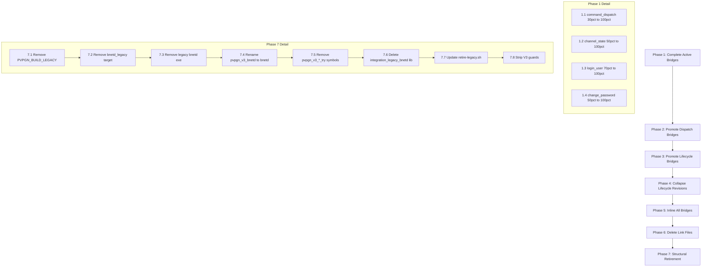

# 16 — Strangler Completion Detail Plan

> Companion to [Plan 06](06-legacy-bnetd-strangler-completion.md).
> This document provides a concrete assessment of the current state and
> an execution-ordered work breakdown for completing the legacy bnetd strangler.

---

## 1. Current State Assessment

### 1.1 Legacy Tree Status

**`src/bnetd/` is already empty** — the legacy source directory contains no files.
All legacy handler code has been relocated into
[`src/integration/legacy_bnetd/`](../src/integration/legacy_bnetd/) as `*_link.cpp`
files (e.g. `handle_bnet_link.cpp`, `handle_telnet_link.cpp`, `irc_link.cpp`).
The legacy `bnetd_legacy` static library target still exists in the build system
and is populated by these relocated sources plus `server_v3_hook.cpp`.

### 1.2 Bridge Inventory

The integration layer contains **~105 bridge source files** in
`src/integration/legacy_bnetd/src/`, organized into three categories:

#### Category A: Observation-Only Bridges (return 0, legacy always runs)

These bridges log structured events but **never intercept** the legacy path.
They always `return 0`, meaning the legacy fallback executes unconditionally.
There are **~25 dispatch bridges** in this category:

| Bridge File | Pattern | v3 Coverage |
|---|---|---|
| `account_dispatch_bridge.cpp` | log + return 0 | 0% — observation only |
| `ad_dispatch_bridge.cpp` | log + return 0 | 0% — observation only |
| `auth_dispatch_bridge.cpp` | log + return 0 | 0% — observation only |
| `bot_dispatch_bridge.cpp` | log + return 0 | 0% — observation only |
| `cdkey_dispatch_bridge.cpp` | log + return 0 | 0% — observation only |
| `clan_dispatch_bridge.cpp` | log + return 0 | 0% — observation only |
| `connection_dispatch_bridge.cpp` | log + return 0 | 0% — observation only |
| `d2_character_dispatch_bridge.cpp` | log + return 0 | 0% — observation only |
| `d2cs_link_dispatch_bridge.cpp` | log + return 0 | 0% — observation only |
| `file_dispatch_bridge.cpp` | log + return 0 | 0% — observation only |
| `friends_dispatch_bridge.cpp` | log + return 0 | 0% — observation only |
| `gameport_dispatch_bridge.cpp` | log + return 0 | 0% — observation only |
| `handshake_dispatch_bridge.cpp` | log + return 0 | 0% — observation only |
| `irc_dispatch_bridge.cpp` | log + return 0 | 0% — observation only |
| `keepalive_dispatch_bridge.cpp` | log + return 0 | 0% — observation only |
| `ladder_dispatch_bridge.cpp` | log + return 0 | 0% — observation only |
| `message_dispatch_bridge.cpp` | log + return 0 | 0% — observation only |
| `passemail_dispatch_bridge.cpp` | log + return 0 | 0% — observation only |
| `profile_dispatch_bridge.cpp` | log + return 0 | 0% — observation only |
| `progident_dispatch_bridge.cpp` | log + return 0 | 0% — observation only |
| `realm_dispatch_bridge.cpp` | log + return 0 | 0% — observation only |
| `server_dispatch_bridge.cpp` | log + return 0 | 0% — observation only |
| `stub_dispatch_bridge.cpp` | log + return 0 | 0% — observation only |
| `telemetry_dispatch_bridge.cpp` | log + return 0 | 0% — observation only |
| `telnet_dispatch_bridge.cpp` | log + return 0 | 0% — observation only |
| `wol_dispatch_bridge.cpp` | log + return 0 | 0% — observation only |

#### Category B: Active Bridges (v3 handles some/all traffic)

These bridges have real v3 application services behind them and can
intercept traffic. Some are fully promoted, others partially:

| Bridge File | v3 Service | Coverage | Notes |
|---|---|---|---|
| `ads_bridge.cpp` | `application/ads/` | **100%** | Handler-pointer dispatch; ready to inline |
| `anongame_inforeply_bridge.cpp` | `application/anongame_inforeply/` | **100%** | Full typed pipeline |
| `get_icon_bridge.cpp` | `application/icon_table/` | **100%** | IconReqTable loaded lazily |
| `set_icon_bridge.cpp` | `application/icon_table/` | **100%** | Validates icon against race-win counts |
| `tournament_bridge.cpp` | `application/tournament/` | **100%** | Snapshots legacy tournament state |
| `profile_bridge.cpp` | `application/profile/` | **100%** | Profile reply builder |
| `clan_profile_bridge.cpp` | `application/profile/` | **100%** | Clan profile variant |
| `chat_command_bridge.cpp` | `application/chat/` | **~80%** | Typed pipeline for chat commands |
| `command_dispatch_bridge.cpp` | `application/admin_commands/` | **~30%** | Only /version, /uptime, /help migrated |
| `channel_state_bridge.cpp` | `application/chat/` | **~50%** | join/leave observation + some interception |
| `realm_list_bridge.cpp` | `application/realm/` | **100%** | Realm list query |
| `anongame_lobby_bridge.cpp` | `application/anongame_lobby/` | **100%** | Lobby state query |
| `login_user_bridge.cpp` | `application/auth/` | **~70%** | Login flow partially v3 |
| `change_password_bridge.cpp` | `application/auth/` | **~50%** | Password change flow |

#### Category C: Send-Bridges (packet encoding + dispatch)

These bridges encode outbound packets via the v3 protocol codec and
dispatch through `pvpgn_v3_send_packet_try`. They are **structurally
complete** — the v3 codec builds the packet bytes, and the send-packet
handler forwards them to the legacy outqueue. There are **~55 send bridges**:

All `send_*_bridge.cpp` files follow the same pattern: encode packet
fields into a byte buffer, then call `pvpgn_v3_send_packet_try()`.
These are **100% v3-encoded** but still route through the legacy
connection outqueue via the send-packet handler.

#### Category D: Lifecycle Bridges (init/load/unload observation)

These observe legacy subsystem lifecycle events (load config, init
data structures, cleanup). They are observation-only (`return 0`):

| Bridge File | Subsystems Covered |
|---|---|
| `bnetd_lifecycle_bridges.cpp` | helpfile, autoupdate, output, support, mail |
| `bnetd_lifecycle_bridges_r246.cpp` | i18n, icons, attrlayer, tracker, team, udptest_send |
| `bnetd_lifecycle_bridges_r247.cpp` | alias_command, command_groups, anongame_maplists, handle_udp |
| `timer_bridge.cpp` | Per-connection timer subsystem |
| `ipban_bridge.cpp` | IP ban list CRUD |
| `runprog_bridge.cpp` | External program execution |
| `news_bridge.cpp` | News file load/unload |
| `userlog_bridge.cpp` | User activity logging |
| `versioncheck_bridge.cpp` | Version check file load/unload |
| `anongame_infos_bridge.cpp` | Anongame info file load/unload |
| `prefs_bridge.cpp` | Server preferences |

#### Category E: Link Files (relocated legacy handlers)

These are the actual legacy handler implementations, relocated from
`src/bnetd/` into the integration layer with v3 guard stripping:

| Link File | Original Location | Split Status |
|---|---|---|
| `handle_bnet_link.cpp` | `src/bnetd/handle_bnet.cpp` | Split into `handle_bnet/` (10 sub-files) |
| `handle_telnet_link.cpp` | `src/bnetd/handle_telnet.cpp` | Single file |
| `handle_bot_link.cpp` | `src/bnetd/handle_bot.cpp` | Single file |
| `handle_apireg_link.cpp` | `src/bnetd/handle_apireg.cpp` | Single file |
| `handle_anongame_link.cpp` | `src/bnetd/handle_anongame.cpp` | Single file |
| `handle_wol_link.cpp` | `src/bnetd/handle_wol.cpp` | Split into `handle_wol/` (3 sub-files) |
| `handle_d2cs_link.cpp` | `src/bnetd/handle_d2cs.cpp` | Single file |
| `irc_link.cpp` | `src/bnetd/irc.cpp` | Split into `irc/` (5 sub-files) |
| `legacy_bnet_frame_router_link.cpp` | Frame routing glue | Single file |
| `send_packet_bridge_link.cpp` | Send-packet glue | Single file |
| `init_conn_bridge_link.cpp` | Init-connection glue | Single file |
| `init_side_effects_link.cpp` | Init side-effects glue | Single file |
| `init_packet_dispatch_link.cpp` | Packet dispatch init | Single file |
| `ads_bridge_link.cpp` | Ads bridge glue | Single file |
| `realm_list_bridge_link.cpp` | Realm list bridge glue | Single file |

### 1.3 Coverage Summary

```
Total bridge source files:           ~105
  Category A (observation-only):      ~25  (0% v3 coverage each)
  Category B (active, partial/full):  ~14  (30-100% v3 coverage)
  Category C (send-bridges):          ~55  (100% encoding, legacy outqueue)
  Category D (lifecycle observation):  ~11  (0% v3 coverage)
  Category E (link files):            ~15  (legacy code, relocated)

Estimated overall v3 functional coverage: ~35-40%
  - Packet encoding: ~90% (send-bridges cover most outbound packets)
  - Inbound dispatch: ~15% (most dispatch bridges are observation-only)
  - Lifecycle management: ~5% (all observation-only)
  - Application logic: ~40% (14 active bridges, varying completeness)
```

### 1.4 Build Target Structure

| Target | Type | Description |
|---|---|---|
| `pvpgn_v3_bnetd` | Executable | v3 composition root with Boost.Asio event loop |
| `bnetd` | Executable | Legacy executable (links `bnetd_legacy` + integration) |
| `bnetd_legacy` | Static lib | Legacy handler code (now mostly in integration layer) |
| `integration_legacy_bnetd` | Static lib | v3 bridge code (pure v3, no legacy headers) |
| `integration_legacy_bnetd_linked` | Static lib | Bridge glue that includes legacy headers |
| `app_bnetd_legacy_bridge` | Static lib | LegacyBridge singleton + AsioEventLoop |

### 1.5 Key Observations

1. **`src/bnetd/` is already empty** — the legacy tree deletion acceptance
   criterion is effectively met, though the `bnetd_legacy` CMake target
   still exists and is populated by relocated link files.

2. **`PVPGN_BUILD_LEGACY`** is still referenced in `src/CMakeLists.txt`
   (gates `infra_legacy_crypto`). It has not been removed.

3. **`pvpgn_v3_bnetd`** is the v3 executable name — needs renaming to `bnetd`.

4. **Shadow mode infrastructure exists** at `src/infra/shadow/` with
   `ShadowAccountRepository`, `ShadowUnitOfWork`, and
   `ShadowUnitOfWorkFactory` — ready for shadow-mode comparison.

5. **Layering exceptions file** (`cmake/layering_exceptions.txt`) is
   already empty (only comments) — this criterion is met.

6. **`retire-legacy.sh`** script exists but references `src/bnetd` (already
   empty) and `src/v3` (does not exist in current layout). Needs updating.

---

## 2. Retirement Criteria (from Plan 06)

| # | Criterion | Current Status |
|---|---|---|
| 1 | `src/integration/legacy_bnetd/` shrinks by >= 80% LOC | **Not met** — full size |
| 2 | `src/bnetd/` legacy tree is deleted | **Met** — directory is empty |
| 3 | `PVPGN_BUILD_LEGACY` cmake option is removed | **Not met** — still referenced |
| 4 | `bnetd-v3` is renamed `bnetd` | **Not met** — exe is `pvpgn_v3_bnetd` |
| 5 | No `pvpgn_v3_*_try` symbol remains | **Not met** — ~262 occurrences |

---

## 3. Remaining Work Items (Execution Order)

### Phase 1: Promote Active Bridges to Full Coverage

These bridges already have v3 application services. The work is to
complete the v3 service coverage so the legacy fallback can be removed.

#### 1.1 Complete `command_dispatch_bridge` coverage

- **Current**: Only `/version`, `/uptime`, `/help` are v3-dispatched
- **Needed**: Migrate remaining admin commands to `application/admin_commands/router`
- **Files to modify**:
  - [`src/integration/legacy_bnetd/src/command_dispatch_bridge.cpp`](../src/integration/legacy_bnetd/src/command_dispatch_bridge.cpp)
  - [`src/application/admin_commands/src/router.cpp`](../src/application/admin_commands/src/router.cpp)
- **Type**: New C++ code required (command handlers)

#### 1.2 Complete `channel_state_bridge` coverage

- **Current**: Join/leave observation + partial interception
- **Needed**: Full channel join/leave/topic lifecycle via v3 `application/chat/`
- **Files to modify**:
  - [`src/integration/legacy_bnetd/src/channel_state_bridge.cpp`](../src/integration/legacy_bnetd/src/channel_state_bridge.cpp)
  - `src/application/chat/src/join_channel.cpp`, `leave_channel.cpp`
- **Type**: New C++ code required (complete use cases)

#### 1.3 Complete `login_user_bridge` coverage

- **Current**: ~70% — login flow partially v3
- **Needed**: Full NLS login, old-style login, account creation via v3
- **Files to modify**:
  - [`src/integration/legacy_bnetd/src/login_user_bridge.cpp`](../src/integration/legacy_bnetd/src/login_user_bridge.cpp)
  - `src/application/auth/src/login_user.cpp`, `login_user_nls.cpp`, `create_account.cpp`
- **Type**: New C++ code required (auth flow completion)

#### 1.4 Complete `change_password_bridge` coverage

- **Current**: ~50%
- **Needed**: Full password change + email-based recovery via v3
- **Files to modify**:
  - [`src/integration/legacy_bnetd/src/change_password_bridge.cpp`](../src/integration/legacy_bnetd/src/change_password_bridge.cpp)
  - `src/application/auth/src/change_password.cpp`
- **Type**: New C++ code required

### Phase 2: Promote Observation-Only Dispatch Bridges

Each dispatch bridge needs a v3 application service that handles the
inbound packet, replacing the legacy handler. This is the bulk of the
remaining work and requires deep domain knowledge.

#### 2.1 Auth subsystem (`auth_dispatch_bridge`)

- **v3 service**: `application/auth/` (partially exists)
- **Legacy handlers**: `handle_bnet/auth.cpp` — auth_info, authreq1, authreq109, createaccount, etc.
- **Type**: New C++ code — complete auth FSM in v3

#### 2.2 Handshake subsystem (`handshake_dispatch_bridge`)

- **v3 service**: Needs new `application/handshake/` or extend `application/connection/`
- **Legacy handlers**: `handle_bnet/handshake.cpp` — compinfo1/2, countryinfo1, auth_info
- **Type**: New C++ code — handshake negotiation

#### 2.3 Friends subsystem (`friends_dispatch_bridge`)

- **v3 service**: `application/social/` (partially exists — add_friend, list_friends)
- **Legacy handlers**: `handle_bnet/friends.cpp` — friendslistreq, friendinforeq
- **Type**: New C++ code — complete friends use cases

#### 2.4 Clan subsystem (`clan_dispatch_bridge`)

- **v3 service**: `application/social/` (partially exists — create_clan, invite, etc.)
- **Legacy handlers**: `handle_bnet/clan.cpp` — 15+ clan operations
- **Type**: New C++ code — complete clan use cases

#### 2.5 Game subsystem (`gameport_dispatch_bridge`, game bridges)

- **v3 service**: `application/game/` (exists — create, join, leave, start, report)
- **Legacy handlers**: `handle_bnet/game.cpp` — gamelistreq, joingame, startgame1/3/4
- **Type**: New C++ code — wire existing use cases to bridges

#### 2.6 Ladder subsystem (`ladder_dispatch_bridge`)

- **v3 service**: `application/ladder/` (exists — get_entry, get_page, recompute)
- **Legacy handlers**: `handle_bnet/ladder.cpp` — ladderreq, laddersearchreq
- **Type**: New C++ code — wire existing use cases

#### 2.7 Realm/D2 subsystem (`realm_dispatch_bridge`, `d2_character_dispatch_bridge`)

- **v3 service**: `application/realm/` (exists — extensive)
- **Legacy handlers**: `handle_bnet/realm.cpp` — realmlistreq, realmjoinreq, charlistreq
- **Type**: New C++ code — wire existing use cases

#### 2.8 Remaining dispatch bridges

The following are lower-priority or simpler:

| Bridge | Likely v3 Home | Complexity |
|---|---|---|
| `account_dispatch_bridge` | `application/auth/` | Medium |
| `ad_dispatch_bridge` | `application/ads/` | Low (ads already 100%) |
| `cdkey_dispatch_bridge` | New `application/cdkey/` | Medium |
| `passemail_dispatch_bridge` | `application/email_management/` | Medium |
| `profile_dispatch_bridge` | `application/profile/` | Low (profile already 100%) |
| `progident_dispatch_bridge` | `application/connection/` | Low |
| `telemetry_dispatch_bridge` | `application/connection/` or infra | Low |
| `keepalive_dispatch_bridge` | `application/connection/` | Low |
| `stub_dispatch_bridge` | Delete (stubs for unknown packets) | Trivial |
| `file_dispatch_bridge` | `application/init/` or infra | Low |
| `connection_dispatch_bridge` | `application/connection/` | Medium |
| `message_dispatch_bridge` | `application/chat/` | Medium |
| `server_dispatch_bridge` | Infra/lifecycle | Low |

#### 2.9 Protocol-specific dispatch bridges

| Bridge | Scope | Complexity |
|---|---|---|
| `bot_dispatch_bridge` | Bot/chat protocol | Medium |
| `telnet_dispatch_bridge` | Telnet protocol | Medium |
| `wol_dispatch_bridge` | Westwood Online protocol | High |
| `irc_dispatch_bridge` | IRC protocol | High |
| `d2cs_link_dispatch_bridge` | D2CS inter-server | High |

### Phase 3: Promote Lifecycle Bridges

Each lifecycle bridge needs a v3 equivalent that manages the subsystem
lifecycle (init, load config, reload, cleanup) without calling legacy code.

| Bridge | Subsystems | Complexity |
|---|---|---|
| `bnetd_lifecycle_bridges.cpp` | helpfile, autoupdate, output, support, mail | Medium |
| `bnetd_lifecycle_bridges_r246.cpp` | i18n, icons, attrlayer, tracker, team | High |
| `bnetd_lifecycle_bridges_r247.cpp` | alias_command, command_groups, anongame_maplists, handle_udp | High |
| `timer_bridge.cpp` | Per-connection timers | Medium |
| `ipban_bridge.cpp` | IP ban list | Medium (v3 `application/moderation/` exists) |
| `runprog_bridge.cpp` | External programs | Low |
| `news_bridge.cpp` | News file | Low |
| `userlog_bridge.cpp` | User activity log | Low (v3 `infra/audit/` exists) |
| `versioncheck_bridge.cpp` | Version check | Low |
| `anongame_infos_bridge.cpp` | Anongame info config | Low (v3 service exists) |
| `prefs_bridge.cpp` | Server preferences | Medium (v3 `infra/config/` exists) |

### Phase 4: Collapse Lifecycle Bridge Revisions

- **Merge** `bnetd_lifecycle_bridges.cpp` + `_r246.cpp` + `_r247.cpp`
  into a single file once all are promoted
- **Type**: Structural (file merge + CMake update)

### Phase 5: Inline Promoted Bridges

Once a bridge is a one-line forward (no legacy fallback), inline the
call at the caller site and delete the bridge file.

- For each promoted bridge in Category B:
  1. Replace `pvpgn_v3_*_try()` call with direct v3 service call
  2. Delete the bridge `.cpp` and `.hpp` files
  3. Remove from `CMakeLists.txt`
  4. Update tests to test the v3 service directly

- For send-bridges (Category C):
  1. Replace `pvpgn_v3_send_packet_try()` calls with direct v3 codec + send
  2. Delete send-bridge files
  3. Remove from `CMakeLists.txt`

### Phase 6: Delete Link Files

Once all bridges in a subsystem are inlined, delete the corresponding
link files:

| Link File Group | Prerequisite |
|---|---|
| `handle_bnet/` (10 files) | All bnet dispatch bridges promoted |
| `handle_telnet_link.cpp` | Telnet dispatch bridge promoted |
| `handle_bot_link.cpp` | Bot dispatch bridge promoted |
| `handle_apireg_link.cpp` | API registration promoted |
| `handle_anongame_link.cpp` | Anongame dispatch bridge promoted |
| `handle_wol/` (3 files) | WoL dispatch bridge promoted |
| `handle_d2cs_link.cpp` | D2CS link dispatch bridge promoted |
| `irc/` (5 files) | IRC dispatch bridge promoted |
| Glue link files (5 files) | All bridges inlined |

### Phase 7: Structural Retirement

These are purely structural changes requiring no new C++ domain logic:

#### 7.1 Remove `PVPGN_BUILD_LEGACY` CMake option

- **File**: [`src/CMakeLists.txt`](../src/CMakeLists.txt:1222) — remove the
  `if(PVPGN_BUILD_LEGACY)` guard around `infra_legacy_crypto`
- **Action**: Make `infra_legacy_crypto` unconditional or remove if no longer needed
- **Type**: Structural (CMake edit)

#### 7.2 Remove `bnetd_legacy` target

- **File**: [`src/integration/legacy_bnetd/CMakeLists.txt`](../src/integration/legacy_bnetd/CMakeLists.txt)
- **Action**: Remove `integration_legacy_bnetd_linked` target and all
  `bnetd_legacy` references
- **Type**: Structural (CMake edit)

#### 7.3 Remove legacy `bnetd` executable target

- **Action**: Delete the legacy `bnetd` executable definition (wherever it lives
  in the legacy build system)
- **Type**: Structural (CMake edit)

#### 7.4 Rename `pvpgn_v3_bnetd` to `bnetd`

- **File**: [`src/app/bnetd/CMakeLists.txt`](../src/app/bnetd/CMakeLists.txt:58)
- **Action**: Change `add_executable(pvpgn_v3_bnetd ...)` to `add_executable(bnetd ...)`
- **Also update**: install target, test names, smoke test scripts, Dockerfile, docs
- **Type**: Structural (rename + grep-replace)

#### 7.5 Remove `pvpgn_v3_*_try` symbols

- **Action**: After all bridges are inlined, grep for remaining `pvpgn_v3_*_try`
  symbols and remove them
- **Verification**: `nm -C pvpgn_v3_bnetd | grep pvpgn_v3_.*_try` returns nothing
- **Type**: Structural (verification)

#### 7.6 Delete `integration_legacy_bnetd` library

- **Action**: Once all bridge files are deleted, remove the
  `integration_legacy_bnetd` target from `src/CMakeLists.txt`
- **Type**: Structural (CMake edit)

#### 7.7 Update `retire-legacy.sh`

- **File**: [`scripts/dev/retire-legacy.sh`](../scripts/dev/retire-legacy.sh)
- **Action**: Update to reflect current directory layout (no `src/v3/`,
  `src/bnetd/` already empty)
- **Type**: Structural (script edit)

#### 7.8 Clean up `PVPGN_V3_BNETD_INTEGRATION` guards

- **Tool**: [`scripts/dev/strip_v3_guards.py`](../scripts/dev/strip_v3_guards.py)
- **Action**: Run on any remaining files with `#ifdef PVPGN_V3_BNETD_INTEGRATION`
- **Type**: Structural (automated)

---

## 4. Execution Order Diagram



---

## 5. Priority Classification

### Can be done now (structural, no new domain logic)

1. **Collapse lifecycle bridge revisions** (Phase 4) — `_r246` and `_r247`
   can be merged into the base file since r247 is the only live path
2. **Inline already-100% bridges** — `ads_bridge`, `anongame_inforeply_bridge`,
   `get_icon_bridge`, `set_icon_bridge`, `tournament_bridge`,
   `profile_bridge`, `clan_profile_bridge`, `realm_list_bridge`,
   `anongame_lobby_bridge`
3. **Update `retire-legacy.sh`** to match current layout
4. **Remove `PVPGN_BUILD_LEGACY`** guard (make `infra_legacy_crypto` unconditional)

### Requires moderate new C++ code

5. **Complete `command_dispatch_bridge`** — migrate more admin commands
6. **Complete `channel_state_bridge`** — wire v3 chat use cases
7. **Complete `login_user_bridge`** — finish auth flow
8. **Complete `change_password_bridge`** — finish password flow
9. **Promote simple dispatch bridges** — ad, profile, progident, keepalive,
   telemetry, stub, file, server (these have simple or existing v3 services)

### Requires significant new C++ code (deep domain knowledge)

10. **Promote auth dispatch** — full auth FSM
11. **Promote handshake dispatch** — connection negotiation
12. **Promote friends/clan dispatch** — social subsystem
13. **Promote game dispatch** — game lifecycle
14. **Promote ladder dispatch** — ranking queries
15. **Promote realm/D2 dispatch** — Diablo 2 realm integration
16. **Promote lifecycle bridges** — subsystem init/cleanup
17. **Promote protocol-specific bridges** — IRC, WoL, telnet, bot, D2CS

---

## 6. Final Retirement Checklist

When all phases are complete, verify:

- [ ] `find src/integration/legacy_bnetd/ -name '*.cpp' | wc -l` returns 0
- [ ] `grep -r pvpgn_v3_.*_try src/` returns 0 matches
- [ ] `grep -r PVPGN_BUILD_LEGACY CMakeLists.txt src/` returns 0 matches
- [ ] `grep -r PVPGN_V3_BNETD_INTEGRATION src/` returns 0 matches
- [ ] `cmake --build --preset v3-dev` produces a `bnetd` binary (not `pvpgn_v3_bnetd`)
- [ ] All e2e smoke tests pass against the renamed binary
- [ ] `cmake/layering_exceptions.txt` contains only comments
- [ ] `scripts/dev/retire-legacy.sh --apply` completes cleanly (or is deleted)
- [ ] `refactoring-progress.md` Plan 06 checkboxes are all checked

---

## 7. Risk Mitigation

| Risk | Mitigation |
|---|---|
| Promoting a bridge before v3 service is feature-complete | Shadow mode mandatory: `src/infra/shadow/` infrastructure exists; use `ShadowUnitOfWork` to run both paths and compare |
| Breaking protocol compatibility during bridge promotion | Each bridge promotion must include protocol-level regression tests in `tests/unit/integration/legacy_bnetd/` |
| Rename `pvpgn_v3_bnetd` to `bnetd` breaks downstream scripts | Do rename as final step; update Dockerfile, CI, docs, install targets atomically |
| `PVPGN_BUILD_LEGACY` removal breaks builds that depend on it | Audit all CMake files for the flag before removal; the only reference is `infra_legacy_crypto` |
