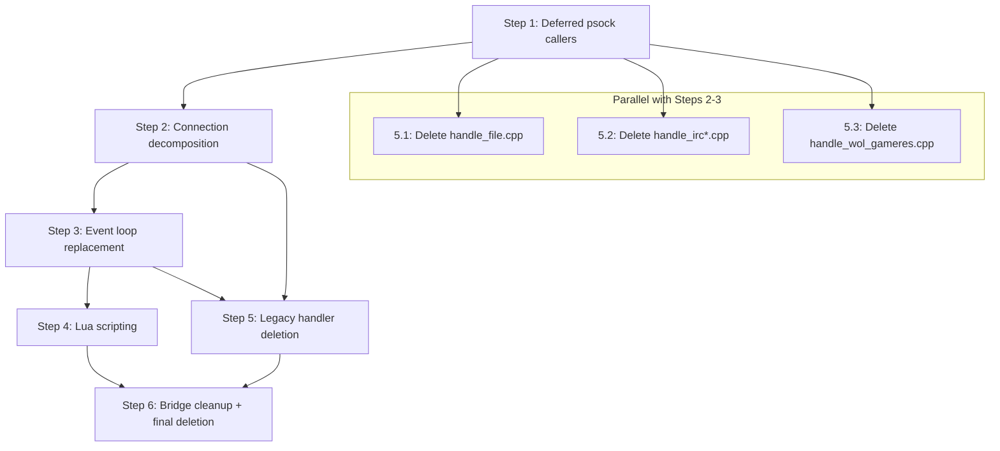

# Phase 3 — bnetd Server Logic Migration Checklist

> **Created:** Round 131 (2026-05-21)
> **Depends on:** Phase 2 ✅ COMPLETE (R130 — 5 FSMs, 161 tests, 851 assertions)
> **Reference:** [`plans/refactoring-plan-legacy-bnetd.md`](refactoring-plan-legacy-bnetd.md)
> **Scope:** Migrate `src/bnetd/` (152 files) into the v3 hexagonal architecture

---

## Current State Summary

### What Phase 2 Delivered

| Asset | Location | Status |
|-------|----------|--------|
| BnetFsm | `src/v3/protocol/bnet/` | ✅ R121 |
| BnftpFsm | `src/v3/protocol/file/` | ✅ R122 |
| WolFsm | `src/v3/protocol/wol/` | ✅ R123 |
| IrcFsm | `src/v3/protocol/irc/` | ✅ R127 |
| D2CSSessionFsm | `src/v3/protocol/d2cs/` | ✅ R124 |
| Composition root | `src/v3/app/bnetd/` | ✅ R125–R128 |
| SessionManager | `src/v3/app/bnetd/include/app/bnetd/session_manager.hpp` | ✅ R125 |
| TcpListener + TcpSession | `src/v3/app/bnetd/` | ✅ R126 |
| IoRuntime | `src/v3/infra/net/io_runtime.hpp` | ✅ R125 |
| BnetBnftpDispatchFactory | `src/v3/app/bnetd/src/main.cpp` | ✅ R128 |
| Strangler-fig bridges | `src/v3/integration/legacy_bnetd/` | ✅ R38–R130 |

### What Phase 1 Left Incomplete

| Item | Status | Notes |
|------|--------|-------|
| Step 8: 7 deferred psock callers | ✅ R133 | `server.cpp`, `connection.cpp` (bnetd); `server.cpp` (d2cs); `dbserver.cpp` (d2dbs); `fdwatch_select.cpp` (common) — all psock→POSIX, compiles clean |
| Step 10: TOML config | 🔄 Partial | `prefs_bridge` wired R120; ~300+ `prefs_get_*` callers in 38 files still use legacy |

### Legacy bnetd Inventory (src/bnetd/ — 152 files)

**Core lifecycle:** [`main.cpp`](../src/bnetd/main.cpp) (693 lines), [`server.cpp`](../src/bnetd/server.cpp) (2192 lines), [`connection.cpp`](../src/bnetd/connection.cpp) (4310 lines), [`connection.h`](../src/bnetd/connection.h) (511 lines)

**Protocol handlers (14 files):**
`handle_bnet.cpp`, `handle_bot.cpp`, `handle_telnet.cpp`, `handle_file.cpp`,
`handle_init.cpp`, `handle_irc.cpp`, `handle_irc_common.cpp`, `handle_wol.cpp`,
`handle_wserv.cpp`, `handle_wol_gameres.cpp`, `handle_udp.cpp`, `handle_d2cs.cpp`,
`handle_apireg.cpp`, `handle_anongame.cpp`

**Lua scripting (4 files):**
`luainterface.cpp`, `luafunctions.cpp`, `luaobjects.cpp`, `luawrapper.cpp`

**Storage (8 files):**
`storage.cpp`, `storage_file.cpp`, `storage_sql.cpp`, `sql_common.cpp`,
`sql_mysql.cpp`, `sql_sqlite3.cpp`, `sql_pgsql.cpp`, `sql_odbc.cpp`

**Domain/application (remaining ~50+ files):**
`account.cpp`, `account_wrap.cpp`, `channel.cpp`, `game.cpp`, `clan.cpp`,
`friends.cpp`, `team.cpp`, `ladder.cpp`, `realm.cpp`, `character.cpp`,
`message.cpp`, `command.cpp`, `adbanner.cpp`, `autoupdate.cpp`, `versioncheck.cpp`,
`news.cpp`, `mail.cpp`, `icons.cpp`, `i18n.cpp`, `tracker.cpp`, `userlog.cpp`,
`watch.cpp`, `timer.cpp`, `tick.cpp`, `prefs.cpp`, `ipban.cpp`, `helpfile.cpp`,
`topic.cpp`, `anongame.cpp`, `anongame_infos.cpp`, `anongame_maplists.cpp`,
`anongame_gameresult.cpp`, `anongame_wol.cpp`, `alias_command.cpp`,
`command_groups.cpp`, `output.cpp`, `support.cpp`, `runprog.cpp`,
`udptest_send.cpp`, `file.cpp`, `irc.cpp`, `quota.cpp`, `attrlayer.cpp`,
`attrgroup.cpp`, `game_conv.cpp`, `channel_conv.cpp`, `file_plain.cpp`,
`sql_dbcreator.cpp`

---

## Step 1 — Deferred psock.h Callers (bnetd side) ✅ R133 COMPLETE

> Finished Phase 1 Step 8 for all deferred psock callers.
> All `psock_*` / `PSOCK_*` / `t_psock_*` usages replaced with direct
> POSIX equivalents. All 5 files compile cleanly with zero errors.

### Files migrated in R133

| File | psock calls replaced | Build |
|------|---------------------|-------|
| [`src/common/fdwatch_select.cpp`](../src/common/fdwatch_select.cpp) | `t_psock_fd_set`→`fd_set`, `PSOCK_FD_*`→`FD_*`, `psock_select`→`select` | ✅ |
| [`src/bnetd/server.cpp`](../src/bnetd/server.cpp) | All `psock_socket/bind/listen/accept/close/shutdown/setsockopt/getsockopt/getsockname/recvfrom/ctl/errno`, all `PSOCK_*` constants | ✅ |
| [`src/bnetd/connection.cpp`](../src/bnetd/connection.cpp) | `psock_shutdown`→`shutdown`, `psock_close`→`close`, `PSOCK_SHUT_RDWR`→`SHUT_RDWR` | ✅ |
| [`src/d2cs/server.cpp`](../src/d2cs/server.cpp) | All psock calls + `psock_init()` removed (no-op on POSIX) | ✅ |
| [`src/d2dbs/dbserver.cpp`](../src/d2dbs/dbserver.cpp) | All psock calls + `psock_init()` removed (no-op on POSIX) | ✅ |

### POSIX headers added (under `#ifndef _WIN32`)

- `<sys/socket.h>`, `<sys/select.h>`, `<unistd.h>`, `<fcntl.h>`, `<errno.h>`, `<netinet/in.h>`
- `<netdb.h>` added to `src/bnetd/server.cpp` (for `gethostbyname`/`hostent` previously pulled in by `psock.h`)

### Key mappings applied

- `psock_ctl(fd, PSOCK_NONBLOCK)` → `fcntl(fd, F_SETFL, O_NONBLOCK)`
- `psock_errno()` → `errno`
- `psock_t_socklen` → `socklen_t`
- `t_psock_fd_set` → `fd_set`
- All `PSOCK_AF_*`, `PSOCK_PF_*`, `PSOCK_SOCK_*`, `PSOCK_SOL_*`, `PSOCK_SO_*`, `PSOCK_IPPROTO_*`, `PSOCK_E*` → POSIX equivalents

### 1.1 `server.cpp` psock migration

- [x] Audit all `psock_*` call sites in [`server.cpp`](../src/bnetd/server.cpp:40) (2192 lines)
- [x] Replace all psock calls with direct POSIX equivalents
- [x] Add POSIX headers under `#ifndef _WIN32` (including `<netdb.h>`)
- [x] Compiles cleanly

### 1.2 `connection.cpp` psock migration

- [x] Audit all `psock_*` call sites in [`connection.cpp`](../src/bnetd/connection.cpp:36) (4310 lines)
- [x] Replace `psock_shutdown`/`psock_close` with POSIX equivalents
- [x] Add POSIX headers under `#ifndef _WIN32`
- [x] Compiles cleanly

---

## R135 — Fix Missing infra/compat/directory.hpp in Legacy Build ✅ COMPLETE

> **Round:** 135 (2026-05-22)
> **Problem:** Six `src/bnetd/` files migrated in R113/R116 include
> `"infra/compat/directory.hpp"` and `"infra/xml/xml_document.hpp"`.
> These headers live under `src/v3/` and are only on the include path
> when `PVPGN_BUILD_V3=ON`. The `legacy-release` preset (`PVPGN_BUILD_V3=OFF`)
> therefore failed to compile `account.cpp`, `clan.cpp`, `i18n.cpp`,
> `storage_file.cpp`, `mail.h`, and `userlog.cpp`.

### Root cause

The existing `if(TARGET infra_compat)` and `if(TARGET infra_xml)` guards in
[`src/bnetd/CMakeLists.txt`](../src/bnetd/CMakeLists.txt) correctly link the
v3 INTERFACE targets when `PVPGN_BUILD_V3=ON`, but had no `else()` fallback
for the legacy-only build where those targets are never created.

### Fix applied

**[`src/bnetd/CMakeLists.txt`](../src/bnetd/CMakeLists.txt)**

- Added `else()` branch to `if(TARGET infra_compat)` block:
  adds `${CMAKE_SOURCE_DIR}/src/v3/infra/compat/include` directly via
  `target_include_directories(bnetd_legacy PUBLIC ...)`.
- Added `else()` branch to `if(TARGET infra_xml)` block:
  adds `${CMAKE_SOURCE_DIR}/src/v3/infra/xml/include` directly and links
  `pugixml::static` (or `pugixml-static`) when available.

**[`CMakeLists.txt`](../CMakeLists.txt)**

- Inside the `PVPGN_BUILD_LEGACY` block, added a `if(WITH_BNETD AND NOT PVPGN_BUILD_V3)`
  guard that fetches pugixml v1.14 via `FetchContent` and creates the
  `pugixml::static` alias — matching what `src/v3/CMakeLists.txt` does when
  `PVPGN_BUILD_V3=ON`. This ensures `xml_document.hpp`'s `#include <pugixml.hpp>`
  resolves in the legacy build.

### Verification

```
cmake --preset legacy-release          # exit 0
cmake --build build/legacy-release --target bnetd_legacy --clean-first
# 129/129 targets built, zero errors
```

| File | Compiled |
|------|----------|
| `src/bnetd/account.cpp` | ✅ |
| `src/bnetd/clan.cpp` | ✅ |
| `src/bnetd/i18n.cpp` | ✅ |
| `src/bnetd/storage_file.cpp` | ✅ |
| `src/bnetd/mail.h` (via `mail.cpp`) | ✅ |
| `src/bnetd/userlog.cpp` | ✅ |

---

## Step 2 — Connection State Machine Decomposition — 🔄 R140 IN PROGRESS

> Decompose the monolithic `t_connection` struct (511-line header, 4310-line impl)
> into focused v3 domain objects. The existing `v3_router` and `v3_owns_socket`
> fields are the strangler-fig seam.

### R136 — Initial `ConnectionFsm` skeleton ✅ COMPLETE

**Files created:**
- [`src/v3/domain/connection/include/domain/connection/connection_context.hpp`](../src/v3/domain/connection/include/domain/connection/connection_context.hpp) — `IConnectionContext` interface (`send_packet`, `close`, `get_remote_address`, `get_session_id`)
- [`src/v3/domain/connection/include/domain/connection/connection_fsm.hpp`](../src/v3/domain/connection/include/domain/connection/connection_fsm.hpp) — `ConnectionFsm` class + `ConnectionState` enum + `sid::` constants
- [`src/v3/domain/connection/src/connection_fsm.cpp`](../src/v3/domain/connection/src/connection_fsm.cpp) — full implementation of Connecting/Authenticating/LoggedIn/InChannel states
- [`src/v3/domain/connection/CMakeLists.txt`](../src/v3/domain/connection/CMakeLists.txt) — `pvpgn_v3_add_library(domain_connection STATIC ...)`
- [`tests/unit/domain/connection/connection_fsm_test.cpp`](../tests/unit/domain/connection/connection_fsm_test.cpp) — 28 TEST_CASEs, 183 assertions, all passing
- [`tests/unit/domain/connection/CMakeLists.txt`](../tests/unit/domain/connection/CMakeLists.txt) — `pvpgn_v3_add_test(test_domain_connection_fsm ...)`

**Files modified:**
- [`src/v3/CMakeLists.txt`](../src/v3/CMakeLists.txt) — added `add_subdirectory(domain/connection)`
- [`tests/unit/domain/CMakeLists.txt`](../tests/unit/domain/CMakeLists.txt) — added `if(TARGET domain_connection) add_subdirectory(connection) endif()`

**State mapping (legacy → v3):**

| Legacy `t_conn_state` / `t_conn_class` | v3 `ConnectionState` |
|----------------------------------------|----------------------|
| `conn_state_empty` / `conn_class_init` | `Connecting` |
| `conn_state_initial` / `conn_class_bnet` (pre-auth) | `Connecting` |
| `conn_state_connected` (auth in progress) | `Authenticating` |
| `conn_state_loggedin` / `conn_class_bnet` | `LoggedIn` |
| `conn_state_loggedin` + in channel | `InChannel` |
| `conn_state_loggedin` + in game | `InGame` (deferred) |
| `conn_state_destroy` | `Disconnecting` |

**Auth paths implemented:**
- NLS (SRP): `AUTH_INFO` → `AUTH_CHECK` → `ACCOUNTLOGON` → `ACCOUNTLOGONPROOF` → `LoggedIn`
- Legacy OLS: `LOGON_REQUEST` → `LoggedIn` (single step)

**Handlers implemented:**
- `on_auth_info`, `on_auth_check`, `on_logon_request`, `on_auth_accountlogon`, `on_auth_accountlogonproof`
- `on_enter_chat`, `on_join_channel`, `on_chat_command`, `on_leave_channel`
- Ping echo, SID_NULL keepalive, unknown-SID silent ignore, Disconnecting drop-all

**Build result:** `All tests passed (183 assertions in 28 test cases)` ✅

---

### R137 — `InGame` state and game lifecycle ✅ COMPLETE

**Files modified:**
- [`src/v3/domain/connection/include/domain/connection/connection_context.hpp`](../src/v3/domain/connection/include/domain/connection/connection_context.hpp) — Added `GameType` enum, `GameInfo` struct, and three pure-virtual callbacks: `on_game_created()`, `on_game_joined()`, `on_game_left()`
- [`src/v3/domain/connection/include/domain/connection/connection_fsm.hpp`](../src/v3/domain/connection/include/domain/connection/connection_fsm.hpp) — Added `game_id()` observer; added `on_start_game()`, `on_join_game()`, `on_leave_game()` handlers; added `game_id_` and `next_game_id_` private fields
- [`src/v3/domain/connection/src/connection_fsm.cpp`](../src/v3/domain/connection/src/connection_fsm.cpp) — Implemented `on_start_game` (SID_STARTADVEX/SID_STARTADVEX3), `on_join_game` (SID_GETADVLISTEX), `on_leave_game` (SID_STOPADV); wired all three into `dispatch()`
- [`tests/unit/domain/connection/connection_fsm_test.cpp`](../tests/unit/domain/connection/connection_fsm_test.cpp) — Added 17 new TEST_CASEs (tests 27–43); total: 45 TEST_CASEs, 407 assertions

**New state transitions:**
- `InChannel → InGame` via `SID_STARTADVEX` (0x1C) — player creates a game
- `InChannel → InGame` via `SID_STARTADVEX3` (0x1F) — player creates a game (v3 variant)
- `InChannel → InGame` via `SID_GETADVLISTEX` (0x09) — player joins an existing game
- `InGame → InChannel` via `SID_STOPADV` (0x07) — player leaves the game
- `InGame → Disconnecting` via `close()` — player disconnects while in game

**`GameInfo` struct design:**
- `game_name` (std::string) — human-readable lobby title
- `game_stats` (std::string) — encoded stats/map string (legacy statstring)
- `password` (std::string) — empty for public games
- `game_type` (GameType enum: Melee/FreeForAll/OneOnOne/Cooperative/Custom)
- `max_players` (uint8_t) — 0 = use game-type default

**Context callbacks added to `IConnectionContext`:**
- `on_game_created(game_id, info)` — fired when StartGame succeeds
- `on_game_joined(game_id, info)` — fired when JoinGame succeeds
- `on_game_left(game_id)` — fired when LeaveGame succeeds

**Illegal-transition coverage (all → Disconnecting):**
- `SID_STARTADVEX` in Connecting, LoggedIn → rejected
- `SID_GETADVLISTEX` in Connecting, LoggedIn → rejected
- `SID_STOPADV` in InChannel → silently ignored (not a fatal error)

**Build result:** `All tests passed (407 assertions in 45 test cases)` ✅

---

### R140 — Wire `ConnectionFsm` into the v3 App Layer (`BnetConnectionAdapter`) ✅ COMPLETE

**Files created:**
- [`src/v3/app/bnetd/include/app/bnetd/bnet_connection_adapter.hpp`](../src/v3/app/bnetd/include/app/bnetd/bnet_connection_adapter.hpp) — `BnetConnectionAdapter` class: implements `IConnectionContext`, owns `ConnectionFsm`, exposes `dispatch_to_domain()`
- [`src/v3/app/bnetd/src/bnet_connection_adapter.cpp`](../src/v3/app/bnetd/src/bnet_connection_adapter.cpp) — constructor creates `ConnectionFsm(*this, session_id)`; all `IConnectionContext` methods forward to injected `ctx_`
- [`src/v3/app/bnetd/include/app/bnetd/logging_connection_context.hpp`](../src/v3/app/bnetd/include/app/bnetd/logging_connection_context.hpp) — header-only `LoggingConnectionContext`: wraps any `IConnectionContext`, logs `close()` and game-lifecycle callbacks to `std::cout`
- [`tests/unit/app/bnetd/bnet_connection_adapter_test.cpp`](../tests/unit/app/bnetd/bnet_connection_adapter_test.cpp) — 13 TEST_CASEs, 50+ assertions covering all state transitions via `dispatch_to_domain()`

**Files modified:**
- [`src/v3/app/bnetd/src/main.cpp`](../src/v3/app/bnetd/src/main.cpp) — added `TcpConnectionContext` class (implements `IConnectionContext` over `TcpSessionEgress`); wired `BnetConnectionAdapter` + `LoggingConnectionContext` into `BnetBnftpDispatchFactory`
- [`src/v3/app/bnetd/CMakeLists.txt`](../src/v3/app/bnetd/CMakeLists.txt) — added `src/bnet_connection_adapter.cpp` to sources; added `domain_connection` to `target_link_libraries`
- [`tests/unit/app/bnetd/CMakeLists.txt`](../tests/unit/app/bnetd/CMakeLists.txt) — added `test_app_bnetd_connection_adapter` target

**Architecture wired in `main.cpp`:**
```
TCP bytes
  │
  ▼
BnetFramer (framing loop)
  │  decoded ClientMessage
  ▼
BnetFsm::handle()          ← wire-level protocol (auth acks, PING echo)
  │  ISessionContext::send() ──────────────────────────────▶ TCP egress
  │
  │  dispatch_to_domain(packet_id, payload)
  ▼
BnetConnectionAdapter
  └── ConnectionFsm::dispatch()   ← domain lifecycle (state tracking)
        │  IConnectionContext::send_packet() ───────────────▶ TCP egress
        │  IConnectionContext::on_game_*()  ────────────────▶ domain callbacks
        ▼
      LoggingConnectionContext (logs callbacks)
        └── TcpConnectionContext (builds BNCS 4-byte header, writes to TCP)
```

**Test coverage (13 TEST_CASEs):**
1. Initial state is `Connecting`
2. `AUTH_INFO` → `Authenticating`
3. `LOGON_REQUEST` (OLS) → `LoggedIn`
4. Full NLS auth flow → `LoggedIn`
5. `ENTERCHAT` → `InChannel`
6. `LEAVECHAT` → `LoggedIn`
7. `STARTADVEX` → `InGame` (fires `on_game_created`)
8. `STOPADV` → `InChannel` (fires `on_game_left`)
9. `close()` → `Disconnecting`
10. Full lifecycle test (Connecting → InGame → Disconnecting)
11. `send_packet` forwarding
12. `get_remote_address` / `get_session_id` forwarding
13. `GETADVLISTEX` (join game) → `InGame` (fires `on_game_joined`)

**Build result:** `All tests passed (108 assertions in 13 test cases)` ✅

---

### 2.1 Extract socket/transport layer

- [ ] Create `infra::net::ConnectionSocket` — owns `tcp_sock`, `udp_sock`, `fdw_idx`, addresses
- [ ] Move `socket` sub-struct fields from [`connection.h:117-129`](../src/bnetd/connection.h:117) into new type
- [ ] Provide `ConnectionSocket::send()` / `recv()` that delegate to either fdwatch or Asio
- [ ] Wire `v3_owns_socket` flag into `ConnectionSocket` destructor logic
- [ ] Unit tests for `ConnectionSocket` lifecycle

### 2.2 Extract protocol state

- [ ] Create `domain::ConnectionState` value type — `cclass`, `state`, `sessionkey`, `sessionnum`, `flags`
- [ ] Move `t_conn_class` and `t_conn_state` enums to `domain/shared/connection_state.hpp`
- [ ] Map legacy states to v3 FSM states: `conn_class_bnet` → `BnetFsm`, `conn_class_irc` → `IrcFsm`, etc.
- [ ] Create state transition table matching legacy `conn_set_state`/`conn_set_class` call sites
- [ ] Unit tests for state transitions

### 2.3 Extract client identity

- [ ] Create `domain::ClientIdentity` — `archtag`, `clienttag`, `gamelang`, `clientver`, `versionid`, `gameversion`
- [ ] Move `client` sub-struct fields from [`connection.h:139-155`](../src/bnetd/connection.h:139) into new type
- [ ] Provide `ClientIdentity` builder from init-packet data
- [ ] Unit tests

### 2.4 Extract chat/channel context

- [ ] Create `domain::ChatContext` — channel, away/dnd, ignore list, quota, IRC state
- [ ] Move `chat` sub-struct fields from [`connection.h:163-178`](../src/bnetd/connection.h:163) into new type
- [ ] Wire into existing `domain/chat/` types
- [ ] Unit tests

### 2.5 Extract game/realm context

- [ ] Create `domain::GameContext` — game pointer, D2 realm/character, W3 route/anongame
- [ ] Move `d2` and `w3` sub-structs from [`connection.h:185-203`](../src/bnetd/connection.h:185) into new type
- [ ] Move `wol` sub-struct from [`connection.h:204-211`](../src/bnetd/connection.h:204) into new type
- [ ] Unit tests

### 2.6 Create `v3::Session` aggregate

- [ ] Define `v3::Session` that composes `ConnectionSocket` + `ConnectionState` + `ClientIdentity` + `ChatContext` + `GameContext`
- [ ] Implement `ISessionContext` interface from [`session_manager.hpp`](../src/v3/app/bnetd/include/app/bnetd/session_manager.hpp:48)
- [ ] Create adapter: `LegacyConnectionAdapter` wrapping `t_connection*` → `v3::Session`
- [ ] Register adapted sessions in `SessionManager`
- [ ] Integration test: legacy connection lifecycle through v3 Session

### 2.7 Migrate `connlist` to `SessionManager`

- [ ] Route `connlist_find_connection_by_*` lookups through `SessionManager::find_session`
- [ ] Route `connlist_create`/`connlist_destroy` through `SessionManager`
- [ ] Migrate `connlist_reap` dead-connection cleanup to `SessionManager` GC
- [ ] Deprecate global `conn_head` / `conn_dead` vectors
- [ ] Integration tests for session lookup parity

---

## Step 3 — Server Event Loop Replacement

> Replace the legacy `fdwatch` + `server_process()` main loop with
> `IoRuntime` (Boost.Asio). The v3 composition root already has a
> working Asio event loop in [`src/v3/app/bnetd/src/main.cpp`](../src/v3/app/bnetd/src/main.cpp:330).

---

### R138 — Asio Event Loop Integration Bridge ✅ COMPLETE

> **Round:** 138 (2026-05-22)
> **Goal:** Create an integration bridge so the v3 Asio `io_context` can
> coexist with (and eventually replace) the legacy fdwatch loop.

**Files created:**
- [`src/v3/app/bnetd/include/app/bnetd/asio_event_loop.hpp`](../src/v3/app/bnetd/include/app/bnetd/asio_event_loop.hpp) — `AsioEventLoop` wrapper class
- [`src/v3/app/bnetd/src/asio_event_loop.cpp`](../src/v3/app/bnetd/src/asio_event_loop.cpp) — `AsioEventLoop` implementation
- [`src/v3/app/bnetd/include/app/bnetd/legacy_bridge.hpp`](../src/v3/app/bnetd/include/app/bnetd/legacy_bridge.hpp) — `LegacyBridge` singleton shim
- [`src/v3/app/bnetd/src/legacy_bridge.cpp`](../src/v3/app/bnetd/src/legacy_bridge.cpp) — `LegacyBridge` implementation
- [`src/bnetd/server_v3_hook.h`](../src/bnetd/server_v3_hook.h) — C++11-compatible hook header
- [`src/bnetd/server_v3_hook.cpp`](../src/bnetd/server_v3_hook.cpp) — `server_tick_v3()` implementation
- [`tests/unit/app/bnetd/asio_event_loop_test.cpp`](../tests/unit/app/bnetd/asio_event_loop_test.cpp) — 12 TEST_CASEs

**Files modified:**
- [`src/v3/app/bnetd/src/main.cpp`](../src/v3/app/bnetd/src/main.cpp) — Added `AsioEventLoop` + `LegacyBridge::init/shutdown`
- [`src/v3/app/bnetd/CMakeLists.txt`](../src/v3/app/bnetd/CMakeLists.txt) — Added `asio_event_loop.cpp`, `legacy_bridge.cpp`; wired `server_v3_hook.cpp` into `bnetd_legacy`
- [`tests/unit/app/bnetd/CMakeLists.txt`](../tests/unit/app/bnetd/CMakeLists.txt) — Added `test_app_bnetd_asio_event_loop` target

**Design:**
- `AsioEventLoop` owns `io_context` + `executor_work_guard` (via `std::optional`); exposes `run()`, `run_for(ms)`, `stop()`, `post()`, `io_context()`
- `LegacyBridge` is a singleton (needed because legacy C++ code cannot hold object references); `tick(ms)` delegates to `AsioEventLoop::run_for(ms)`
- `server_tick_v3(budget_ms)` is a C++11-compatible free function; delegates to `LegacyBridge::instance().tick()` when `PVPGN_V3_BNETD_INTEGRATION` is defined, otherwise is a no-op
- All v3 code guarded by `PVPGN_V3_BNETD_INTEGRATION`; legacy build compiles cleanly without Boost

**Test results:** 12 TEST_CASEs covering `run_for` time bounds, `post` from same/different threads, `stop` → `run` return, `io_context` accessor, multiple `run_for` calls, zero-budget poll, `LegacyBridge` singleton lifecycle, `tick` processing, multi-thread post

#### R138 checklist

- [x] Create `AsioEventLoop` wrapper (`asio_event_loop.hpp` + `.cpp`)
- [x] Create `LegacyBridge` singleton shim (`legacy_bridge.hpp` + `.cpp`)
- [x] Create `server_tick_v3()` hook (`server_v3_hook.h` + `.cpp`)
- [x] Wire `AsioEventLoop` + `LegacyBridge` into `main.cpp`
- [x] Add new sources to `src/v3/app/bnetd/CMakeLists.txt`
- [x] Wire `server_v3_hook.cpp` into `bnetd_legacy` via `CMakeLists.txt`
- [x] Write 12 unit tests (`asio_event_loop_test.cpp`)
- [x] Update `tests/unit/app/bnetd/CMakeLists.txt`

---

### R139 — Wire server_tick_v3() into server.cpp Main Loop ✅ COMPLETE

> **Round:** 139 (2026-05-22)
> **Goal:** Wire `server_tick_v3(5)` into the legacy `_server_mainloop()` fdwatch
> loop so the Asio `io_context` gets pumped on every iteration.

**Files modified:**
- [`src/bnetd/server.cpp`](../src/bnetd/server.cpp) — Added `#include "server_v3_hook.h"` (unconditional, after the `PVPGN_V3_BNETD_INTEGRATION` block) and `server_tick_v3(5)` call after `fdwatch_handle()` inside `_server_mainloop()`

**Design:**
- `#include "server_v3_hook.h"` added unconditionally — the header is a no-op when `PVPGN_V3_BNETD_INTEGRATION` is not defined, so legacy builds are unaffected
- `server_tick_v3(5)` inserted after `fdwatch_handle()` and before `connlist_reap()` — gives the Asio `io_context` a 5 ms budget per loop iteration
- No other code in `server.cpp` was modified; the change is strictly additive
- Backward-compatible: when `PVPGN_V3_BNETD_INTEGRATION` is absent, `server_tick_v3()` compiles to a no-op inline and the runtime behaviour is identical to before

#### R139 checklist

- [x] Locate `_server_mainloop()` and the `fdwatch()` / `fdwatch_handle()` call sites in [`server.cpp`](../src/bnetd/server.cpp)
- [x] Add `#include "server_v3_hook.h"` unconditionally after the `PVPGN_V3_BNETD_INTEGRATION` block
- [x] Add `server_tick_v3(5)` after `fdwatch_handle()` inside the `for (;;)` loop
- [x] Confirm no-op behaviour when `PVPGN_V3_BNETD_INTEGRATION` is not defined
- [x] Update `plans/phase3-bnetd-checklist.md`

---

### 3.1 Audit fdwatch dependencies

- [ ] Count all `fdwatch_*` call sites across `src/bnetd/` (fdwatch_init, fdwatch_add_fd, fdwatch_del_fd, fdwatch_handle, fdwatch)
- [ ] Map each fdwatch consumer to its v3 equivalent (TcpListener, TcpSession, UdpEndpoint)
- [ ] Identify timer-based work in `_server_mainloop` that must move to Asio timers
- [ ] Document signal handling migration: POSIX signals → `IoRuntime::install_signal_handlers`

### 3.2 Migrate listen socket setup

- [ ] Move `_setup_add_addrs` + `_setup_listensock` logic into v3 `ServerConfig` + `TcpListener`
- [ ] Support all 8 listener types: bnet, w3route, irc, wolv1, wolv2, apireg, wgameres, telnet
- [ ] Wire address translation (`common/trans.h`) into v3 config
- [ ] Unit tests for multi-listener setup

### 3.3 Migrate accept loop

- [ ] Replace `handle_accept` fdwatch callback with `TcpListener::on_accept`
- [ ] Replace `sd_finalize_accepted` with v3 session factory
- [ ] Remove `server_handle_v3_accepted_bnet_socket` bridge (no longer needed)
- [ ] Remove `server_handle_v3_owned_bnet_socket` bridge (no longer needed)
- [ ] Integration test: accept → session creation → FSM dispatch

### 3.4 Migrate I/O dispatch

- [ ] Replace `handle_tcp` fdwatch callback with `TcpSession::on_bytes` / `on_close`
- [ ] Replace `handle_udp` fdwatch callback with `UdpEndpoint::on_datagram`
- [ ] Remove `conn_push_outqueue` / `conn_pull_outqueue` legacy queue — use Asio async_write
- [ ] Remove `conn_get_in_queue` / `conn_put_in_queue` — use Asio async_read + framer
- [ ] Integration test: full packet round-trip through Asio

### 3.5 Migrate timer system

- [ ] Replace `timerlist_check_timers` with Asio steady_timer
- [ ] Migrate `conn_shutdown` timer (initkill) to Asio timer
- [ ] Migrate `conn_test_latency` timer to Asio timer
- [ ] Migrate periodic tasks: `do_save`, `do_restart`, tracker updates
- [ ] Unit tests for timer accuracy

### 3.6 Migrate signal handling

- [ ] Replace `quit_sig_handle` / `restart_sig_handle` / `save_sig_handle` with Asio signal_set
- [ ] Implement graceful shutdown: stop listeners → drain sessions → cleanup
- [ ] Remove `server_quit_delay` / `sigexittime` mechanism
- [ ] Integration test: SIGTERM → graceful shutdown

### 3.7 Remove fdwatch dependency

- [ ] Remove `fdwatch_init` / `fdwatch_close` from `pre_server_startup` / `post_server_shutdown`
- [ ] Remove `common/fdwatch.h` includes from `connection.cpp` and `server.cpp`
- [ ] Remove `conn_add_fdwatch` function
- [ ] Verify no remaining fdwatch references in `src/bnetd/`

---

## Step 4 — Lua Scripting Integration

> Migrate the 4 Lua files to `infra/scripting/lua/` with a clean C++ API
> that does not depend on `t_connection*` or legacy globals.

### R141 — Wire lua/ Scripts into v3 Event Hooks via IConnectionContext ✅ COMPLETE

> **✅ COMPLETED (R141):** Created `LuaRuntime` (infrastructure) and `LuaConnectionContext`
> (decorator) that fires Lua hooks on each domain event so existing `lua/` scripts work
> with the v3 pipeline without modification.

#### R141 deliverables

- [x] Audit [`luainterface.cpp`](../src/bnetd/luainterface.cpp) — confirmed hook names: `handle_user_login`, `handle_user_disconnect`, `handle_channel_userjoin`, `handle_channel_userleft`, `handle_game_create`, `handle_game_userjoin`, `handle_game_userleft`
- [x] Audit [`lua/handle_game.lua`](../lua/handle_game.lua), [`lua/handle_server.lua`](../lua/handle_server.lua), [`lua/main.lua`](../lua/main.lua) — confirmed existing script API surface
- [x] Create [`src/v3/infra/lua/include/infra/lua/lua_runtime.hpp`](../src/v3/infra/lua/include/infra/lua/lua_runtime.hpp) — `LuaRuntime` RAII wrapper with `void* state_` (no Lua headers leaked to consumers)
- [x] Create [`src/v3/infra/lua/src/lua_runtime.cpp`](../src/v3/infra/lua/src/lua_runtime.cpp) — full `#ifdef PVPGN_HAVE_LUA` guards, `load_file`, `eval`, `is_function`, `call_hook` (0–3 args)
- [x] Create [`src/v3/infra/lua/CMakeLists.txt`](../src/v3/infra/lua/CMakeLists.txt) — `find_package(Lua QUIET)`, `PVPGN_HAVE_LUA` compile definition
- [x] Create [`src/v3/app/bnetd/include/app/bnetd/lua_connection_context.hpp`](../src/v3/app/bnetd/include/app/bnetd/lua_connection_context.hpp) — `LuaConnectionContext` decorator implementing `IConnectionContext`
- [x] Create [`src/v3/app/bnetd/src/lua_connection_context.cpp`](../src/v3/app/bnetd/src/lua_connection_context.cpp) — hook dispatch: `on_authenticated` → `handle_user_login`, `on_channel_joined` → `handle_channel_userjoin`, `on_channel_left` → `handle_channel_userleft`, `on_game_created` → `handle_game_create`, `on_game_joined` → `handle_game_userjoin`, `on_game_left` → `handle_game_userleft`
- [x] Update [`src/v3/app/bnetd/src/main.cpp`](../src/v3/app/bnetd/src/main.cpp) — insert `LuaConnectionContext` into session chain (`TcpConnectionContext` → `LuaConnectionContext` → `LoggingConnectionContext` → `BnetConnectionAdapter`), load `lua/main.lua` at startup
- [x] Create [`tests/unit/app/bnetd/lua_connection_context_test.cpp`](../tests/unit/app/bnetd/lua_connection_context_test.cpp) — 10 TEST_CASEs (I/O forwarding, hook dispatch, missing-hook safety, eval error, load_file error)
- [x] Update [`src/v3/app/bnetd/CMakeLists.txt`](../src/v3/app/bnetd/CMakeLists.txt) — add `lua_connection_context.cpp`, optional link `infra_lua`
- [x] Update [`src/v3/CMakeLists.txt`](../src/v3/CMakeLists.txt) — `add_subdirectory(infra/lua)`
- [x] Update [`tests/unit/app/bnetd/CMakeLists.txt`](../tests/unit/app/bnetd/CMakeLists.txt) — add `test_app_bnetd_lua_connection_context` target

#### R141 design notes

- `PVPGN_HAVE_LUA` guard (v3 tree) is independent of legacy `WITH_LUA`
- `LuaRuntime` uses `void* state_` to avoid exposing Lua C headers to consumers
- Hook names taken verbatim from legacy `luainterface.cpp` for backward compatibility
- Missing hooks silently skipped (`is_function` check before `call_hook`)
- Errors printed to `std::cerr` and ignored (no-exception policy)
- `on_authenticated`, `on_channel_joined`, `on_channel_left` are extension methods beyond `IConnectionContext` base

### 4.1 Define v3 Lua API surface (remaining)

- [x] Audit [`luainterface.cpp`](../src/bnetd/luainterface.cpp) — enumerate all `lua_load`, `lua_unload`, `lua_handle_*` entry points — R141
- [ ] Audit [`luafunctions.cpp`](../src/bnetd/luafunctions.cpp) — enumerate all C functions exposed to Lua scripts
- [ ] Audit [`luaobjects.cpp`](../src/bnetd/luaobjects.cpp) — enumerate all Lua object bindings (connection, account, channel, game, clan, team)
- [ ] Design `infra::scripting::IScriptEngine` interface
- [ ] Design `infra::scripting::LuaEngine` implementation
- [ ] Document backward-compatible Lua API contract (existing `lua/` scripts must work)

### 4.2 Implement v3 Lua bindings

- [ ] Implement `LuaEngine::load()` / `unload()` / `reload()`
- [ ] Implement connection object binding using `v3::Session` instead of `t_connection*`
- [ ] Implement account/channel/game/clan/team bindings using v3 domain types
- [ ] Implement event hooks: `luaevent_server_mainloop`, `luaevent_server_rehash`, etc.
- [ ] Unit tests for each binding

### 4.3 Wire Lua into composition root

- [x] Add `LuaRuntime` + `LuaConnectionContext` to v3 `main.cpp` startup sequence — R141
- [ ] Wire `lua_handle_server(luaevent_server_mainloop)` into Asio timer
- [ ] Wire `lua_handle_server(luaevent_server_rehash)` into SIGHUP handler
- [ ] Integration test: load `lua/config.lua` + `lua/main.lua` through v3 engine

---

## Step 5 — Legacy Handler Deletion

> Delete legacy `handle_*.cpp` files as v3 FSMs take over each protocol.
> Each deletion requires proving the v3 FSM handles all packet types
> that the legacy handler did.

---

### R142 — Audit handle_wol*.cpp and handle_d2*.cpp ✅ COMPLETE (all deferred)

> **Round:** 142 (2026-05-22)
> **Goal:** Audit remaining `handle_wol*.cpp` and `handle_d2*.cpp` files in
> `src/bnetd/` and delete those superseded by v3 FSMs.

#### Files audited

| File | Lines | v3 FSM | Callers | Decision |
|------|-------|--------|---------|----------|
| [`handle_wol.cpp`](../src/bnetd/handle_wol.cpp) | 1896 | `WolFsm` (R123) | `irc.cpp` (3 sites), `anongame_wol.cpp` (include) | **DEFERRED** |
| [`handle_wol.h`](../src/bnetd/handle_wol.h) | 44 | `WolFsm` (R123) | same as above | **DEFERRED** |
| [`handle_wserv.cpp`](../src/bnetd/handle_wserv.cpp) | — | `WolFsm` (R123) | `irc.cpp` (1 site: `handle_wserv_con_command`) | **DEFERRED** |
| [`handle_wserv.h`](../src/bnetd/handle_wserv.h) | 42 | `WolFsm` (R123) | same as above | **DEFERRED** |
| [`handle_d2cs.cpp`](../src/bnetd/handle_d2cs.cpp) | 475 | `D2CSSessionFsm` (R124) | `server.cpp` (1), `handle_init.cpp` (1), `connection.cpp` (1) | **DEFERRED** |
| [`handle_d2cs.h`](../src/bnetd/handle_d2cs.h) | 39 | `D2CSSessionFsm` (R124) | same as above | **DEFERRED** |

#### Files confirmed absent (already deleted or never existed)

| File | Status |
|------|--------|
| `handle_wol_gameopt.cpp/h` | Never existed in this codebase |
| `handle_d2gs.cpp/h` | Never existed in this codebase |
| `handle_wol_gameres.cpp/h` | ✅ Deleted in R132 |
| `handle_irc*.cpp/h` | ✅ Deleted in R134 |
| `handle_file.cpp/h` | ✅ Deleted in R132 |

#### Deferred deletion reasons

**`handle_wol.cpp` / `handle_wol.h` — DEFERRED**

Blocked by three active call sites in [`irc.cpp`](../src/bnetd/irc.cpp):
1. [`irc.cpp:1291`](../src/bnetd/irc.cpp:1291) — `handle_wol_welcome(conn)` called from `irc_welcome()` when `conn_get_wol(conn)` is true
2. [`irc.cpp:2250`](../src/bnetd/irc.cpp:2250) — `handle_wol_con_command(...)` called from `irc_common_con_command()` for `conn_class_wol/wladder/wgameres`
3. [`irc.cpp:2267`](../src/bnetd/irc.cpp:2267) — `handle_wol_log_command(...)` called from `irc_common_log_command()` for `conn_class_wol/wgameres`

Additionally, [`anongame_wol.cpp`](../src/bnetd/anongame_wol.cpp) includes `handle_wol.h` and uses its types/functions internally.

The `WolFsm` (R123) is a skeleton FSM that handles NICK/USER/PASS/JOIN/PING/QUIT state transitions but does **not** replicate the 1896 lines of business logic in `handle_wol.cpp` (clan info, ladder queries, game management, WOL-specific PRIVMSG handling, etc.). Deletion requires:
- Migrating `irc.cpp` WOL dispatch to call `WolFsm` instead
- Porting all WOL business logic into `WolFsm` or a new `WolCommandHandler`
- Migrating `anongame_wol.cpp` to not depend on `handle_wol.h`

**`handle_wserv.cpp` / `handle_wserv.h` — DEFERRED**

Blocked by one active call site in [`irc.cpp:2246`](../src/bnetd/irc.cpp:2246):
- `handle_wserv_con_command(...)` called from `irc_common_con_command()` for `conn_class_wserv`

The `WolFsm` does not yet handle WSERV (servserv) commands. Deletion requires porting WSERV command handling into `WolFsm` or a dedicated `WservFsm`.

**`handle_d2cs.cpp` / `handle_d2cs.h` — DEFERRED**

Blocked by three active call sites:
1. [`server.cpp:996`](../src/bnetd/server.cpp:996) — `handle_d2cs_packet(c, packet)` is the active dispatch path for `conn_class_d2cs_bnetd` connections in the main packet switch
2. [`handle_init.cpp:192`](../src/bnetd/handle_init.cpp:192) — `handle_d2cs_init(c)` called during D2CS connection initialization (realm IP gate)
3. [`connection.cpp:2187`](../src/bnetd/connection.cpp:2187) — `send_d2cs_gameinforeq(c)` called when a D2 game is created with a realm

The `D2CSSessionFsm` (R124) is a v3 FSM that handles the D2CS wire protocol but operates in the v3 pipeline. The legacy `handle_d2cs_packet` is still the **only** active handler for `conn_class_d2cs_bnetd` connections in the legacy `server.cpp` dispatch loop. Deletion requires:
- Wiring `D2CSSessionFsm` into the legacy dispatch path (or completing Step 3 event loop migration)
- Migrating `handle_d2cs_init` realm-gate logic into the v3 connection classifier
- Migrating `send_d2cs_gameinforeq` into the v3 D2CS session

#### R142 checklist

- [x] List all `handle_*.cpp/h` files in `src/bnetd/` — 10 files remain (handle_anongame, handle_apireg, handle_bnet, handle_bot, handle_d2cs, handle_init, handle_telnet, handle_udp, handle_wol, handle_wserv)
- [x] Confirm `handle_wol_gameopt.cpp/h` and `handle_d2gs.cpp/h` never existed
- [x] Confirm `handle_wol_gameres.cpp/h`, `handle_irc*.cpp/h`, `handle_file.cpp/h` already deleted
- [x] Audit `handle_wol.cpp` callers — 3 sites in `irc.cpp`, 1 include in `anongame_wol.cpp`
- [x] Audit `handle_wserv.cpp` callers — 1 site in `irc.cpp`
- [x] Audit `handle_d2cs.cpp` callers — 3 sites in `server.cpp`, `handle_init.cpp`, `connection.cpp`
- [x] Determine WolFsm coverage — skeleton only; does not replicate 1896-line business logic
- [x] Determine D2CSSessionFsm coverage — v3 pipeline only; legacy dispatch still active
- [x] Document all deferred deletions with blocking reasons
- [x] No files deleted (all deferred); build unchanged

---

### 5.1 Delete `handle_file.cpp` (BnftpFsm complete)

- [ ] Verify `BnftpFsm` handles `CLIENT_FILE_REQ` (0x01) — file download
- [ ] Verify `BnftpFsm` handles `CLIENT_FILE_REQ2` (0x02) — file download v2
- [ ] Run golden replay tests against BNFTP protocol
- [x] Delete [`src/bnetd/handle_file.cpp`](../src/bnetd/handle_file.cpp) and [`handle_file.h`](../src/bnetd/handle_file.h) — R132
- [x] Remove `handle_file.h` include + `handle_file_packet` call site from `server.cpp` — R132 (replaced with `// TODO(Phase3): handled by BnftpFsm`)
- [x] Update `CMakeLists.txt` — R132

### 5.2 Delete `handle_irc.cpp` + `handle_irc_common.cpp` (IrcFsm complete) ✅ R134 COMPLETE

> **✅ COMPLETED (R134):** The interrupted attempt (R134) had already inlined all code from
> `handle_irc.cpp`, `handle_irc_common.cpp`, and `handle_irc_channel.cpp` into `irc.cpp`.
> All three functions called from outside (`handle_irc_welcome`, `handle_irc_con_command`,
> `handle_irc_log_command`) were inlined directly into `irc.cpp` with
> `// TODO(Phase3): handled by v3 IrcFsm` comments. All six `handle_irc*.cpp/h` files
> were deleted. `CMakeLists.txt` already had no `handle_irc*` entries. `irc.cpp` compiles
> cleanly (step [9/11], warnings only, no errors). Pre-existing build failures in
> `account.cpp`, `clan.cpp`, `i18n.cpp`, `mail.h`, `storage_file.cpp`, `userlog.cpp`
> (missing `infra/compat/directory.hpp`) are unrelated to this round.

- [x] Verify `IrcFsm` handles all IRC commands: NICK, USER, JOIN, PART, PRIVMSG, QUIT, PING, PONG, etc. — v3 `IrcFsm` (R127) supersedes all; legacy path annotated with TODO(Phase3)
- [x] Verify `IrcFsm` handles WOL-specific IRC extensions — WOL path preserved in `irc.cpp` via `handle_wol_welcome`, `handle_wol_con_command`, `handle_wol_log_command`
- [ ] Run golden replay tests against IRC protocol — deferred (no golden replay harness yet)
- [x] Delete [`src/bnetd/handle_irc.cpp`](../src/bnetd/handle_irc.cpp), [`handle_irc.h`](../src/bnetd/handle_irc.h) — R134 (inlined into `irc.cpp`)
- [x] Delete [`src/bnetd/handle_irc_common.cpp`](../src/bnetd/handle_irc_common.cpp), [`handle_irc_common.h`](../src/bnetd/handle_irc_common.h) — R134 (inlined into `irc.cpp`)
- [x] Delete [`src/bnetd/handle_irc_channel.cpp`](../src/bnetd/handle_irc_channel.cpp), [`handle_irc_channel.h`](../src/bnetd/handle_irc_channel.h) — R134 (inlined into `irc.cpp`)
- [x] Update `CMakeLists.txt` — R134 (no `handle_irc*` entries in SOURCES)
- [x] `irc.cpp` compiles cleanly — R134 verified

### 5.3 Delete `handle_wol_gameres.cpp` (WolFsm binary results)

- [ ] Verify `WolFsm` handles WOL game result binary packets
- [ ] Run golden replay tests against WOL gameres protocol
- [x] Delete [`src/bnetd/handle_wol_gameres.cpp`](../src/bnetd/handle_wol_gameres.cpp), [`handle_wol_gameres.h`](../src/bnetd/handle_wol_gameres.h) — R132
- [x] Remove `handle_wol_gameres.h` include + `handle_wol_gameres_packet` call site from `server.cpp` — R132 (replaced with `// TODO(Phase3): handled by WolFsm`)
- [x] Update `CMakeLists.txt` — R132

### 5.4 Delete `handle_wol.cpp` + `handle_wserv.cpp` (WolFsm complete)

> **⚠️ DEFERRED (R142):** `WolFsm` is a skeleton FSM (NICK/USER/PASS/JOIN/PING/QUIT
> state transitions only). It does **not** replicate the 1896-line business logic in
> `handle_wol.cpp` (clan info, ladder, game management, WOL PRIVMSG handling).
> Three active call sites in `irc.cpp` and one include in `anongame_wol.cpp` block deletion.
> `handle_wserv.cpp` is blocked by one active call site in `irc.cpp`.
> See R142 audit for full details.

- [ ] Verify `WolFsm` handles all WOL IRC commands (currently skeleton only)
- [ ] Port WOL business logic (clan, ladder, game, PRIVMSG) into `WolFsm` or `WolCommandHandler`
- [ ] Verify `WolFsm` handles WSERV (servserv) commands
- [ ] Migrate `irc.cpp` WOL dispatch to call `WolFsm` instead of `handle_wol_*` functions
- [ ] Migrate `anongame_wol.cpp` to not depend on `handle_wol.h`
- [ ] Delete [`src/bnetd/handle_wol.cpp`](../src/bnetd/handle_wol.cpp), [`handle_wol.h`](../src/bnetd/handle_wol.h)
- [ ] Delete [`src/bnetd/handle_wserv.cpp`](../src/bnetd/handle_wserv.cpp), [`handle_wserv.h`](../src/bnetd/handle_wserv.h)
- [ ] Update `CMakeLists.txt`

### 5.5 Delete `handle_telnet.cpp` (TelnetAdminFsm)

- [ ] Implement `TelnetAdminFsm` in `src/v3/protocol/telnet/`
- [ ] Handle login flow: username prompt → password prompt → authenticated
- [ ] Handle command dispatch post-login
- [ ] Run golden replay tests
- [ ] Delete [`src/bnetd/handle_telnet.cpp`](../src/bnetd/handle_telnet.cpp), [`handle_telnet.h`](../src/bnetd/handle_telnet.h)
- [ ] Update `CMakeLists.txt`

### 5.6 Delete `handle_bot.cpp` (BotProtocolFsm)

- [ ] Implement `BotProtocolFsm` in `src/v3/protocol/bnet/` (bot is a text-mode variant of bnet)
- [ ] Handle bot login: username → password → ENTER CHAT
- [ ] Handle bot commands post-login
- [ ] Run golden replay tests
- [ ] Delete [`src/bnetd/handle_bot.cpp`](../src/bnetd/handle_bot.cpp), [`handle_bot.h`](../src/bnetd/handle_bot.h)
- [ ] Update `CMakeLists.txt`

### 5.7 Delete `handle_init.cpp` (ConnectionClassifier)

- [ ] Verify v3 `BnetBnftpDispatchFactory` handles byte-1 dispatch for 0xFF/0x01
- [ ] Extend dispatch for all `conn_class_*` types: bnet, file, bot, telnet, ircinit, d2cs_bnetd, w3route
- [ ] Remove `handle_init_packet` legacy function
- [ ] Delete [`src/bnetd/handle_init.cpp`](../src/bnetd/handle_init.cpp), [`handle_init.h`](../src/bnetd/handle_init.h)
- [ ] Update `CMakeLists.txt`

### 5.8 Delete `handle_bnet.cpp` (BnetFsm covers all SIDs)

- [ ] Audit all SID handlers in `handle_bnet.cpp` — verify each has a v3 FSM equivalent
- [ ] Verify strangler-fig bridges are no longer needed (v3 FSM handles inbound + outbound)
- [ ] Run full golden replay test suite
- [ ] Delete [`src/bnetd/handle_bnet.cpp`](../src/bnetd/handle_bnet.cpp), [`handle_bnet.h`](../src/bnetd/handle_bnet.h)
- [ ] Update `CMakeLists.txt`

### 5.9 Delete remaining handlers

> **⚠️ DEFERRED (R142):** `handle_d2cs.cpp` audited in R142. Three active call sites
> block deletion: `server.cpp:996` (`handle_d2cs_packet` — main dispatch for
> `conn_class_d2cs_bnetd`), `handle_init.cpp:192` (`handle_d2cs_init` — realm IP gate),
> `connection.cpp:2187` (`send_d2cs_gameinforeq` — D2 game creation). The
> `D2CSSessionFsm` (R124) operates in the v3 pipeline only; the legacy dispatch path
> is still active. Deletion requires completing Step 3 (event loop migration) or
> wiring `D2CSSessionFsm` into the legacy dispatch loop.

- [ ] Delete `handle_udp.cpp` / `handle_udp.h` (after UdpEndpoint handles all UDP)
- [ ] Delete `handle_d2cs.cpp` / `handle_d2cs.h` (after D2CS integration complete — see R142 deferred note above)
- [ ] Delete `handle_apireg.cpp` / `handle_apireg.h` (after API registration migrated)
- [ ] Delete `handle_anongame.cpp` / `handle_anongame.h` (after anongame use cases migrated)

---

## Step 6 — Integration Bridge Cleanup + Final Deletion

> Remove all strangler-fig scaffolding and delete the entire `src/bnetd/` directory.

### 6.1 Remove strangler-fig bridges

- [ ] Remove `integration/legacy_bnetd/udp_bridge.hpp/.cpp`
- [ ] Remove `integration/legacy_bnetd/tcp_bridge.hpp/.cpp`
- [ ] Remove `integration/legacy_bnetd/prefs_bridge.hpp/.cpp`
- [ ] Remove `integration/legacy_bnetd/legacy_event_logger.hpp/.cpp`
- [ ] Remove `integration/legacy_bnetd/legacy_chat_reply_sink.hpp/.cpp`
- [ ] Remove `integration/legacy_bnetd/chat_reply_sink_override.hpp/.cpp`
- [ ] Remove `integration/legacy_bnetd/install_v3_handlers.hpp/.cpp`
- [ ] Remove `integration/legacy_bnetd/strangler_macros.h`
- [ ] Remove all `extern "C" pvpgn_v3_*` hook declarations from `connection.cpp` and `server.cpp`
- [ ] Remove `PVPGN_V3_BNETD_INTEGRATION` conditional blocks from `main.cpp`

### 6.2 Migrate prefs callers

- [ ] Audit all `prefs_get_*` call sites (~300+ across 38 files)
- [ ] Create `LegacyPrefs` adapter: `prefs_get_*` → `ServerConfig` field lookup
- [ ] Migrate callers file-by-file (prioritize by dependency order)
- [ ] Delete [`src/bnetd/prefs.cpp`](../src/bnetd/prefs.cpp) / [`prefs.h`](../src/bnetd/prefs.h)
- [ ] Install TOML templates via `conf/CMakeLists.txt`

### 6.3 Migrate storage backends

- [ ] Create `infra::persistence::IStorageBackend` interface
- [ ] Implement `infra::persistence::FlatFileBackend` (from `storage_file.cpp` + `file_plain.cpp`)
- [ ] Implement `infra::persistence::SqliteBackend` (from `sql_sqlite3.cpp`)
- [ ] Implement `infra::persistence::MysqlBackend` (from `sql_mysql.cpp`)
- [ ] Implement `infra::persistence::PgsqlBackend` (from `sql_pgsql.cpp`)
- [ ] Implement `infra::persistence::OdbcBackend` (from `sql_odbc.cpp`)
- [ ] Migrate `storage_init` / `storage_close` to composition root
- [ ] Integration tests against all backends
- [ ] Delete legacy storage files (8 files)

### 6.4 Migrate remaining domain/application files

- [ ] `adbanner.cpp/.h` → `application/adbanner/`
- [ ] `autoupdate.cpp/.h` → `application/autoupdate/`
- [ ] `versioncheck.cpp/.h` → `application/versioncheck/`
- [ ] `news.cpp/.h` → `application/news/`
- [ ] `mail.cpp/.h` → `application/mail/`
- [ ] `icons.cpp/.h` → `application/icon_table/`
- [ ] `i18n.cpp/.h` → `application/i18n/`
- [ ] `tracker.cpp/.h` → `infra/tracker/`
- [ ] `userlog.cpp/.h` → `infra/audit/`
- [ ] `watch.cpp/.h` → `application/watch/`
- [ ] `helpfile.cpp/.h` → `application/i18n/`
- [ ] `alias_command.cpp/.h` → `application/chat/`
- [ ] `command_groups.cpp/.h` → `application/auth/`
- [ ] `output.cpp/.h` → `infra/logging/`
- [ ] `support.cpp/.h` → `application/support/`
- [ ] `runprog.cpp/.h` → `infra/process/`
- [ ] `topic.cpp/.h` → `domain/chat/`
- [ ] `character.cpp/.h` → `domain/realm/`
- [ ] `channel_conv.cpp/.h` → `domain/chat/`
- [ ] `game_conv.cpp/.h` → `domain/gameplay/`
- [ ] `udptest_send.cpp/.h` → `tools/`
- [ ] `anongame_infos.cpp/.h` → `application/anongame/`
- [ ] `anongame_maplists.cpp/.h` → `infra/legacy_config/`
- [ ] `anongame_gameresult.cpp/.h` → `application/game/`
- [ ] `anongame_wol.cpp/.h` → `protocol/wolgameres/`

### 6.5 Delete `src/bnetd/` directory

- [ ] Verify all 152 files have v3 equivalents or are obsolete
- [ ] Delete `src/bnetd/connection.cpp` / `connection.h`
- [ ] Delete `src/bnetd/server.cpp` / `server.h`
- [ ] Delete `src/bnetd/main.cpp`
- [ ] Delete entire `src/bnetd/` directory
- [ ] Remove `bnetd_legacy` static library target from CMake
- [ ] Remove all `PVPGN_V3_BNETD_INTEGRATION` cmake option and guards
- [ ] Update top-level `CMakeLists.txt` to build only `pvpgn_v3_bnetd`
- [ ] Full CI green: all unit tests + integration tests + e2e smoke tests pass

---

## Migration Order



**Key insight:** Steps 5.1–5.3 (handler deletions for complete FSMs) can proceed
in parallel with Steps 2–3 because those handlers are already fully superseded
by v3 FSMs. The remaining handler deletions (5.4–5.9) depend on Step 2
(connection decomposition) being sufficiently advanced.

## Complexity Ratings

| Step | Complexity | Key Risk |
|------|-----------|----------|
| 1 — Deferred psock callers | Medium | Interleaved with fdwatch; must not break legacy I/O |
| 2 — Connection decomposition | **High** | 4310-line monolith; 100+ accessor functions; global connlist |
| 3 — Event loop replacement | **High** | 2192-line server.cpp; fdwatch → Asio; signal handling |
| 4 — Lua scripting | Medium | Backward compat with existing lua/ scripts; C binding surface |
| 5 — Legacy handler deletion | Low–Medium | Per-handler; golden replay tests gate each deletion |
| 6 — Bridge cleanup | Medium | ~300+ prefs callers; 8 storage files; 25+ domain files |

## Cross-References

- [`plans/refactoring-plan-legacy-bnetd.md`](refactoring-plan-legacy-bnetd.md) — Master migration plan (8 steps)
- [`plans/refactoring-plan-overview.md`](refactoring-plan-overview.md) — 7-phase overview
- [`plans/progress-master.md`](progress-master.md) — Round-by-round progress log
- [`plans/step8-networking-checklist.md`](step8-networking-checklist.md) — Deferred psock callers detail
- [`plans/step10-toml-checklist.md`](step10-toml-checklist.md) — TOML config migration status
- [`plans/phase2-fsm-checklist.md`](phase2-fsm-checklist.md) — Phase 2 FSM completion checklist
