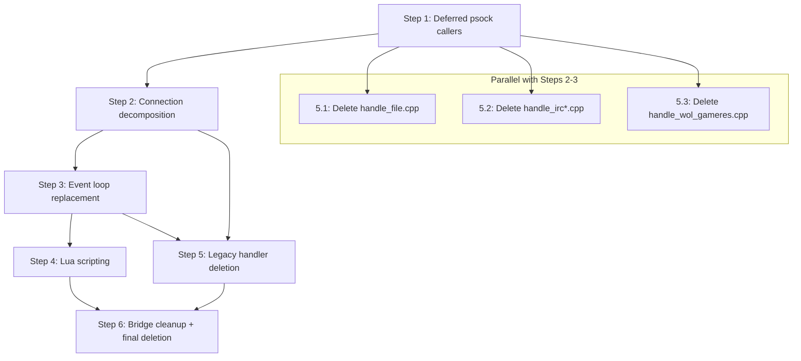

# Phase 3 — bnetd Server Logic Migration Checklist

> **Created:** Round 131 (2026-05-21)
> **Depends on:** Phase 2 ✅ COMPLETE (R130 — 5 FSMs, 161 tests, 851 assertions)
> **Reference:** [`plans/refactoring-plan-legacy-bnetd.md`](refactoring-plan-legacy-bnetd.md)
> **Scope:** Migrate `src/bnetd/` (152 files) into the v3 hexagonal architecture

---

## Current State Summary

### What Phase 2 Delivered

| Asset | Location | Status |
|-------|----------|--------|
| BnetFsm | `src/v3/protocol/bnet/` | ✅ R121 |
| BnftpFsm | `src/v3/protocol/file/` | ✅ R122 |
| WolFsm | `src/v3/protocol/wol/` | ✅ R123 |
| IrcFsm | `src/v3/protocol/irc/` | ✅ R127 |
| D2CSSessionFsm | `src/v3/protocol/d2cs/` | ✅ R124 |
| Composition root | `src/v3/app/bnetd/` | ✅ R125–R128 |
| SessionManager | `src/v3/app/bnetd/include/app/bnetd/session_manager.hpp` | ✅ R125 |
| TcpListener + TcpSession | `src/v3/app/bnetd/` | ✅ R126 |
| IoRuntime | `src/v3/infra/net/io_runtime.hpp` | ✅ R125 |
| BnetBnftpDispatchFactory | `src/v3/app/bnetd/src/main.cpp` | ✅ R128 |
| Strangler-fig bridges | `src/v3/integration/legacy_bnetd/` | ✅ R38–R130 |

### What Phase 1 Left Incomplete

| Item | Status | Notes |
|------|--------|-------|
| Step 8: 7 deferred psock callers | ✅ R133 | `server.cpp`, `connection.cpp` (bnetd); `server.cpp` (d2cs); `dbserver.cpp` (d2dbs); `fdwatch_select.cpp` (common) — all psock→POSIX, compiles clean |
| Step 10: TOML config | 🔄 Partial | `prefs_bridge` wired R120; ~300+ `prefs_get_*` callers in 38 files still use legacy |

### Legacy bnetd Inventory (src/bnetd/ — 152 files)

**Core lifecycle:** [`main.cpp`](../src/bnetd/main.cpp) (693 lines), [`server.cpp`](../src/bnetd/server.cpp) (2192 lines), [`connection.cpp`](../src/bnetd/connection.cpp) (4310 lines), [`connection.h`](../src/bnetd/connection.h) (511 lines)

**Protocol handlers (14 files):**
`handle_bnet.cpp`, `handle_bot.cpp`, `handle_telnet.cpp`, `handle_file.cpp`,
`handle_init.cpp`, `handle_irc.cpp`, `handle_irc_common.cpp`, `handle_wol.cpp`,
`handle_wserv.cpp`, `handle_wol_gameres.cpp`, `handle_udp.cpp`, `handle_d2cs.cpp`,
`handle_apireg.cpp`, `handle_anongame.cpp`

**Lua scripting (4 files):**
`luainterface.cpp`, `luafunctions.cpp`, `luaobjects.cpp`, `luawrapper.cpp`

**Storage (8 files):**
`storage.cpp`, `storage_file.cpp`, `storage_sql.cpp`, `sql_common.cpp`,
`sql_mysql.cpp`, `sql_sqlite3.cpp`, `sql_pgsql.cpp`, `sql_odbc.cpp`

**Domain/application (remaining ~50+ files):**
`account.cpp`, `account_wrap.cpp`, `channel.cpp`, `game.cpp`, `clan.cpp`,
`friends.cpp`, `team.cpp`, `ladder.cpp`, `realm.cpp`, `character.cpp`,
`message.cpp`, `command.cpp`, `adbanner.cpp`, `autoupdate.cpp`, `versioncheck.cpp`,
`news.cpp`, `mail.cpp`, `icons.cpp`, `i18n.cpp`, `tracker.cpp`, `userlog.cpp`,
`watch.cpp`, `timer.cpp`, `tick.cpp`, `prefs.cpp`, `ipban.cpp`, `helpfile.cpp`,
`topic.cpp`, `anongame.cpp`, `anongame_infos.cpp`, `anongame_maplists.cpp`,
`anongame_gameresult.cpp`, `anongame_wol.cpp`, `alias_command.cpp`,
`command_groups.cpp`, `output.cpp`, `support.cpp`, `runprog.cpp`,
`udptest_send.cpp`, `file.cpp`, `irc.cpp`, `quota.cpp`, `attrlayer.cpp`,
`attrgroup.cpp`, `game_conv.cpp`, `channel_conv.cpp`, `file_plain.cpp`,
`sql_dbcreator.cpp`

---

## Step 1 — Deferred psock.h Callers (bnetd side) ✅ R133 COMPLETE

> Finished Phase 1 Step 8 for all deferred psock callers.
> All `psock_*` / `PSOCK_*` / `t_psock_*` usages replaced with direct
> POSIX equivalents. All 5 files compile cleanly with zero errors.

### Files migrated in R133

| File | psock calls replaced | Build |
|------|---------------------|-------|
| [`src/common/fdwatch_select.cpp`](../src/common/fdwatch_select.cpp) | `t_psock_fd_set`→`fd_set`, `PSOCK_FD_*`→`FD_*`, `psock_select`→`select` | ✅ |
| [`src/bnetd/server.cpp`](../src/bnetd/server.cpp) | All `psock_socket/bind/listen/accept/close/shutdown/setsockopt/getsockopt/getsockname/recvfrom/ctl/errno`, all `PSOCK_*` constants | ✅ |
| [`src/bnetd/connection.cpp`](../src/bnetd/connection.cpp) | `psock_shutdown`→`shutdown`, `psock_close`→`close`, `PSOCK_SHUT_RDWR`→`SHUT_RDWR` | ✅ |
| [`src/d2cs/server.cpp`](../src/d2cs/server.cpp) | All psock calls + `psock_init()` removed (no-op on POSIX) | ✅ |
| [`src/d2dbs/dbserver.cpp`](../src/d2dbs/dbserver.cpp) | All psock calls + `psock_init()` removed (no-op on POSIX) | ✅ |

### POSIX headers added (under `#ifndef _WIN32`)

- `<sys/socket.h>`, `<sys/select.h>`, `<unistd.h>`, `<fcntl.h>`, `<errno.h>`, `<netinet/in.h>`
- `<netdb.h>` added to `src/bnetd/server.cpp` (for `gethostbyname`/`hostent` previously pulled in by `psock.h`)

### Key mappings applied

- `psock_ctl(fd, PSOCK_NONBLOCK)` → `fcntl(fd, F_SETFL, O_NONBLOCK)`
- `psock_errno()` → `errno`
- `psock_t_socklen` → `socklen_t`
- `t_psock_fd_set` → `fd_set`
- All `PSOCK_AF_*`, `PSOCK_PF_*`, `PSOCK_SOCK_*`, `PSOCK_SOL_*`, `PSOCK_SO_*`, `PSOCK_IPPROTO_*`, `PSOCK_E*` → POSIX equivalents

### 1.1 `server.cpp` psock migration

- [x] Audit all `psock_*` call sites in [`server.cpp`](../src/bnetd/server.cpp:40) (2192 lines)
- [x] Replace all psock calls with direct POSIX equivalents
- [x] Add POSIX headers under `#ifndef _WIN32` (including `<netdb.h>`)
- [x] Compiles cleanly

### 1.2 `connection.cpp` psock migration

- [x] Audit all `psock_*` call sites in [`connection.cpp`](../src/bnetd/connection.cpp:36) (4310 lines)
- [x] Replace `psock_shutdown`/`psock_close` with POSIX equivalents
- [x] Add POSIX headers under `#ifndef _WIN32`
- [x] Compiles cleanly

---

## Step 2 — Connection State Machine Decomposition

> Decompose the monolithic `t_connection` struct (511-line header, 4310-line impl)
> into focused v3 domain objects. The existing `v3_router` and `v3_owns_socket`
> fields are the strangler-fig seam.

### 2.1 Extract socket/transport layer

- [ ] Create `infra::net::ConnectionSocket` — owns `tcp_sock`, `udp_sock`, `fdw_idx`, addresses
- [ ] Move `socket` sub-struct fields from [`connection.h:117-129`](../src/bnetd/connection.h:117) into new type
- [ ] Provide `ConnectionSocket::send()` / `recv()` that delegate to either fdwatch or Asio
- [ ] Wire `v3_owns_socket` flag into `ConnectionSocket` destructor logic
- [ ] Unit tests for `ConnectionSocket` lifecycle

### 2.2 Extract protocol state

- [ ] Create `domain::ConnectionState` value type — `cclass`, `state`, `sessionkey`, `sessionnum`, `flags`
- [ ] Move `t_conn_class` and `t_conn_state` enums to `domain/shared/connection_state.hpp`
- [ ] Map legacy states to v3 FSM states: `conn_class_bnet` → `BnetFsm`, `conn_class_irc` → `IrcFsm`, etc.
- [ ] Create state transition table matching legacy `conn_set_state`/`conn_set_class` call sites
- [ ] Unit tests for state transitions

### 2.3 Extract client identity

- [ ] Create `domain::ClientIdentity` — `archtag`, `clienttag`, `gamelang`, `clientver`, `versionid`, `gameversion`
- [ ] Move `client` sub-struct fields from [`connection.h:139-155`](../src/bnetd/connection.h:139) into new type
- [ ] Provide `ClientIdentity` builder from init-packet data
- [ ] Unit tests

### 2.4 Extract chat/channel context

- [ ] Create `domain::ChatContext` — channel, away/dnd, ignore list, quota, IRC state
- [ ] Move `chat` sub-struct fields from [`connection.h:163-178`](../src/bnetd/connection.h:163) into new type
- [ ] Wire into existing `domain/chat/` types
- [ ] Unit tests

### 2.5 Extract game/realm context

- [ ] Create `domain::GameContext` — game pointer, D2 realm/character, W3 route/anongame
- [ ] Move `d2` and `w3` sub-structs from [`connection.h:185-203`](../src/bnetd/connection.h:185) into new type
- [ ] Move `wol` sub-struct from [`connection.h:204-211`](../src/bnetd/connection.h:204) into new type
- [ ] Unit tests

### 2.6 Create `v3::Session` aggregate

- [ ] Define `v3::Session` that composes `ConnectionSocket` + `ConnectionState` + `ClientIdentity` + `ChatContext` + `GameContext`
- [ ] Implement `ISessionContext` interface from [`session_manager.hpp`](../src/v3/app/bnetd/include/app/bnetd/session_manager.hpp:48)
- [ ] Create adapter: `LegacyConnectionAdapter` wrapping `t_connection*` → `v3::Session`
- [ ] Register adapted sessions in `SessionManager`
- [ ] Integration test: legacy connection lifecycle through v3 Session

### 2.7 Migrate `connlist` to `SessionManager`

- [ ] Route `connlist_find_connection_by_*` lookups through `SessionManager::find_session`
- [ ] Route `connlist_create`/`connlist_destroy` through `SessionManager`
- [ ] Migrate `connlist_reap` dead-connection cleanup to `SessionManager` GC
- [ ] Deprecate global `conn_head` / `conn_dead` vectors
- [ ] Integration tests for session lookup parity

---

## Step 3 — Server Event Loop Replacement

> Replace the legacy `fdwatch` + `server_process()` main loop with
> `IoRuntime` (Boost.Asio). The v3 composition root already has a
> working Asio event loop in [`src/v3/app/bnetd/src/main.cpp`](../src/v3/app/bnetd/src/main.cpp:330).

### 3.1 Audit fdwatch dependencies

- [ ] Count all `fdwatch_*` call sites across `src/bnetd/` (fdwatch_init, fdwatch_add_fd, fdwatch_del_fd, fdwatch_handle, fdwatch)
- [ ] Map each fdwatch consumer to its v3 equivalent (TcpListener, TcpSession, UdpEndpoint)
- [ ] Identify timer-based work in `_server_mainloop` that must move to Asio timers
- [ ] Document signal handling migration: POSIX signals → `IoRuntime::install_signal_handlers`

### 3.2 Migrate listen socket setup

- [ ] Move `_setup_add_addrs` + `_setup_listensock` logic into v3 `ServerConfig` + `TcpListener`
- [ ] Support all 8 listener types: bnet, w3route, irc, wolv1, wolv2, apireg, wgameres, telnet
- [ ] Wire address translation (`common/trans.h`) into v3 config
- [ ] Unit tests for multi-listener setup

### 3.3 Migrate accept loop

- [ ] Replace `handle_accept` fdwatch callback with `TcpListener::on_accept`
- [ ] Replace `sd_finalize_accepted` with v3 session factory
- [ ] Remove `server_handle_v3_accepted_bnet_socket` bridge (no longer needed)
- [ ] Remove `server_handle_v3_owned_bnet_socket` bridge (no longer needed)
- [ ] Integration test: accept → session creation → FSM dispatch

### 3.4 Migrate I/O dispatch

- [ ] Replace `handle_tcp` fdwatch callback with `TcpSession::on_bytes` / `on_close`
- [ ] Replace `handle_udp` fdwatch callback with `UdpEndpoint::on_datagram`
- [ ] Remove `conn_push_outqueue` / `conn_pull_outqueue` legacy queue — use Asio async_write
- [ ] Remove `conn_get_in_queue` / `conn_put_in_queue` — use Asio async_read + framer
- [ ] Integration test: full packet round-trip through Asio

### 3.5 Migrate timer system

- [ ] Replace `timerlist_check_timers` with Asio steady_timer
- [ ] Migrate `conn_shutdown` timer (initkill) to Asio timer
- [ ] Migrate `conn_test_latency` timer to Asio timer
- [ ] Migrate periodic tasks: `do_save`, `do_restart`, tracker updates
- [ ] Unit tests for timer accuracy

### 3.6 Migrate signal handling

- [ ] Replace `quit_sig_handle` / `restart_sig_handle` / `save_sig_handle` with Asio signal_set
- [ ] Implement graceful shutdown: stop listeners → drain sessions → cleanup
- [ ] Remove `server_quit_delay` / `sigexittime` mechanism
- [ ] Integration test: SIGTERM → graceful shutdown

### 3.7 Remove fdwatch dependency

- [ ] Remove `fdwatch_init` / `fdwatch_close` from `pre_server_startup` / `post_server_shutdown`
- [ ] Remove `common/fdwatch.h` includes from `connection.cpp` and `server.cpp`
- [ ] Remove `conn_add_fdwatch` function
- [ ] Verify no remaining fdwatch references in `src/bnetd/`

---

## Step 4 — Lua Scripting Integration

> Migrate the 4 Lua files to `infra/scripting/lua/` with a clean C++ API
> that does not depend on `t_connection*` or legacy globals.

### 4.1 Define v3 Lua API surface

- [ ] Audit [`luainterface.cpp`](../src/bnetd/luainterface.cpp) — enumerate all `lua_load`, `lua_unload`, `lua_handle_*` entry points
- [ ] Audit [`luafunctions.cpp`](../src/bnetd/luafunctions.cpp) — enumerate all C functions exposed to Lua scripts
- [ ] Audit [`luaobjects.cpp`](../src/bnetd/luaobjects.cpp) — enumerate all Lua object bindings (connection, account, channel, game, clan, team)
- [ ] Design `infra::scripting::IScriptEngine` interface
- [ ] Design `infra::scripting::LuaEngine` implementation
- [ ] Document backward-compatible Lua API contract (existing `lua/` scripts must work)

### 4.2 Implement v3 Lua bindings

- [ ] Create `src/v3/infra/scripting/lua/` directory structure
- [ ] Implement `LuaEngine::load()` / `unload()` / `reload()`
- [ ] Implement connection object binding using `v3::Session` instead of `t_connection*`
- [ ] Implement account/channel/game/clan/team bindings using v3 domain types
- [ ] Implement event hooks: `luaevent_server_mainloop`, `luaevent_server_rehash`, etc.
- [ ] Unit tests for each binding

### 4.3 Wire Lua into composition root

- [ ] Add `LuaEngine` to v3 `main.cpp` startup sequence
- [ ] Wire `lua_handle_server(luaevent_server_mainloop)` into Asio timer
- [ ] Wire `lua_handle_server(luaevent_server_rehash)` into SIGHUP handler
- [ ] Integration test: load `lua/config.lua` + `lua/main.lua` through v3 engine

---

## Step 5 — Legacy Handler Deletion

> Delete legacy `handle_*.cpp` files as v3 FSMs take over each protocol.
> Each deletion requires proving the v3 FSM handles all packet types
> that the legacy handler did.

### 5.1 Delete `handle_file.cpp` (BnftpFsm complete)

- [ ] Verify `BnftpFsm` handles `CLIENT_FILE_REQ` (0x01) — file download
- [ ] Verify `BnftpFsm` handles `CLIENT_FILE_REQ2` (0x02) — file download v2
- [ ] Run golden replay tests against BNFTP protocol
- [x] Delete [`src/bnetd/handle_file.cpp`](../src/bnetd/handle_file.cpp) and [`handle_file.h`](../src/bnetd/handle_file.h) — R132
- [x] Remove `handle_file.h` include + `handle_file_packet` call site from `server.cpp` — R132 (replaced with `// TODO(Phase3): handled by BnftpFsm`)
- [x] Update `CMakeLists.txt` — R132

### 5.2 Delete `handle_irc.cpp` + `handle_irc_common.cpp` (IrcFsm complete)

> **⏸️ DEFERRED (R132):** `handle_irc.cpp` is called from `handle_irc_common.cpp` (which calls
> `handle_irc_con_command` / `handle_irc_log_command`) and from `irc.cpp` (which calls
> `handle_irc_welcome`). These callers are outside `connection.cpp` and cannot be removed
> without also migrating `handle_irc_common.cpp` and `irc.cpp`. Defer until Step 3
> (event loop replacement) clears the `server.cpp` dispatch path.

- [ ] Verify `IrcFsm` handles all IRC commands: NICK, USER, JOIN, PART, PRIVMSG, QUIT, PING, PONG, etc.
- [ ] Verify `IrcFsm` handles WOL-specific IRC extensions
- [ ] Run golden replay tests against IRC protocol
- [ ] Delete [`src/bnetd/handle_irc.cpp`](../src/bnetd/handle_irc.cpp), [`handle_irc.h`](../src/bnetd/handle_irc.h)
- [ ] Delete [`src/bnetd/handle_irc_common.cpp`](../src/bnetd/handle_irc_common.cpp), [`handle_irc_common.h`](../src/bnetd/handle_irc_common.h)
- [ ] Update `CMakeLists.txt`

### 5.3 Delete `handle_wol_gameres.cpp` (WolFsm binary results)

- [ ] Verify `WolFsm` handles WOL game result binary packets
- [ ] Run golden replay tests against WOL gameres protocol
- [x] Delete [`src/bnetd/handle_wol_gameres.cpp`](../src/bnetd/handle_wol_gameres.cpp), [`handle_wol_gameres.h`](../src/bnetd/handle_wol_gameres.h) — R132
- [x] Remove `handle_wol_gameres.h` include + `handle_wol_gameres_packet` call site from `server.cpp` — R132 (replaced with `// TODO(Phase3): handled by WolFsm`)
- [x] Update `CMakeLists.txt` — R132

### 5.4 Delete `handle_wol.cpp` + `handle_wserv.cpp` (WolFsm complete)

- [ ] Verify `WolFsm` handles all WOL IRC commands
- [ ] Verify `WolFsm` handles WSERV (servserv) commands
- [ ] Delete [`src/bnetd/handle_wol.cpp`](../src/bnetd/handle_wol.cpp), [`handle_wol.h`](../src/bnetd/handle_wol.h)
- [ ] Delete [`src/bnetd/handle_wserv.cpp`](../src/bnetd/handle_wserv.cpp), [`handle_wserv.h`](../src/bnetd/handle_wserv.h)
- [ ] Update `CMakeLists.txt`

### 5.5 Delete `handle_telnet.cpp` (TelnetAdminFsm)

- [ ] Implement `TelnetAdminFsm` in `src/v3/protocol/telnet/`
- [ ] Handle login flow: username prompt → password prompt → authenticated
- [ ] Handle command dispatch post-login
- [ ] Run golden replay tests
- [ ] Delete [`src/bnetd/handle_telnet.cpp`](../src/bnetd/handle_telnet.cpp), [`handle_telnet.h`](../src/bnetd/handle_telnet.h)
- [ ] Update `CMakeLists.txt`

### 5.6 Delete `handle_bot.cpp` (BotProtocolFsm)

- [ ] Implement `BotProtocolFsm` in `src/v3/protocol/bnet/` (bot is a text-mode variant of bnet)
- [ ] Handle bot login: username → password → ENTER CHAT
- [ ] Handle bot commands post-login
- [ ] Run golden replay tests
- [ ] Delete [`src/bnetd/handle_bot.cpp`](../src/bnetd/handle_bot.cpp), [`handle_bot.h`](../src/bnetd/handle_bot.h)
- [ ] Update `CMakeLists.txt`

### 5.7 Delete `handle_init.cpp` (ConnectionClassifier)

- [ ] Verify v3 `BnetBnftpDispatchFactory` handles byte-1 dispatch for 0xFF/0x01
- [ ] Extend dispatch for all `conn_class_*` types: bnet, file, bot, telnet, ircinit, d2cs_bnetd, w3route
- [ ] Remove `handle_init_packet` legacy function
- [ ] Delete [`src/bnetd/handle_init.cpp`](../src/bnetd/handle_init.cpp), [`handle_init.h`](../src/bnetd/handle_init.h)
- [ ] Update `CMakeLists.txt`

### 5.8 Delete `handle_bnet.cpp` (BnetFsm covers all SIDs)

- [ ] Audit all SID handlers in `handle_bnet.cpp` — verify each has a v3 FSM equivalent
- [ ] Verify strangler-fig bridges are no longer needed (v3 FSM handles inbound + outbound)
- [ ] Run full golden replay test suite
- [ ] Delete [`src/bnetd/handle_bnet.cpp`](../src/bnetd/handle_bnet.cpp), [`handle_bnet.h`](../src/bnetd/handle_bnet.h)
- [ ] Update `CMakeLists.txt`

### 5.9 Delete remaining handlers

- [ ] Delete `handle_udp.cpp` / `handle_udp.h` (after UdpEndpoint handles all UDP)
- [ ] Delete `handle_d2cs.cpp` / `handle_d2cs.h` (after D2CS integration complete)
- [ ] Delete `handle_apireg.cpp` / `handle_apireg.h` (after API registration migrated)
- [ ] Delete `handle_anongame.cpp` / `handle_anongame.h` (after anongame use cases migrated)

---

## Step 6 — Integration Bridge Cleanup + Final Deletion

> Remove all strangler-fig scaffolding and delete the entire `src/bnetd/` directory.

### 6.1 Remove strangler-fig bridges

- [ ] Remove `integration/legacy_bnetd/udp_bridge.hpp/.cpp`
- [ ] Remove `integration/legacy_bnetd/tcp_bridge.hpp/.cpp`
- [ ] Remove `integration/legacy_bnetd/prefs_bridge.hpp/.cpp`
- [ ] Remove `integration/legacy_bnetd/legacy_event_logger.hpp/.cpp`
- [ ] Remove `integration/legacy_bnetd/legacy_chat_reply_sink.hpp/.cpp`
- [ ] Remove `integration/legacy_bnetd/chat_reply_sink_override.hpp/.cpp`
- [ ] Remove `integration/legacy_bnetd/install_v3_handlers.hpp/.cpp`
- [ ] Remove `integration/legacy_bnetd/strangler_macros.h`
- [ ] Remove all `extern "C" pvpgn_v3_*` hook declarations from `connection.cpp` and `server.cpp`
- [ ] Remove `PVPGN_V3_BNETD_INTEGRATION` conditional blocks from `main.cpp`

### 6.2 Migrate prefs callers

- [ ] Audit all `prefs_get_*` call sites (~300+ across 38 files)
- [ ] Create `LegacyPrefs` adapter: `prefs_get_*` → `ServerConfig` field lookup
- [ ] Migrate callers file-by-file (prioritize by dependency order)
- [ ] Delete [`src/bnetd/prefs.cpp`](../src/bnetd/prefs.cpp) / [`prefs.h`](../src/bnetd/prefs.h)
- [ ] Install TOML templates via `conf/CMakeLists.txt`

### 6.3 Migrate storage backends

- [ ] Create `infra::persistence::IStorageBackend` interface
- [ ] Implement `infra::persistence::FlatFileBackend` (from `storage_file.cpp` + `file_plain.cpp`)
- [ ] Implement `infra::persistence::SqliteBackend` (from `sql_sqlite3.cpp`)
- [ ] Implement `infra::persistence::MysqlBackend` (from `sql_mysql.cpp`)
- [ ] Implement `infra::persistence::PgsqlBackend` (from `sql_pgsql.cpp`)
- [ ] Implement `infra::persistence::OdbcBackend` (from `sql_odbc.cpp`)
- [ ] Migrate `storage_init` / `storage_close` to composition root
- [ ] Integration tests against all backends
- [ ] Delete legacy storage files (8 files)

### 6.4 Migrate remaining domain/application files

- [ ] `adbanner.cpp/.h` → `application/adbanner/`
- [ ] `autoupdate.cpp/.h` → `application/autoupdate/`
- [ ] `versioncheck.cpp/.h` → `application/versioncheck/`
- [ ] `news.cpp/.h` → `application/news/`
- [ ] `mail.cpp/.h` → `application/mail/`
- [ ] `icons.cpp/.h` → `application/icon_table/`
- [ ] `i18n.cpp/.h` → `application/i18n/`
- [ ] `tracker.cpp/.h` → `infra/tracker/`
- [ ] `userlog.cpp/.h` → `infra/audit/`
- [ ] `watch.cpp/.h` → `application/watch/`
- [ ] `helpfile.cpp/.h` → `application/i18n/`
- [ ] `alias_command.cpp/.h` → `application/chat/`
- [ ] `command_groups.cpp/.h` → `application/auth/`
- [ ] `output.cpp/.h` → `infra/logging/`
- [ ] `support.cpp/.h` → `application/support/`
- [ ] `runprog.cpp/.h` → `infra/process/`
- [ ] `topic.cpp/.h` → `domain/chat/`
- [ ] `character.cpp/.h` → `domain/realm/`
- [ ] `channel_conv.cpp/.h` → `domain/chat/`
- [ ] `game_conv.cpp/.h` → `domain/gameplay/`
- [ ] `udptest_send.cpp/.h` → `tools/`
- [ ] `anongame_infos.cpp/.h` → `application/anongame/`
- [ ] `anongame_maplists.cpp/.h` → `infra/legacy_config/`
- [ ] `anongame_gameresult.cpp/.h` → `application/game/`
- [ ] `anongame_wol.cpp/.h` → `protocol/wolgameres/`

### 6.5 Delete `src/bnetd/` directory

- [ ] Verify all 152 files have v3 equivalents or are obsolete
- [ ] Delete `src/bnetd/connection.cpp` / `connection.h`
- [ ] Delete `src/bnetd/server.cpp` / `server.h`
- [ ] Delete `src/bnetd/main.cpp`
- [ ] Delete entire `src/bnetd/` directory
- [ ] Remove `bnetd_legacy` static library target from CMake
- [ ] Remove all `PVPGN_V3_BNETD_INTEGRATION` cmake option and guards
- [ ] Update top-level `CMakeLists.txt` to build only `pvpgn_v3_bnetd`
- [ ] Full CI green: all unit tests + integration tests + e2e smoke tests pass

---

## Migration Order

**Key insight:** Steps 5.1–5.3 (handler deletions for complete FSMs) can proceed
in parallel with Steps 2–3 because those handlers are already fully superseded
by v3 FSMs. The remaining handler deletions (5.4–5.9) depend on Step 2
(connection decomposition) being sufficiently advanced.

## Complexity Ratings

| Step | Complexity | Key Risk |
|------|-----------|----------|
| 1 — Deferred psock callers | Medium | Interleaved with fdwatch; must not break legacy I/O |
| 2 — Connection decomposition | **High** | 4310-line monolith; 100+ accessor functions; global connlist |
| 3 — Event loop replacement | **High** | 2192-line server.cpp; fdwatch → Asio; signal handling |
| 4 — Lua scripting | Medium | Backward compat with existing lua/ scripts; C binding surface |
| 5 — Legacy handler deletion | Low–Medium | Per-handler; golden replay tests gate each deletion |
| 6 — Bridge cleanup | Medium | ~300+ prefs callers; 8 storage files; 25+ domain files |

## Cross-References

- [`plans/refactoring-plan-legacy-bnetd.md`](refactoring-plan-legacy-bnetd.md) — Master migration plan (8 steps)
- [`plans/refactoring-plan-overview.md`](refactoring-plan-overview.md) — 7-phase overview
- [`plans/progress-master.md`](progress-master.md) — Round-by-round progress log
- [`plans/step8-networking-checklist.md`](step8-networking-checklist.md) — Deferred psock callers detail
- [`plans/step10-toml-checklist.md`](step10-toml-checklist.md) — TOML config migration status
- [`plans/phase2-fsm-checklist.md`](phase2-fsm-checklist.md) — Phase 2 FSM completion checklist
