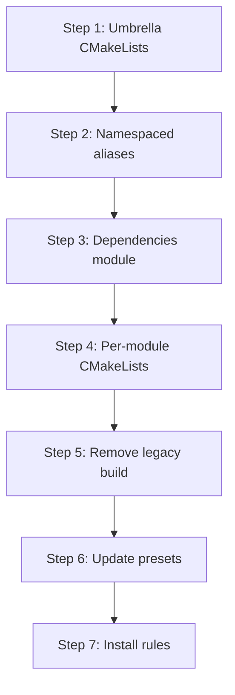

# Refactoring Plan: Build System Consolidation

## Scope

Consolidate the dual CMake build system (legacy C++11 + v3 C++20) into a single unified build rooted in `src/v3/`. Remove the `PVPGN_BUILD_LEGACY` / `PVPGN_BUILD_V3` split.

## Current Build Architecture

### Root CMakeLists.txt

The root [`CMakeLists.txt`](CMakeLists.txt) currently manages two parallel build trees:

```
PVPGN_BUILD_LEGACY=ON  → src/ (C++11, legacy)
PVPGN_BUILD_V3=ON      → src/v3/ (C++20, hexagonal)
```

Key characteristics:
- Project version: 4.0.0
- Legacy: C++11, platform-specific `#ifdef` blocks, `setup_before.h`/`setup_after.h`
- v3: C++20, `cmake/v3.cmake` helper with `pvpgn_v3_add_library()` and `pvpgn_v3_add_test()`
- MSVC gets special handling for UNICODE defines (legacy needs them, v3 does not)

### cmake/v3.cmake Helper

The [`cmake/v3.cmake`](cmake/v3.cmake) module provides:
- `pvpgn_v3_apply_flags()` — C++20 standard, strict warnings, sanitizers, coverage
- `pvpgn_v3_add_library()` — Standardized library creation with INTERFACE/STATIC support
- `pvpgn_v3_add_test()` — Test target creation with Catch2

### Third-Party Dependencies

| Dependency | Legacy | v3 | Resolution |
|------------|--------|-----|------------|
| zlib | System find | FetchContent fallback | Keep FetchContent approach |
| fmt | FetchContent or system | Not used (uses `std::format`) | Remove after legacy deletion |
| spdlog | Not used | FetchContent | Keep |
| toml++ | Not used | FetchContent | Keep |
| Boost | Not used | System find (Asio, Fiber) | Keep |
| Catch2 | Not used | FetchContent | Keep |
| pugixml | Bundled in src/common | FetchContent | Switch to FetchContent |
| ankerl/unordered_dense | Not used | FetchContent | Keep |
| OpenSSL | Not used | System find | Keep |
| MySQL client | System find | Not yet | Add system find |
| SQLite3 | System find | Not yet | Add system find |
| PostgreSQL | System find | Not yet | Add system find |
| ODBC | System find | Not yet | Add system find |
| Lua | System find | FetchContent in scripting | Keep |

## Target Build Architecture

### Phase 1: Intermediate State (During Migration)

Keep the dual-tree build but improve it:

1. **Move `ConfigureChecks.cmake` logic into `cmake/`** — Currently at root level, only needed by legacy
2. **Create `cmake/FindMySQL.cmake`** etc. for v3 storage backends
3. **Ensure both trees can build independently** — `PVPGN_BUILD_LEGACY=ON PVPGN_BUILD_V3=OFF` and vice versa

### Phase 2: Final State (After Migration Complete)

Single unified build:

```
CMakeLists.txt                    # Root: project definition, options, dependencies
cmake/
  v3.cmake                       # Build helpers (rename to pvpgn.cmake)
  FindMySQL.cmake                # MySQL client finder
  FindSQLite3.cmake              # SQLite3 finder
  FindPostgreSQL.cmake           # PostgreSQL finder
  FindODBC.cmake                 # ODBC finder
  Modules/                       # Additional CMake modules
src/v3/
  CMakeLists.txt                 # Main source tree entry point
  core/CMakeLists.txt
  domain/CMakeLists.txt          # [NEW] Umbrella for all domain modules
  application/CMakeLists.txt     # [NEW] Umbrella for all application modules
  protocol/CMakeLists.txt        # [NEW] Umbrella for all protocol modules
  infra/CMakeLists.txt           # [NEW] Umbrella for all infra modules
  integration/CMakeLists.txt     # [NEW] Umbrella for all integration modules
  runtime/CMakeLists.txt
  services/CMakeLists.txt        # [NEW] Umbrella for all service compositions
  scripting/CMakeLists.txt
  tools/CMakeLists.txt           # [NEW] Umbrella for all tools
tests/
  CMakeLists.txt                 # Test root
  unit/CMakeLists.txt
  functional/CMakeLists.txt
  e2e/CMakeLists.txt
  fuzz/CMakeLists.txt
```

### New Root CMakeLists.txt Structure

```cmake
cmake_minimum_required(VERSION 3.20)
project(pvpgn VERSION 4.0.0 LANGUAGES CXX)

set(CMAKE_CXX_STANDARD 20)
set(CMAKE_CXX_STANDARD_REQUIRED ON)
set(CMAKE_CXX_EXTENSIONS OFF)

list(APPEND CMAKE_MODULE_PATH "${CMAKE_SOURCE_DIR}/cmake")
include(pvpgn.cmake)  # Renamed from v3.cmake

# ---- Options -------------------------------------------------------
option(PVPGN_BUILD_TESTS    "Build unit/functional/e2e tests"     ON)
option(PVPGN_BUILD_FUZZ     "Build fuzz targets"                  OFF)
option(PVPGN_WITH_SPDLOG    "Use spdlog for structured logging"   ON)
option(PVPGN_WITH_TOMLPP    "Use toml++ for configuration"        ON)
option(PVPGN_WITH_BOOST     "Use Boost for networking"            ON)
option(PVPGN_WITH_FIBER     "Enable Boost.Fiber concurrency"      OFF)
option(PVPGN_WITH_MYSQL     "Enable MySQL storage backend"        OFF)
option(PVPGN_WITH_SQLITE3   "Enable SQLite3 storage backend"      OFF)
option(PVPGN_WITH_PGSQL     "Enable PostgreSQL storage backend"   OFF)
option(PVPGN_WITH_ODBC      "Enable ODBC storage backend"         OFF)
option(PVPGN_WITH_LUA       "Enable Lua scripting"                OFF)
option(PVPGN_WITH_WEBUI     "Enable web UI and REST API"          ON)
if(WIN32)
    option(PVPGN_WITH_GUI   "Enable Windows GUI"                  ON)
endif()

# ---- Dependencies --------------------------------------------------
include(FetchContent)
# ... (spdlog, toml++, Catch2, ankerl, zlib, pugixml, etc.)

# ---- Source tree ---------------------------------------------------
add_subdirectory(src/v3)

# ---- Tests ---------------------------------------------------------
if(PVPGN_BUILD_TESTS)
    enable_testing()
    include(CTest)
    add_subdirectory(tests)
endif()

# ---- Configuration files -------------------------------------------
add_subdirectory(conf)
add_subdirectory(files)

# ---- Install -------------------------------------------------------
# ... install rules for binaries, configs, man pages
```

## Detailed Migration Steps

### Step 1: Create Umbrella CMakeLists.txt Files

Currently, `src/v3/CMakeLists.txt` is a single 999-line file that defines every library target. Split it into per-layer umbrella files:

```cmake
# src/v3/CMakeLists.txt (simplified)
add_subdirectory(core)
add_subdirectory(domain)
add_subdirectory(application)
add_subdirectory(protocol)
add_subdirectory(infra)
add_subdirectory(integration)
add_subdirectory(runtime)
add_subdirectory(services)
add_subdirectory(scripting)
add_subdirectory(tools)
```

Each subdirectory gets its own `CMakeLists.txt`:

```cmake
# src/v3/domain/CMakeLists.txt
add_subdirectory(shared)
add_subdirectory(identity)
add_subdirectory(chat)
add_subdirectory(social)
add_subdirectory(gameplay)
add_subdirectory(ladder)
add_subdirectory(moderation)
add_subdirectory(matchmaking)
add_subdirectory(realm)
```

And each module gets its own `CMakeLists.txt`:

```cmake
# src/v3/domain/identity/CMakeLists.txt
pvpgn_v3_add_library(domain_identity
    SOURCES
        src/attribute_map.cpp
    PUBLIC_INCLUDES
        ${CMAKE_CURRENT_SOURCE_DIR}/include
    PUBLIC_DEPS
        core
        domain_shared
)
```

### Step 2: Standardize Target Naming

Current naming is flat: `core`, `domain_identity`, `application_auth`, `protocol_bnet`, etc.

Adopt namespaced aliases for cleaner dependency declarations:

```cmake
# After creating target 'domain_identity':
add_library(pvpgn::domain::identity ALIAS domain_identity)
```

This allows consumers to write:
```cmake
target_link_libraries(my_target PRIVATE pvpgn::domain::identity)
```

### Step 3: Move Third-Party Dependency Management

Create a dedicated `cmake/dependencies.cmake` that handles all FetchContent declarations:

```cmake
# cmake/dependencies.cmake
include(FetchContent)

# Each dependency in its own function for clarity
function(pvpgn_fetch_spdlog)
    # ...
endfunction()

function(pvpgn_fetch_tomlpp)
    # ...
endfunction()

function(pvpgn_fetch_catch2)
    # ...
endfunction()

# ... etc.
```

### Step 4: Create Per-Module CMakeLists.txt

For each module that currently has its target defined in the monolithic `src/v3/CMakeLists.txt`, create a local `CMakeLists.txt`. Many modules already have one (e.g., `application/auth/CMakeLists.txt`), but some don't.

Modules needing new `CMakeLists.txt`:
- `core/`
- `domain/shared/`
- `domain/chat/`
- `domain/social/`
- `domain/gameplay/`
- `domain/ladder/`
- `domain/moderation/`
- `domain/matchmaking/`
- `protocol/common/`
- `protocol/bnet/`
- `protocol/irc/`
- `protocol/udp/`
- `protocol/telnet/`
- `protocol/file/`
- `protocol/d2gs/`
- `protocol/wolgameres/`
- `infra/compression/`
- `infra/config/`
- `infra/log/`
- `infra/legacy_config/`
- `infra/legacy_crypto/`
- `infra/audit/`
- `infra/inmemory/`
- `infra/routing/`
- `infra/session/`
- `infra/net/`
- `infra/metrics/`
- `infra/webui/`
- `integration/legacy_bnetd/`
- `runtime/`

### Step 5: Remove Legacy Build Infrastructure

Once all legacy code is migrated:

1. Delete `src/CMakeLists.txt`
2. Delete `ConfigureChecks.cmake`
3. Delete `config.h.cmake`
4. Remove `PVPGN_BUILD_LEGACY` and `PVPGN_BUILD_V3` options
5. Remove UNICODE/`_UNICODE` handling for MSVC
6. Remove `fmt` dependency (v3 uses `std::format` or spdlog's bundled fmt)
7. Remove legacy compiler version checks (G++ 5.1, VS 2015)
8. Update minimum CMake version to 3.20 (for C++20 support)
9. Update minimum compiler requirements: GCC 12+, Clang 15+, MSVC 19.30+

### Step 6: CMake Presets Update

Update [`CMakePresets.json`](CMakePresets.json) to reflect the new unified build:

```json
{
    "version": 6,
    "configurePresets": [
        {
            "name": "default",
            "binaryDir": "${sourceDir}/build",
            "cacheVariables": {
                "CMAKE_BUILD_TYPE": "Debug",
                "PVPGN_BUILD_TESTS": "ON"
            }
        },
        {
            "name": "release",
            "binaryDir": "${sourceDir}/build-release",
            "cacheVariables": {
                "CMAKE_BUILD_TYPE": "Release",
                "PVPGN_BUILD_TESTS": "OFF"
            }
        },
        {
            "name": "ci",
            "binaryDir": "${sourceDir}/build-ci",
            "cacheVariables": {
                "CMAKE_BUILD_TYPE": "Debug",
                "PVPGN_BUILD_TESTS": "ON",
                "PVPGN_WITH_SQLITE3": "ON",
                "PVPGN_WITH_LUA": "ON"
            }
        }
    ]
}
```

### Step 7: Install Rules

Consolidate install rules:

```cmake
# Executables
install(TARGETS pvpgn-bnetd pvpgn-d2cs pvpgn-d2dbs pvpgn-combined
        DESTINATION ${CMAKE_INSTALL_SBINDIR})

# Tools
install(TARGETS bni2tga bnibuild bnpass bntrackd
        DESTINATION ${CMAKE_INSTALL_BINDIR})

# Configuration
install(DIRECTORY conf/ DESTINATION ${CMAKE_INSTALL_SYSCONFDIR}/pvpgn
        PATTERN "*.in" EXCLUDE)

# Man pages
install(DIRECTORY man/ DESTINATION ${CMAKE_INSTALL_MANDIR})
```

## Migration Order



Steps 1-4 can be done **during** the code migration (they're backward compatible). Steps 5-7 happen **after** all legacy code is migrated.

## CI/CD Considerations

The build system changes affect CI pipelines:

1. **GitHub Actions** (`.github/`) — Update build matrix to test v3-only builds
2. **Travis CI** (`.travis.yml`) — Update or remove (may be superseded by GitHub Actions)
3. **AppVeyor** (`appveyor.yml`) — Update Windows build configuration
4. **Test matrix** — Ensure all storage backends are tested in CI
