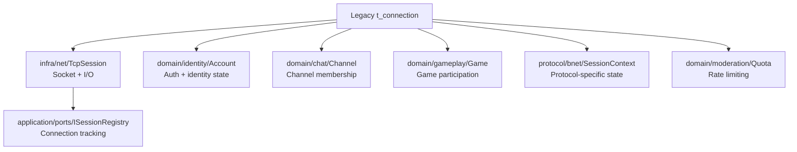
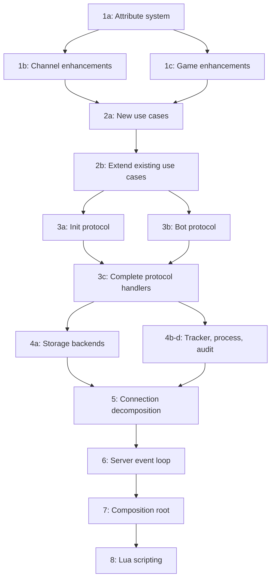

# Refactoring Plan: Legacy bnetd Migration

## Scope

Migrate `src/bnetd/` (140+ files, ~706-line main.cpp, massive `connection.h` with 510+ lines) into the v3 hexagonal architecture. This is the largest and most complex phase of the refactoring.

## Current State

### What Already Exists in v3

The v3 tree already has significant coverage of bnetd functionality:

| v3 Module | Coverage | Legacy Equivalent |
|-----------|----------|-------------------|
| `domain/identity/` | Account aggregate with login, ban, password, command groups | `account.cpp/.h`, `account_wrap.cpp/.h` |
| `domain/chat/` | Channel aggregate, whisper | `channel.cpp/.h`, `message.cpp/.h` |
| `domain/social/` | FriendList, Clan, Team | `friends.cpp/.h`, `clan.cpp/.h`, `team.cpp/.h` |
| `domain/gameplay/` | Game aggregate | `game.cpp/.h` |
| `domain/ladder/` | Ladder calculator | `ladder.cpp/.h`, `ladder_calc.cpp/.h` |
| `domain/moderation/` | IpBanList, Quota | `ipban.cpp/.h`, `quota.h` |
| `domain/matchmaking/` | AnonGameQueue, Tournament | `anongame.cpp/.h`, `tournament.cpp/.h` |
| `application/auth/` | Login, Logout, CreateAccount, ChangePassword, AccountLock, PermissionChecker | `handle_bnet.cpp` auth portions |
| `application/chat/` | JoinChannel, PostMessage, Whisper, Commands, BanFromChannel, etc. | `command.cpp/.h`, `message.cpp/.h` |
| `application/game/` | StartGame, JoinGame, LeaveGame, ReportGameResult | `game.cpp/.h` |
| `application/moderation/` | BanAccount, BanIP, KickConnection, SilenceUser | `ipban.cpp/.h`, `command.cpp` |
| `application/social/` | AddFriend, CreateClan, InviteToClan, etc. | `friends.cpp/.h`, `clan.cpp/.h` |
| `protocol/bnet/` | Codec, FSM, anongame, event dispatcher | `handle_bnet.cpp`, `handle_anongame.cpp` |
| `protocol/irc/` | Codec, FSM, bridge FSM | `handle_irc.cpp`, `irc.cpp` |
| `protocol/telnet/` | Codec, admin FSM | `handle_telnet.cpp` |
| `protocol/file/` | Codec, BNFTP FSM | `handle_file.cpp` |
| `protocol/udp/` | Codec | `handle_udp.cpp` |
| `protocol/wolgameres/` | Codec, WOL FSM | `handle_wol.cpp`, `handle_wol_gameres.cpp` |
| `integration/legacy_bnetd/` | Strangler-fig bridges for 20+ packet handlers | Bridges to legacy code |

### What Still Needs Migration

The following bnetd functionality has **no v3 equivalent yet**:

| Legacy File | Functionality | Target v3 Location |
|-------------|---------------|-------------------|
| `connection.cpp/.h` | Connection state machine, 510+ line header | `domain/shared/` + `infra/net/` |
| `server.cpp/.h` | Main event loop, signal handling | `runtime/` + `infra/net/` |
| `prefs.cpp/.h` | Configuration preferences | `infra/config/` |
| `cmdline.cpp/.h` | Command-line parsing | `runtime/` |
| `main.cpp` | Entry point, initialization | `services/bnetd/` |
| `storage.cpp/.h` | Storage backend abstraction | `infra/persistence/` |
| `storage_file.cpp/.h` | Flat-file storage | `infra/file/` |
| `storage_sql.cpp/.h` | SQL storage abstraction | `infra/persistence/` |
| `sql_common.cpp/.h` | SQL utilities | `infra/persistence/` |
| `sql_mysql.cpp/.h` | MySQL backend | `infra/mysql/` |
| `sql_sqlite3.cpp/.h` | SQLite3 backend | `infra/sqlite/` |
| `sql_pgsql.cpp/.h` | PostgreSQL backend | `infra/postgres/` |
| `sql_odbc.cpp/.h` | ODBC backend | `infra/odbc/` |
| `sql_dbcreator.cpp/.h` | DB schema creation | `infra/migrations/` |
| `file_plain.cpp/.h` | Plain-text file storage | `infra/file/` |
| `file.cpp/.h` | File serving | `infra/file/` |
| `attrgroup.cpp/.h` | Attribute group management | `domain/identity/` |
| `attrlayer.cpp/.h` | Attribute layering | `domain/identity/` |
| `attr.h` | Attribute definitions | `domain/identity/` |
| `adbanner.cpp/.h` | Ad banner rotation | `application/adbanner/` |
| `autoupdate.cpp/.h` | Client auto-update | `application/autoupdate/` |
| `versioncheck.cpp/.h` | Client version verification | `application/versioncheck/` |
| `channel_conv.cpp/.h` | Channel name conversion | `domain/chat/` |
| `game_conv.cpp/.h` | Game type conversion | `domain/gameplay/` |
| `character.cpp/.h` | D2 character handling | `domain/realm/` |
| `handle_init.cpp/.h` | Connection init handler | `protocol/bnet/` |
| `handle_bot.cpp/.h` | Bot protocol handler | `protocol/bnet/` |
| `handle_d2cs.cpp/.h` | D2CS communication | `integration/d2cs/` |
| `handle_apireg.cpp/.h` | API registration | `infra/webui/` |
| `handle_wserv.cpp/.h` | Westwood server handler | `protocol/wolgameres/` |
| `handle_irc_common.cpp/.h` | Shared IRC handling | `protocol/irc/` |
| `helpfile.cpp/.h` | Help file loading | `application/i18n/` |
| `i18n.cpp/.h` | Internationalization | `application/i18n/` |
| `icons.cpp/.h` | Icon management | `application/icon_table/` |
| `mail.cpp/.h` | In-game mail | `application/mail/` |
| `news.cpp/.h` | News/MOTD | `application/news/` |
| `output.cpp/.h` | Output formatting | `infra/logging/` |
| `realm.cpp/.h` | Realm management | `domain/realm/` |
| `runprog.cpp/.h` | External program execution | `infra/process/` |
| `support.cpp/.h` | Support file serving | `application/support/` |
| `tick.cpp/.h` | Timer tick management | `infra/net/` scheduler |
| `timer.cpp/.h` | Timer events | `core/scheduler.hpp` |
| `topic.cpp/.h` | Channel topics | `domain/chat/` |
| `tracker.cpp/.h` | Server tracker | `infra/tracker/` |
| `udptest_send.cpp/.h` | UDP test utility | `tools/` |
| `userlog.cpp/.h` | User activity logging | `infra/audit/` |
| `watch.cpp/.h` | Watch notifications | `application/watch/` |
| `anongame_infos.cpp/.h` | Anongame info management | `application/anongame_infoply/` |
| `anongame_maplists.cpp/.h` | Map list management | `infra/legacy_config/` |
| `anongame_gameresult.cpp/.h` | Game result processing | `application/game/` |
| `anongame_wol.cpp/.h` | WOL anongame | `protocol/wolgameres/` |
| `alias_command.cpp/.h` | Command aliases | `application/chat/` |
| `command_groups.cpp/.h` | Permission groups | `application/auth/` |
| `lua*.cpp/.h` | Lua scripting integration | `infra/scripting/lua/` |

## Migration Strategy

### Principle: Inside-Out Migration

Migrate from the **domain core outward**:

1. **Domain aggregates** — Pure logic, no I/O dependencies
2. **Application use cases** — Orchestrate domain + ports
3. **Protocol handlers** — Wire format ↔ use case translation
4. **Infrastructure adapters** — Concrete I/O implementations
5. **Composition root** — Wire everything together

### Step 1: Complete Domain Layer

#### 1a. Attribute System

The legacy attribute system (`attrgroup.cpp/.h`, `attrlayer.cpp/.h`, `attr.h`) is the backbone of account persistence. The v3 `domain/identity/attribute_map.hpp` already exists but needs completion:

- Migrate attribute key constants from `attr.h`
- Implement attribute layering (default → user → runtime) in `domain/identity/`
- Add typed attribute accessors matching legacy `accountlist_*` functions

#### 1b. Channel Enhancements

- Migrate `channel_conv.cpp/.h` channel name normalization into `domain/chat/channel.hpp`
- Migrate `topic.cpp/.h` into `domain/chat/channel.hpp` as a Channel method

#### 1c. Game Enhancements

- Migrate `game_conv.cpp/.h` game type conversion into `domain/gameplay/game.hpp`
- Migrate `anongame_gameresult.cpp/.h` result processing into `domain/gameplay/`

### Step 2: Complete Application Layer

#### 2a. New Use Cases

Create these new application-layer modules:

```
application/adbanner/          # Ad banner rotation logic
  include/application/adbanner/
    rotate_banner.hpp
    banner_repository.hpp      # Port interface
  src/
    rotate_banner.cpp

application/autoupdate/        # Client version check + update
  include/application/autoupdate/
    check_version.hpp
    update_repository.hpp      # Port interface
  src/
    check_version.cpp

application/versioncheck/      # Version verification
  include/application/versioncheck/
    verify_client.hpp
  src/
    verify_client.cpp

application/mail/              # In-game mail
  include/application/mail/
    send_mail.hpp
    read_mail.hpp
    mail_repository.hpp        # Port interface
  src/
    send_mail.cpp
    read_mail.cpp

application/news/              # News/MOTD
  include/application/news/
    get_news.hpp
    news_repository.hpp        # Port interface
  src/
    get_news.cpp

application/watch/             # Watch notifications
  include/application/watch/
    add_watch.hpp
    notify_watchers.hpp
  src/
    add_watch.cpp
    notify_watchers.cpp

application/support/           # Support file serving
  include/application/support/
    serve_support_file.hpp
  src/
    serve_support_file.cpp
```

#### 2b. Extend Existing Use Cases

- `application/auth/` — Add command group management from `command_groups.cpp/.h`
- `application/chat/` — Add alias command support from `alias_command.cpp/.h`
- `application/i18n/` — Integrate `helpfile.cpp/.h` and `i18n.cpp/.h`

### Step 3: Complete Protocol Layer

#### 3a. Init Protocol Handler

Migrate `handle_init.cpp/.h` — the connection classification logic that determines whether an incoming connection is bnet, IRC, telnet, file transfer, etc.

Target: `protocol/bnet/include/protocol/bnet/init_handler.hpp`

This is critical because it's the first packet handler that runs on every new connection.

#### 3b. Bot Protocol Handler

Migrate `handle_bot.cpp/.h` — the text-based bot protocol.

Target: `protocol/bnet/include/protocol/bnet/bot_handler.hpp`

#### 3c. Complete Existing Protocol Handlers

Several protocol FSMs have disabled source files:
- `protocol/telnet/src/admin_fsm.cpp` — disabled, missing `command_registry.hpp`
- `protocol/file/src/bnftp_fsm.cpp` — disabled, missing `session_context.hpp`

These need their dependencies resolved and re-enabled.

### Step 4: Complete Infrastructure Layer

#### 4a. Storage Backends

The v3 tree already has stubs for multiple storage backends. Complete them:

```
infra/file/                    # Flat-file storage (from file_plain.cpp, storage_file.cpp)
  Already exists with account_repository, flat_db_reader, ip_ban_repository

infra/sqlite/                  # SQLite storage (from sql_sqlite3.cpp)
  Already exists with account_ban_repository, account_repository, etc.

infra/mysql/                   # MySQL storage (from sql_mysql.cpp)
  Already has stubs - needs implementation

infra/postgres/                # PostgreSQL storage (from sql_pgsql.cpp)
  Already has stubs - needs implementation

infra/odbc/                    # [NEW] ODBC storage (from sql_odbc.cpp)
  include/infra/odbc/
    account_repository.hpp
    connection.hpp
    unit_of_work_factory.hpp
  src/
    account_repository.cpp
    connection.cpp
    unit_of_work_factory.cpp
```

#### 4b. Tracker

Migrate `tracker.cpp/.h` — the server tracker that reports to tracking servers:

```
infra/tracker/
  include/infra/tracker/
    tracker_client.hpp
  src/
    tracker_client.cpp
```

#### 4c. Process Execution

Migrate `runprog.cpp/.h`:

```
infra/process/
  include/infra/process/
    external_program.hpp
  src/
    external_program.cpp
```

#### 4d. User Activity Logging

Migrate `userlog.cpp/.h` — already partially covered by `infra/audit/`:

- Extend `infra/audit/in_memory_audit_log.hpp` to cover user activity events
- Add file-based audit log implementation

### Step 5: Connection State Machine Decomposition

The legacy `connection.cpp/.h` is the **single largest refactoring challenge**. It's a 510+ line header with a monolithic `t_connection` struct that holds:

- Socket state
- Protocol classification
- Authentication state
- Game state
- Channel membership
- Character data
- IRC state
- WOL state
- Quota tracking
- Latency tracking

**Decomposition strategy:**



The v3 tree already has `protocol/bnet/session_context.hpp` and `session_context_impl.hpp` which model the protocol-specific portion. The decomposition:

1. **Socket/IO** → `infra::net::TcpSession` (already exists)
2. **Identity** → `domain::identity::Account` (already exists)
3. **Channel** → `domain::chat::Channel` membership tracked via `IChannelRepository`
4. **Game** → `domain::gameplay::Game` participation tracked via `IGameRepository`
5. **Protocol state** → `protocol::bnet::SessionContext` (already exists)
6. **Rate limiting** → `domain::moderation::Quota` (already exists as header)
7. **Connection registry** → `application::ports::ISessionRegistry` (already exists)

### Step 6: Server Event Loop Replacement

The legacy `server.cpp` runs a `fdwatch`-based event loop. The v3 tree replaces this with:

- `infra::net::IoRuntime` — Boost.Asio `io_context` wrapper
- `infra::net::TcpAcceptor` — Accepts connections, creates sessions
- `infra::net::FiberPool` — Fiber-based concurrency for session handling
- `infra::net::SignalHandler` — POSIX signal handling
- `infra::net::ShutdownCoordinator` — Graceful shutdown

The `runtime::ServiceHost` orchestrates the lifecycle.

### Step 7: Create bnetd Composition Root

Create `src/v3/services/bnetd/`:

```
services/bnetd/
  CMakeLists.txt
  include/services/bnetd/
    bnetd_composition.hpp
  src/
    bnetd_composition.cpp
    main_bnetd.cpp
```

The composition root wires together:
- All domain aggregates
- All application use cases
- All infrastructure adapters (selected by config)
- All protocol handlers
- The networking runtime

This replaces the legacy `main.cpp` initialization sequence.

### Step 8: Lua Scripting Migration

The legacy Lua integration (`luafunctions.cpp/.h`, `luainterface.cpp/.h`, `luaobjects.cpp/.h`, `luawrapper.cpp/.h`) needs migration to the v3 scripting infrastructure:

The v3 tree already has `infra/scripting/lua/` with:
- `lua_command_registry.hpp` — Command registration
- `lua_event_bus.hpp` — Event handling
- `fiber_lua_scheduler.hpp` — Async Lua execution
- `sandbox.hpp` — Lua sandboxing
- `plugin_store.hpp` — Plugin management

Steps:
1. Map legacy `luafunctions` to v3 Lua API bindings
2. Map legacy `luaobjects` to v3 domain object wrappers
3. Ensure backward compatibility with existing Lua scripts in `lua/`

## Migration Order Within bnetd



## Files to Delete After Full Migration

Once the v3 bnetd composition root is functional and all tests pass:

- **Entire `src/bnetd/` directory** — all 140+ files
- The `bnetd_legacy` static library target in CMake
- All `PVPGN_V3_BNETD_INTEGRATION` conditional compilation blocks
- The `integration/legacy_bnetd/` strangler-fig bridges

## Risk Mitigation

| Risk | Mitigation |
|------|------------|
| Connection state machine is too complex to decompose at once | Use the existing `SessionContext` as an intermediate step; migrate fields one at a time |
| Lua script backward compatibility | Run legacy Lua test suite against v3 Lua bindings |
| Storage backend parity | Run integration tests against all backends: flat-file, SQLite, MySQL, PostgreSQL |
| Protocol regression | Golden replay tests catch any wire-format deviation |
| Performance regression | Benchmark the Boost.Asio event loop against legacy fdwatch under load |
