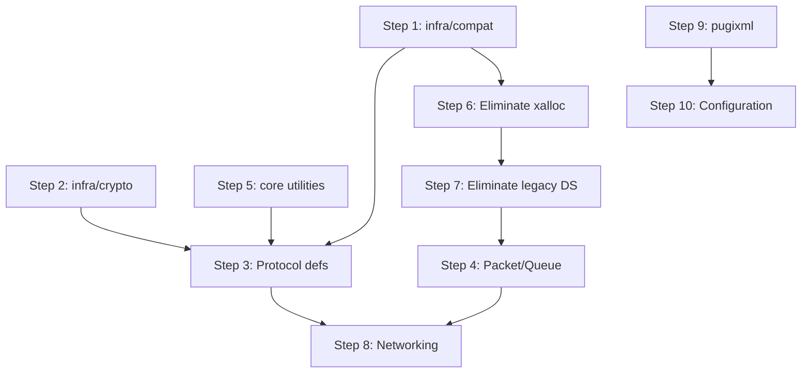

# Refactoring Plan: Legacy Common & Compat Migration

## Scope

Migrate `src/common/` (100+ files) and `src/compat/` (36 files) into the v3 tree. These are the foundation libraries that every other module depends on.

## Current State Analysis

### src/common/ — What It Contains

The `src/common/` directory is a monolithic grab-bag of:

| Category | Files | Target in v3 |
|----------|-------|--------------|
| **Protocol definitions** | `bnet_protocol.h`, `bot_protocol.h`, `d2cs_protocol.h`, `d2cs_d2gs_protocol.h`, `d2cs_d2dbs_ladder.h`, `d2cs_bnetd_protocol.h`, `d2game_protocol.h`, `file_protocol.h`, `init_protocol.h`, `irc_protocol.h`, `udp_protocol.h`, `anongame_protocol.h`, `wol_gameres_protocol.h`, `tracker.h` | `src/v3/protocol/*/include/` |
| **Packet handling** | `packet.cpp/.h`, `queue.cpp/.h` | `src/v3/protocol/common/` |
| **Networking** | `network.cpp/.h`, `addr.cpp/.h`, `fdwatch*.cpp/.h`, `fdwbackend.cpp/.h`, `trans.cpp/.h` | `src/v3/infra/net/` |
| **Crypto/Hashing** | `bnethash.cpp/.h`, `bnethashconv.cpp/.h`, `bnetsrp3.cpp/.h`, `bigint.cpp/.h`, `wolhash.cpp/.h`, `peerchat.cpp/.h` | `src/v3/infra/crypto/` |
| **Type utilities** | `bn_type.cpp/.h`, `tag.cpp/.h`, `bnettime.cpp/.h`, `hexdump.cpp/.h`, `util.cpp/.h`, `xstr.cpp/.h`, `xstring.cpp/.h`, `token.cpp/.h` | `src/v3/core/` |
| **Memory management** | `xalloc.cpp/.h`, `scoped_ptr.h`, `scoped_array.h` | Remove — use `std::unique_ptr`, `std::vector` |
| **Data structures** | `hashtable.cpp/.h`, `list.cpp/.h`, `elist.h` | Remove — use STL containers |
| **Logging** | `eventlog.cpp/.h`, `gui_printf.cpp/.h` | `src/v3/infra/logging/` (bridge already exists) |
| **Configuration** | `conf.cpp/.h` | `src/v3/infra/config/` |
| **System utilities** | `rlimit.cpp/.h`, `give_up_root_privileges.cpp/.h`, `systemerror.cpp/.h` | `src/v3/runtime/` |
| **Portability** | `setup_before.h`, `setup_after.h`, `flags.h`, `field_sizes.h`, `introtate.h`, `lstr.h` | `src/v3/infra/compat/` or remove |
| **Program info** | `proginfo.cpp/.h`, `version.h` | `src/v3/core/` |
| **D2 character** | `d2char_checksum.cpp/.h`, `d2char_file.h` | `src/v3/protocol/d2save/` |
| **RCM** | `rcm.cpp/.h` | `src/v3/core/` or remove |
| **XML** | `pugixml.cpp/.h`, `pugiconfig.h` | External dependency via FetchContent |
| **Format compat** | `fmt_compat.h`, `hash_tuple.hpp`, `asnprintf.cpp/.h` | `src/v3/core/` or remove |

### src/compat/ — What It Contains

Platform compatibility shims for POSIX/Windows differences:

| File | Purpose | Target |
|------|---------|--------|
| `gethostname.h` | `gethostname()` wrapper | `src/v3/infra/compat/` |
| `gettimeofday.cpp/.h` | Windows `gettimeofday()` | Remove — use `std::chrono` |
| `mkdir.h` | Cross-platform `mkdir()` | `src/v3/infra/compat/` or `std::filesystem` |
| `mmap.cpp/.h` | Memory-mapped files | `src/v3/infra/compat/` |
| `netinet_in.h` | Network byte order | Remove — use `core/endian.hpp` |
| `pdir.cpp/.h` | Directory iteration | Remove — use `std::filesystem` |
| `pgetopt.cpp/.h` | `getopt()` implementation | `src/v3/infra/compat/` or use CLI library |
| `pgetpid.h` | `getpid()` wrapper | `src/v3/infra/compat/` |
| `psock.cpp/.h` | Socket abstraction | Remove — use Boost.Asio |
| `read.h`, `recv.h`, `send.h`, `socket.h` | Socket I/O wrappers | Remove — use Boost.Asio |
| `rename.h` | Cross-platform `rename()` | `std::filesystem::rename()` |
| `strcasecmp.cpp/.h`, `strncasecmp.cpp/.h` | Case-insensitive compare | Remove — use `core/` utility |
| `strdup.cpp/.h` | `strdup()` | Remove — use `std::string` |
| `strerror.cpp/.h` | Thread-safe `strerror()` | Remove — use `std::system_error` |
| `strsep.cpp/.h` | String tokenizer | Remove — use `std::string_view` |
| `termios.h` | Terminal I/O | `src/v3/infra/compat/` |
| `uname.cpp/.h` | System info | `src/v3/infra/compat/` |
| `access.h`, `runtime_libs.h`, `statmacros.h`, `stdfileno.h` | Misc POSIX | `src/v3/infra/compat/` |

## Migration Steps

### Step 1: Create `src/v3/infra/compat/`

Create a thin compatibility layer for the few platform-specific functions that cannot be replaced by C++20 standard library:

```
src/v3/infra/compat/
  include/infra/compat/
    platform.hpp          # OS detection macros
    mmap.hpp              # Memory-mapped file wrapper
    terminal.hpp          # Terminal I/O
    process.hpp           # getpid, uname, gethostname
  src/
    mmap.cpp
    terminal.cpp
    process.cpp
```

**Files to eliminate entirely** (replaced by C++20/Boost):
- All socket wrappers → Boost.Asio
- `gettimeofday` → `std::chrono`
- `pdir` → `std::filesystem`
- `mkdir` → `std::filesystem::create_directories`
- `rename` → `std::filesystem::rename`
- `strdup`, `strsep`, `strcasecmp`, `strncasecmp` → `std::string`, `std::string_view`
- `strerror` → `std::system_error`
- `netinet_in.h` → `core/endian.hpp`
- `pgetopt` → CLI parsing in `runtime/src/cli.cpp`

### Step 2: Create `src/v3/infra/crypto/`

Extract all cryptographic/hashing code from `src/common/`:

```
src/v3/infra/crypto/
  include/infra/crypto/
    bnet_hash.hpp         # Legacy broken-SHA1 hash (from bnethash)
    bnet_hash_conv.hpp    # Hash format conversion
    srp3.hpp              # SRP3 authentication (from bnetsrp3)
    bigint.hpp            # Big integer math (from bigint)
    wol_hash.hpp          # Westwood Online hash
    peerchat.hpp          # Peerchat encryption
  src/
    bnet_hash.cpp
    bnet_hash_conv.cpp
    srp3.cpp
    bigint.cpp
    wol_hash.cpp
    peerchat.cpp
```

Note: `src/v3/infra/legacy_crypto/` already exists with a `bnet_session_hasher` that wraps the legacy `bnethash`. The new `infra/crypto/` will be a clean C++20 reimplementation, and `legacy_crypto/` can be removed once the migration is complete.

### Step 3: Migrate Protocol Definitions

Move all `*_protocol.h` headers into their respective v3 protocol modules:

| Legacy Header | Target |
|---------------|--------|
| `bnet_protocol.h` | `src/v3/protocol/bnet/include/protocol/bnet/wire_types.hpp` |
| `bot_protocol.h` | `src/v3/protocol/bnet/include/protocol/bnet/bot_wire_types.hpp` |
| `init_protocol.h` | `src/v3/protocol/bnet/include/protocol/bnet/init_wire_types.hpp` |
| `file_protocol.h` | `src/v3/protocol/file/include/protocol/file/wire_types.hpp` |
| `irc_protocol.h` | `src/v3/protocol/irc/include/protocol/irc/wire_types.hpp` |
| `udp_protocol.h` | `src/v3/protocol/udp/include/protocol/udp/wire_types.hpp` |
| `anongame_protocol.h` | `src/v3/protocol/bnet/include/protocol/bnet/anongame_wire_types.hpp` |
| `d2cs_protocol.h` | `src/v3/protocol/d2cs/include/protocol/d2cs/wire_types.hpp` |
| `d2cs_d2gs_protocol.h` | `src/v3/protocol/d2gs/include/protocol/d2gs/wire_types.hpp` |
| `d2cs_bnetd_protocol.h` | `src/v3/protocol/d2cs/include/protocol/d2cs/bnetd_wire_types.hpp` |
| `d2cs_d2dbs_ladder.h` | `src/v3/protocol/d2dbs/include/protocol/d2dbs/ladder_wire_types.hpp` |
| `d2cs_d2gs_character.h` | `src/v3/protocol/d2gs/include/protocol/d2gs/character_wire_types.hpp` |
| `d2game_protocol.h` | `src/v3/protocol/d2gs/include/protocol/d2gs/game_wire_types.hpp` |
| `wol_gameres_protocol.h` | `src/v3/protocol/wolgameres/include/protocol/wolgameres/wire_types.hpp` |
| `tracker.h` | `src/v3/protocol/common/include/protocol/common/tracker_wire_types.hpp` |

Each migration involves:
1. Converting C-style `#define` constants to `constexpr` or `enum class`
2. Converting C structs with `bn_int`/`bn_short` fields to typed structs with proper serialization
3. Removing `setup_before.h`/`setup_after.h` includes
4. Adding proper namespaces: `pvpgn::protocol::<module>`

### Step 4: Migrate Packet and Queue

The legacy `packet.cpp/.h` and `queue.cpp/.h` handle raw byte buffers. The v3 tree already has `protocol/common/packet.hpp`, `reader.hpp`, and `writer.hpp`. Steps:

1. Audit all legacy packet operations used by bnetd/d2cs/d2dbs
2. Ensure v3 `protocol::common::Packet` covers all use cases
3. Add any missing operations to the v3 packet class
4. Update all consumers to use the v3 packet API

### Step 5: Migrate Type Utilities to `core/`

| Legacy File | Target | Notes |
|-------------|--------|-------|
| `bn_type.cpp/.h` | `core/endian.hpp` | Already exists — verify completeness |
| `tag.cpp/.h` | `domain/shared/client_tag.hpp` | Already exists — verify completeness |
| `bnettime.cpp/.h` | `core/clock.hpp` | Bnet epoch time conversion |
| `hexdump.cpp/.h` | `core/format.hpp` | Debug hex dump utility |
| `util.cpp/.h` | `core/` | String utilities, path helpers |
| `xstr.cpp/.h`, `xstring.cpp/.h` | Remove | Use `std::string` |
| `token.cpp/.h` | Remove | Use `std::string_view` tokenization |
| `proginfo.cpp/.h` | `core/version.hpp` | Already exists |
| `version.h` | `core/version.hpp` | Already exists |

### Step 6: Eliminate Legacy Memory Management

Replace all uses of:
- `xmalloc()` / `xfree()` / `xrealloc()` → `std::vector`, `std::unique_ptr`, `std::string`
- `xstrdup()` → `std::string`
- `scoped_ptr` → `std::unique_ptr`
- `scoped_array` → `std::vector`

This is a cross-cutting concern that affects every file being migrated.

### Step 7: Eliminate Legacy Data Structures

Replace:
- `t_list` / `list_*()` → `std::vector`, `std::list`
- `t_hashtable` / `hashtable_*()` → `std::unordered_map`, `ankerl::unordered_dense::map`
- `t_elist` → `std::list` or intrusive list from Boost

### Step 8: Migrate Networking to `infra/net/`

The v3 tree already has a complete Boost.Asio-based networking layer in `src/v3/infra/net/`. The legacy `fdwatch` event loop, `network.cpp`, `addr.cpp`, and `trans.cpp` will be replaced by:

- `infra::net::IoRuntime` — Boost.Asio io_context wrapper
- `infra::net::TcpAcceptor` — TCP listener
- `infra::net::TcpSession` — Per-connection session
- `infra::net::UdpEndpoint` — UDP socket
- `infra::net::FiberPool` — Fiber-based concurrency

No new code needed — just ensure all legacy networking consumers are migrated to use the v3 networking layer.

### Step 9: Handle pugixml

The legacy tree bundles `pugixml.cpp/.h` directly in `src/common/`. The v3 approach should use FetchContent:

```cmake
FetchContent_Declare(
    pugixml
    GIT_REPOSITORY https://github.com/zeux/pugixml.git
    GIT_TAG        v1.14
    GIT_SHALLOW    TRUE
)
FetchContent_MakeAvailable(pugixml)
```

Consumers that need XML parsing (i18n, config) link against `pugixml::pugixml`.

### Step 10: Migrate Configuration

Legacy `conf.cpp/.h` provides a simple key-value config parser. The v3 tree already has:
- `infra/config/server_config.hpp` — TOML-based config
- `infra/legacy_config/` — Legacy .conf file parsers

The migration path:
1. Convert all `.conf.in` files to TOML format
2. The `tools/conf_converter/` already exists for this purpose
3. Update all config consumers to use `infra::config::ServerConfig`

## Dependency Graph for Migration Order



## Files That Can Be Deleted After Migration

Once all consumers are migrated, these legacy files can be removed:

- **Entire `src/compat/` directory** — replaced by `infra/compat/` + C++20 stdlib
- **`src/common/setup_before.h`**, **`setup_after.h`** — no longer needed with C++20
- **`src/common/xalloc.cpp/.h`** — replaced by STL
- **`src/common/scoped_ptr.h`**, **`scoped_array.h`** — replaced by `std::unique_ptr`
- **`src/common/hashtable.cpp/.h`**, **`list.cpp/.h`**, **`elist.h`** — replaced by STL
- **`src/common/fdwatch*.cpp/.h`**, **`fdwbackend.cpp/.h`** — replaced by Boost.Asio
- **`src/common/network.cpp/.h`** — replaced by `infra/net/`
- **`src/common/pugixml.cpp/.h`**, **`pugiconfig.h`** — replaced by FetchContent
- **`src/common/asnprintf.cpp/.h`** — replaced by `fmt` / `std::format`
- **All `*_protocol.h` files** — replaced by v3 wire_types headers
