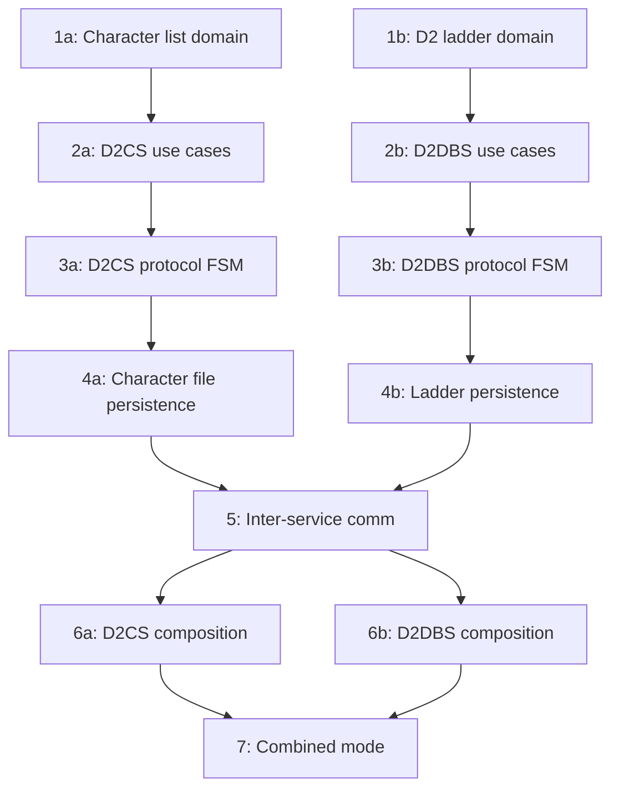

# Refactoring Plan: Legacy D2 Services Migration

## Scope

Migrate `src/d2cs/` (40+ files) and `src/d2dbs/` (20+ files) into the v3 tree. These are the Diablo II Character Server and Database Server respectively.

## Current State

### src/d2cs/ — Diablo II Character Server

| Legacy File | Purpose | Target v3 Location |
|-------------|---------|-------------------|
| `main.cpp` | Entry point | `services/d2cs/src/main_d2cs.cpp` |
| `bnetd.cpp/.h` | Communication with bnetd | `integration/d2cs_bnetd/` |
| `cmdline.cpp/.h` | CLI parsing | `runtime/` (shared) |
| `connection.cpp/.h` | Connection management | `infra/net/` + `protocol/d2cs/` |
| `d2charfile.cpp/.h` | Character file I/O | `infra/persistence/realm/` |
| `d2charlist.cpp/.h` | Character list management | `domain/realm/` |
| `d2gs.cpp/.h` | Game server management | `application/realm/` |
| `d2ladder.cpp/.h` | Ladder management | `domain/ladder/` |
| `game.cpp/.h` | Game session tracking | `domain/gameplay/` |
| `gamequeue.cpp/.h` | Game queue management | `application/realm/gs_queue` |
| `handle_bnetd.cpp/.h` | bnetd packet handler | `protocol/d2cs/` |
| `handle_d2cs.cpp/.h` | D2CS packet handler | `protocol/d2cs/` |
| `handle_d2gs.cpp/.h` | D2GS packet handler | `protocol/d2gs/` |
| `handle_init.cpp/.h` | Init packet handler | `protocol/d2cs/` |
| `handle_signal.cpp/.h` | Signal handling | `runtime/` (shared) |
| `net.cpp/.h` | Networking | `infra/net/` (shared) |
| `prefs.cpp/.h` | Configuration | `infra/config/` |
| `s2s.cpp/.h` | Server-to-server comm | `runtime/peer_link` |
| `server.cpp/.h` | Main event loop | `runtime/service_host` |
| `serverqueue.cpp/.h` | Server queue | `infra/net/` |
| `setup.h` | Build configuration | Remove — use CMake |
| `version.h` | Version info | `core/version.hpp` |
| `bit.h` | Bit manipulation | `core/` or remove |

### src/d2dbs/ — Diablo II Database Server

| Legacy File | Purpose | Target v3 Location |
|-------------|---------|-------------------|
| `main.cpp` | Entry point | `services/d2dbs/src/main_d2dbs.cpp` |
| `charlock.cpp/.h` | Character locking | `application/realm/character_lock` |
| `cmdline.cpp/.h` | CLI parsing | `runtime/` (shared) |
| `d2ladder.cpp/.h` | Ladder persistence | `infra/persistence/realm/` |
| `dbsdupecheck.cpp/.h` | Dupe detection | `domain/realm/dupe_checker` |
| `dbserver.cpp/.h` | Database server logic | `services/d2dbs/` |
| `dbspacket.cpp/.h` | DBS packet handling | `protocol/d2dbs/` |
| `handle_signal.cpp/.h` | Signal handling | `runtime/` (shared) |
| `prefs.cpp/.h` | Configuration | `infra/config/` |
| `setup.h` | Build configuration | Remove |
| `version.h` | Version info | `core/version.hpp` |

### What Already Exists in v3

The v3 tree already has significant D2 infrastructure:

- **`domain/realm/`** — `Character`, `DupeChecker`, `Realm` aggregates with implementations
- **`application/realm/`** — `CharacterLock`, `CharacterPersistence`, `GsQueue` use cases
- **`protocol/d2cs/`** — Codec and FSM for D2CS wire protocol
- **`protocol/d2dbs/`** — Codec and FSM for D2DBS wire protocol
- **`protocol/d2gs/`** — Codec for D2GS wire protocol
- **`protocol/d2save/`** — D2 save file codec
- **`infra/persistence/realm/`** — `FilesystemSaveStore`, `InMemoryCharacterRepository`, `InMemorySaveStore`
- **`services/d2cs/`** — Composition root stub (`D2csComposition`)
- **`services/d2dbs/`** — Composition root stub (`D2dbsComposition`)

## Migration Strategy

The D2 services are simpler than bnetd because:
1. They have fewer protocol handlers
2. The domain logic is more contained
3. Much of the v3 infrastructure already exists
4. They communicate with bnetd via well-defined inter-service protocols

### Step 1: Complete Domain Layer

#### 1a. Character List Management

Migrate `d2charlist.cpp/.h` into `domain/realm/`:

```
domain/realm/
  include/domain/realm/
    character_list.hpp     # [NEW] Character list aggregate
  src/
    character_list.cpp     # [NEW]
```

The `CharacterList` manages the per-account list of characters with operations:
- Add character
- Remove character
- List characters
- Check character count limits

#### 1b. D2 Ladder Domain

Migrate ladder calculation logic from `d2ladder.cpp/.h` into `domain/ladder/`:

```
domain/ladder/
  include/domain/ladder/
    d2_ladder.hpp          # [NEW] D2-specific ladder rankings
  src/
    d2_ladder.cpp          # [NEW]
```

### Step 2: Complete Application Layer

#### 2a. D2CS Use Cases

```
application/realm/
  include/application/realm/
    create_character.hpp   # [NEW]
    delete_character.hpp   # [NEW]
    list_characters.hpp    # [NEW]
    join_game_server.hpp   # [NEW]
  src/
    create_character.cpp   # [NEW]
    delete_character.cpp   # [NEW]
    list_characters.cpp    # [NEW]
    join_game_server.cpp   # [NEW]
```

#### 2b. D2DBS Use Cases

```
application/realm/
  include/application/realm/
    save_character.hpp     # [NEW]
    load_character.hpp     # [NEW]
    update_ladder.hpp      # [NEW]
  src/
    save_character.cpp     # [NEW]
    load_character.cpp     # [NEW]
    update_ladder.cpp      # [NEW]
```

### Step 3: Complete Protocol Layer

#### 3a. D2CS Protocol FSM

The v3 `protocol/d2cs/fsm.hpp` already exists. Ensure it covers all packet types from:
- `handle_d2cs.cpp` — Client ↔ D2CS packets
- `handle_bnetd.cpp` — bnetd ↔ D2CS packets
- `handle_d2gs.cpp` — D2GS ↔ D2CS packets
- `handle_init.cpp` — Connection init packets

#### 3b. D2DBS Protocol FSM

The v3 `protocol/d2dbs/fsm.hpp` already exists. Ensure it covers all packet types from:
- `dbspacket.cpp` — D2CS ↔ D2DBS packets

### Step 4: Complete Infrastructure

#### 4a. Character File Persistence

Migrate `d2charfile.cpp/.h` into `infra/persistence/realm/`:

The v3 tree already has `FilesystemSaveStore` — extend it to cover all character file operations:
- Save character data
- Load character data
- Character file validation
- Backup/restore

#### 4b. Ladder Persistence

```
infra/persistence/realm/
  include/infra/persistence/realm/
    filesystem_ladder_store.hpp   # [NEW]
  src/
    filesystem_ladder_store.cpp   # [NEW]
```

### Step 5: Inter-Service Communication

The legacy D2CS communicates with bnetd via raw TCP sockets using the `s2s.cpp/.h` and `bnetd.cpp/.h` modules. The v3 tree replaces this with:

- `runtime::PeerLink` — TLS + JWT authenticated inter-service communication
- `infra::discovery::ServiceRegistry` — Service endpoint discovery

Create integration adapters:

```
integration/d2cs_bnetd/
  include/integration/d2cs_bnetd/
    bnetd_client.hpp       # D2CS -> bnetd communication
  src/
    bnetd_client.cpp
```

### Step 6: Complete Composition Roots

#### 6a. D2CS Composition

The stub at `services/d2cs/src/d2cs_composition.cpp` needs to be completed with:
- Character repository initialization
- Game server queue setup
- Protocol handler registration
- Networking setup (TCP listener for clients, TCP client for bnetd/D2GS)

#### 6b. D2DBS Composition

The stub at `services/d2dbs/src/d2dbs_composition.cpp` needs to be completed with:
- Character persistence initialization
- Ladder store setup
- Dupe checker initialization
- Protocol handler registration

### Step 7: Combined Mode Integration

The `services/combined/` composition root needs to orchestrate D2CS and D2DBS alongside bnetd in single-binary mode. The existing `CombinedComposition` registers service endpoints but doesn't yet start the actual services.

## Migration Order



## Files to Delete After Full Migration

- **Entire `src/d2cs/` directory** — all 40+ files
- **Entire `src/d2dbs/` directory** — all 20+ files
- Legacy D2CS/D2DBS CMakeLists.txt entries in `src/CMakeLists.txt`
- Legacy D2CS/D2DBS Windows resources in `src/win32/`

## Configuration Migration

Legacy config files that need TOML equivalents:

| Legacy Config | Purpose | TOML Target |
|---------------|---------|-------------|
| `conf/d2cs.conf.in` | D2CS configuration | `conf/d2cs.toml.in` |
| `conf/d2dbs.conf.in` | D2DBS configuration | `conf/d2dbs.toml.in` |
| `conf/realm.conf.in` | Realm definitions | `conf/realm.toml.in` |

The `tools/conf_converter/` can handle this conversion.
