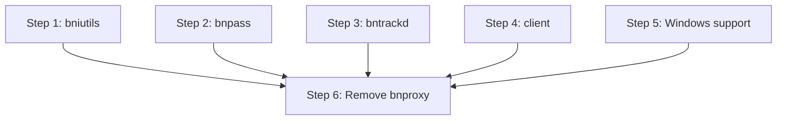

# Refactoring Plan: Legacy Tools & Utilities Migration

## Scope

Migrate `src/bniutils/`, `src/bnpass/`, `src/bnproxy/`, `src/bntrackd/`, `src/client/`, and `src/win32/` into the v3 tree under `src/v3/tools/` and `src/v3/runtime/`.

## Current State

### src/bniutils/ — BNI Image Tools

| File | Purpose |
|------|---------|
| `bni.cpp/.h` | BNI file format parser |
| `bni2tga.cpp` | BNI to TGA converter (executable) |
| `bnibuild.cpp` | BNI file builder (executable) |

These are standalone CLI tools for working with Battle.net Icon (BNI) files used for user icons in the game client.

### src/bnpass/ — Password Hash Tool

| File | Purpose |
|------|---------|
| `bnpass.cpp` | Password hash generator (executable) |
| `sha1hash.cpp` | SHA1 hash implementation |

A CLI tool that generates password hashes for manual account creation.

### src/bnproxy/ — Battle.net Proxy (DEPRECATED)

| File | Purpose |
|------|---------|
| `bnproxy.c` | Proxy server (C, not C++) |
| `virtconn.c/.h` | Virtual connection management |
| `DEPRECATED.md` | Deprecation notice |

This is explicitly marked as deprecated. It's written in C, not C++.

### src/bntrackd/ — Tracker Daemon

| File | Purpose |
|------|---------|
| `bntrackd.cpp` | Server tracker daemon (executable) |
| `servers.xsl` | XSL stylesheet for server list |

A daemon that collects and serves a list of PvPGN servers.

### src/client/ — Test Clients

| File | Purpose |
|------|---------|
| `bnchat.cpp` | Chat client |
| `bnbot.cpp` | Bot client |
| `bnftp.cpp` | File transfer client |
| `bnstat.cpp` | Status query client |
| `client.cpp/.h` | Shared client library |
| `client_connect.cpp/.h` | Connection helper |
| `udptest.cpp/.h` | UDP test client |
| `ansi_term.h` | ANSI terminal codes |

Test/debug clients for exercising the server.

### src/win32/ — Windows GUI

| File | Purpose |
|------|---------|
| `winmain.cpp/.h` | Windows GUI entry point |
| `console_output.cpp/.h` | Console output for Windows |
| `service.cpp/.h` | Windows Service integration |
| `windump.cpp/.h` | Windows crash dump |
| `resource.rc/.h` | bnetd GUI resources |
| `d2cs_resource.rc/.h` | D2CS GUI resources |
| `d2cs_winmain.cpp` | D2CS Windows entry |
| `d2dbs_resource.rc/.h` | D2DBS GUI resources |
| `d2dbs_winmain.cpp` | D2DBS Windows entry |
| `console_resource.rc/.h` | Console resources |
| `dirent.h` | Windows dirent implementation |
| `logo01.ico` | Application icon |

## Migration Strategy

### Decision: What to Keep, What to Drop

| Component | Decision | Rationale |
|-----------|----------|-----------|
| bniutils | **Migrate** | Still useful for icon management |
| bnpass | **Migrate** | Useful admin tool, needs modernization |
| bnproxy | **Drop** | Explicitly deprecated, written in C |
| bntrackd | **Migrate** | Server tracking is still needed |
| client | **Migrate** | Useful for testing and debugging |
| win32 GUI | **Migrate partially** | Windows Service support needed; GUI is optional |

### Step 1: Migrate bniutils → `tools/bniutils/`

```
src/v3/tools/bniutils/
  CMakeLists.txt
  include/tools/bniutils/
    bni.hpp                # BNI format parser (C++20 rewrite)
  src/
    bni.cpp
    bni2tga.cpp            # CLI: BNI → TGA converter
    bnibuild.cpp           # CLI: BNI builder
```

Changes from legacy:
- Replace `xalloc` with STL containers
- Replace raw file I/O with `std::fstream` / `std::filesystem`
- Use `core/bytes.hpp` for byte manipulation
- Use `core/result.hpp` for error handling
- Add Catch2 unit tests for BNI parsing

### Step 2: Migrate bnpass → `tools/bnpass/`

```
src/v3/tools/bnpass/
  CMakeLists.txt
  src/
    bnpass.cpp             # CLI: password hash generator
```

Changes from legacy:
- Use `infra/crypto/bnet_hash.hpp` instead of bundled SHA1
- Use `runtime/cli.cpp` for argument parsing
- Support both legacy hash and SRP3 formats

### Step 3: Migrate bntrackd → `tools/bntrackd/`

```
src/v3/tools/bntrackd/
  CMakeLists.txt
  include/tools/bntrackd/
    tracker_server.hpp     # Tracker server logic
  src/
    tracker_server.cpp
    main.cpp               # CLI entry point
  resources/
    servers.xsl            # XSL stylesheet
```

Changes from legacy:
- Use Boost.Asio for networking instead of raw sockets
- Use `runtime::ServiceHost` for lifecycle management
- Use `infra/config/` for configuration
- Add JSON API endpoint alongside legacy UDP protocol

### Step 4: Migrate client → `tools/client/`

```
src/v3/tools/client/
  CMakeLists.txt
  include/tools/client/
    client.hpp             # Shared client library
    client_connect.hpp     # Connection helper
    ansi_term.hpp          # ANSI terminal codes
  src/
    client.cpp
    client_connect.cpp
    bnchat.cpp             # CLI: chat client
    bnbot.cpp              # CLI: bot client
    bnftp.cpp              # CLI: file transfer client
    bnstat.cpp             # CLI: status query client
    udptest.cpp            # CLI: UDP test
```

Changes from legacy:
- Use Boost.Asio for networking
- Use `protocol/bnet/codec.hpp` for packet encoding/decoding
- Use `protocol/irc/codec.hpp` for IRC protocol
- Use `core/result.hpp` for error handling

### Step 5: Migrate Windows Support → `runtime/`

The Windows-specific code splits into two categories:

#### 5a. Windows Service Support (Keep in runtime/)

Already partially handled by `runtime/src/win_service.cpp`. Ensure it covers:
- Service installation/removal
- Service start/stop/pause
- Service status reporting
- Event log integration

#### 5b. Windows GUI (Optional, separate target)

```
src/v3/tools/wingui/
  CMakeLists.txt
  include/tools/wingui/
    console_output.hpp
    windump.hpp
  src/
    console_output.cpp
    windump.cpp
    winmain.cpp
  resources/
    resource.rc
    resource.h
    console_resource.rc
    console_resource.h
    logo01.ico
```

The GUI is optional and only built when `WITH_WIN32_GUI=ON`. It provides:
- A Windows tray icon
- Console output window
- Crash dump generation

#### 5c. Windows dirent.h

Replace `src/win32/dirent.h` with `std::filesystem` throughout the codebase. This header is only needed because the legacy code uses POSIX `opendir()`/`readdir()`.

### Step 6: Remove bnproxy

Simply delete `src/bnproxy/` and remove its `add_subdirectory` from `src/CMakeLists.txt`. It's already marked deprecated.

## Target CMake Structure

```cmake
# tools/CMakeLists.txt
add_subdirectory(bniutils)
add_subdirectory(bnpass)
add_subdirectory(bntrackd)
add_subdirectory(client)
add_subdirectory(conf_converter)  # Already exists

if(WIN32 AND WITH_WIN32_GUI)
    add_subdirectory(wingui)
endif()
```

Each tool subdirectory produces one or more executables:

```cmake
# tools/bniutils/CMakeLists.txt
pvpgn_v3_add_library(bni_lib STATIC
    SOURCES src/bni.cpp
    PUBLIC_INCLUDES ${CMAKE_CURRENT_SOURCE_DIR}/include
    PUBLIC_DEPS core
)

add_executable(bni2tga src/bni2tga.cpp)
target_link_libraries(bni2tga PRIVATE bni_lib)

add_executable(bnibuild src/bnibuild.cpp)
target_link_libraries(bnibuild PRIVATE bni_lib)

install(TARGETS bni2tga bnibuild DESTINATION ${BINDIR})
```

## Migration Order



All tool migrations are independent of each other and can proceed in parallel. The only shared dependency is `core/` and `infra/crypto/` (for bnpass).

## Files to Delete After Migration

- **Entire `src/bniutils/` directory**
- **Entire `src/bnpass/` directory**
- **Entire `src/bnproxy/` directory** (immediate deletion — deprecated)
- **Entire `src/bntrackd/` directory**
- **Entire `src/client/` directory**
- **Entire `src/win32/` directory**
- Corresponding entries in `src/CMakeLists.txt`
