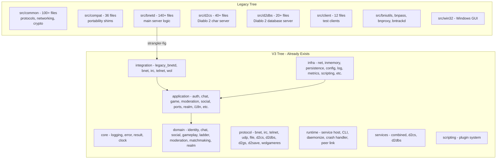
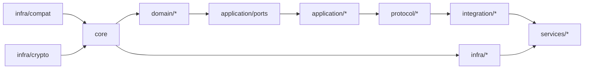

# Refactoring Plan: Overview

## Project Summary

PvPGN (Player vs Player Gaming Network) is a Battle.net emulation server written in C/C++. The codebase currently has two parallel trees:

1. **Legacy tree** (`src/bnetd/`, `src/common/`, `src/compat/`, `src/d2cs/`, `src/d2dbs/`, `src/client/`, `src/bniutils/`, `src/bnpass/`, `src/bnproxy/`, `src/bntrackd/`, `src/win32/`) — C++11, flat file layout, global state, `setup_before.h`/`setup_after.h` portability shims, `fdwatch` event loop, custom memory allocators (`xalloc`).

2. **v3 tree** (`src/v3/`) — C++20, hexagonal architecture with clean separation into `core/`, `domain/`, `application/`, `protocol/`, `infra/`, `integration/`, `runtime/`, `services/`, `scripting/`, `tools/`. Uses Boost.Asio, spdlog, toml++, Catch2 for tests.

The v3 tree is already well-structured and follows modern C++ best practices. The goal is to **migrate all legacy code into the v3 layout**, completing the strangler-fig pattern that is already partially in place.

## Current Architecture



## High-Level Strategy

The refactoring follows a **strangler-fig** pattern — the v3 tree progressively absorbs legacy functionality until the legacy tree can be removed entirely. The migration is organized into 7 phases:

### Phase 1: Foundation Layer Migration
Migrate `src/common/` and `src/compat/` into `src/v3/core/` and `src/v3/infra/compat/`. This is the most critical phase since every other module depends on these.

### Phase 2: Protocol Layer Completion
Complete the protocol layer migration — many protocol codecs already exist in v3 but some legacy protocol headers and implementations still live in `src/common/`.

### Phase 3: bnetd Server Logic Migration
The largest phase. Migrate `src/bnetd/` functionality into the appropriate v3 layers (domain, application, integration). The strangler-fig bridges already handle many packet types.

### Phase 4: Diablo 2 Services Migration
Migrate `src/d2cs/` and `src/d2dbs/` into `src/v3/services/d2cs/` and `src/v3/services/d2dbs/`, leveraging the existing composition roots.

### Phase 5: Tools and Utilities Migration
Migrate `src/bniutils/`, `src/bnpass/`, `src/bnproxy/`, `src/bntrackd/`, `src/client/` into `src/v3/tools/`.

### Phase 6: Build System Consolidation
Remove the dual-build system, make v3 the only build path, update all CMakeLists.txt.

### Phase 7: Test Completion and Cleanup
Ensure all migrated code has tests, remove legacy test infrastructure, finalize documentation.

## Target Directory Layout

```
src/v3/
  core/                          # Foundation: error, result, clock, logging, bytes, endian, format
    include/core/
    src/
  domain/                        # Pure domain aggregates and value objects
    shared/                      # Cross-cutting: IDs, events, value objects
    identity/                    # Account aggregate
    chat/                        # Channel aggregate
    social/                      # FriendList, Clan, Team
    gameplay/                    # Game aggregate
    ladder/                      # Ladder calculator
    moderation/                  # IpBanList, Quota
    matchmaking/                 # AnonGameQueue, Tournament
    realm/                       # Realm, Character, DupeChecker
  application/                   # Use cases orchestrating domain + ports
    auth/                        # Login, Logout, CreateAccount, ChangePassword
    chat/                        # JoinChannel, PostMessage, Whisper, Commands
    game/                        # StartGame, JoinGame, LeaveGame
    moderation/                  # BanAccount, BanIP, KickConnection
    social/                      # AddFriend, CreateClan, InviteToClan
    realm/                       # CharacterLock, GameServerQueue
    i18n/                        # String table, localization
    anongame_infoply/            # FINDANONGAME INFOREPLY builder
    icon_table/                  # Icon table builder
    tournament/                  # Tournament reply builder
    profile/                     # Profile reply builder
    ports/                       # Repository interfaces, event bus, etc.
  protocol/                      # Wire-format codecs and FSMs
    common/                      # Shared packet, reader, writer
    bnet/                        # Battle.net protocol
    irc/                         # IRC protocol
    telnet/                      # Telnet admin protocol
    udp/                         # UDP protocol
    file/                        # BNFTP file transfer
    d2cs/                        # D2CS protocol
    d2dbs/                       # D2DBS protocol
    d2gs/                        # D2GS protocol
    d2save/                      # D2 save file codec
    wolgameres/                  # Westwood Online game results
  infra/                         # Infrastructure adapters
    net/                         # Boost.Asio networking, fiber pool
    compat/                      # [NEW] Portability shims from src/compat
    crypto/                      # [NEW] Hash functions from src/common
    persistence/                 # SQLite, filesystem adapters
    inmemory/                    # In-memory repositories
    file/                        # Flat-file repositories
    sqlite/                      # SQLite repositories
    mysql/                       # MySQL repositories
    postgres/                    # PostgreSQL repositories
    config/                      # TOML config, legacy config loaders
    log/                         # spdlog, JSON line logger
    logging/                     # eventlog bridge
    metrics/                     # Prometheus metrics
    webui/                       # REST API + dashboard
    routing/                     # Message routing
    session/                     # Protocol session factories
    audit/                       # Audit logging
    clock/                       # Clock bridge
    compression/                 # zlib adapter
    discovery/                   # Service registry
    migrations/                  # DB migrations
    sandbox/                     # Plugin sandboxing
    scripting/                   # Lua scripting, plugin system
    legacy_config/               # Legacy .conf file parsers
    legacy_crypto/               # Legacy bnet hash adapter
    storage/                     # Storage repository adapters
  integration/                   # Strangler-fig bridges
    legacy_bnetd/                # Legacy bnetd bridges
    bnet/                        # Bnet session handler
    irc/                         # IRC session factory
    telnet/                      # Telnet session factory
    wol/                         # WOL session factory
  runtime/                       # Service lifecycle
    src/                         # service_host, CLI, daemonize, crash_handler, peer_link
  services/                      # Composition roots
    combined/                    # Single-binary mode
    d2cs/                        # D2CS composition
    d2dbs/                       # D2DBS composition
    bnetd/                       # [NEW] bnetd composition root
  scripting/                     # Plugin manifest, semver
    plugin/
  tools/                         # CLI utilities
    conf_converter/              # Config file converter
    bniutils/                    # [NEW] BNI image tools
    bnpass/                      # [NEW] Password hash tool
    bntrackd/                    # [NEW] Tracker daemon
    client/                      # [NEW] Test clients
```

## Key Principles

1. **No Big Bang** — Each phase can be merged independently. The strangler-fig bridges ensure the legacy binary keeps working throughout.

2. **Test-First Migration** — Every migrated module must have Catch2 unit tests before the legacy code is removed.

3. **C++20 Throughout** — All migrated code uses C++20 features: `std::string_view`, `std::optional`, `std::variant`, concepts, ranges where appropriate.

4. **Hexagonal Architecture** — Domain logic has zero dependencies on infrastructure. All I/O goes through port interfaces in `application/ports/`.

5. **No Global State** — All dependencies are injected through constructors. No singletons, no global variables.

6. **Value Semantics** — Domain objects are value types where possible. Events are returned, not published through side channels.

## Dependency Order

The migration must respect the dependency graph:



## Risk Assessment

| Risk | Mitigation |
|------|------------|
| Breaking legacy binary during migration | Strangler-fig bridges maintain backward compatibility |
| Protocol regression | Golden replay tests in `tests/unit/protocol/bnet/` catch wire-format changes |
| Build time increase during dual-tree phase | `PVPGN_BUILD_LEGACY` and `PVPGN_BUILD_V3` flags allow building either tree independently |
| Platform-specific code in compat layer | Wrap in `#ifdef` blocks within `infra/compat/`, test on CI matrix |
| Database schema changes | Migration runner in `infra/migrations/` handles schema evolution |

## Cross-References

- [Legacy Common & Compat Migration](refactoring-plan-legacy-common.md)
- [Legacy bnetd Migration](refactoring-plan-legacy-bnetd.md)
- [Legacy D2 Services Migration](refactoring-plan-legacy-d2.md)
- [Legacy Tools Migration](refactoring-plan-legacy-tools.md)
- [Build System Consolidation](refactoring-plan-build-system.md)
- [Testing Strategy](refactoring-plan-testing.md)
