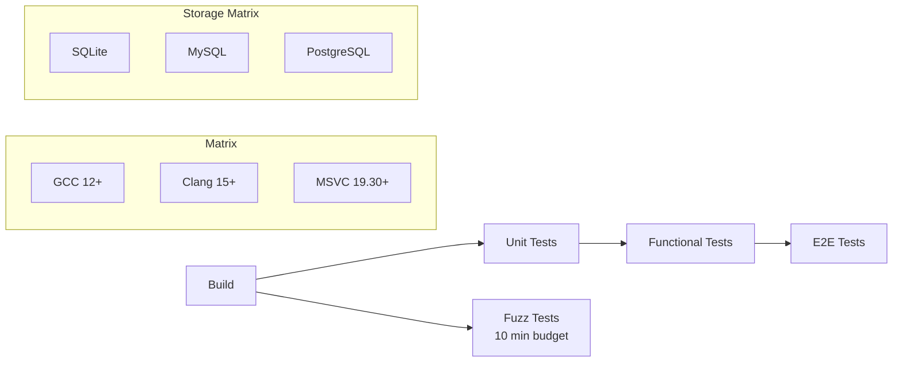

# Refactoring Plan: Testing Strategy

## Scope

Define the testing strategy for the refactoring, including migration of legacy tests, new test requirements for migrated code, and the overall test infrastructure.

## Current Test Infrastructure

### Legacy Tests (`src/test/`)

The legacy tree has a minimal test directory at `src/test/` (included via `src/CMakeLists.txt` when `CMAKE_TESTING_ENABLED`). These are basic smoke tests, not comprehensive unit tests.

### v3 Tests (`tests/`)

The v3 tree has a well-structured test hierarchy:

```
tests/
  unit/                          # Unit tests (Catch2)
    core/                        # 12 test files
    domain/                      # 7 subdirectories, 12+ test files
    application/                 # 10 subdirectories, 20+ test files
    protocol/                    # 10 subdirectories, 20+ test files
    infra/                       # 15+ subdirectories, 25+ test files
    integration/                 # 5 subdirectories, 10+ test files
    runtime/                     # Runtime tests
    scripting/                   # Scripting tests
    services/                    # Service composition tests
  functional/                    # Functional tests
    config_roundtrip_test.cpp    # Config conversion test
    plugin_lifecycle_test.cpp    # Plugin lifecycle test
  e2e/                           # End-to-end tests
    service_startup_test.cpp     # Service startup test
  fuzz/                          # Fuzz testing
    bnet_codec_fuzz.cpp          # Bnet protocol fuzzer
    d2save_codec_fuzz.cpp        # D2 save file fuzzer
    corpus/                      # Fuzz corpus data
```

### Test Framework

- **Catch2 v3.5.4** — Fetched via FetchContent
- **C++20** — Tests use the same standard as production code
- **CTest** — Test runner integration

### Existing Test Coverage by Layer

| Layer | Module | Test Files | Coverage Level |
|-------|--------|------------|----------------|
| core | bytes, clock, endian, error, event_bus, format, logging, result, scheduler, strong_typedef, version | 12 | High |
| domain/identity | account, attribute_map, attribute_map_typed | 3 | Medium |
| domain/chat | channel, whisper | 2 | Medium |
| domain/gameplay | game | 1 | Low |
| domain/ladder | ladder | 1 | Low |
| domain/matchmaking | matchmaking | 1 | Low |
| domain/moderation | ip_ban_list | 1 | Low |
| domain/realm | character, dupe_checker, realm | 3 | Medium |
| domain/shared | value_objects | 1 | Low |
| domain/social | social | 1 | Low |
| application/auth | account_lock, change_password, create_account, login_classifier, login_user, login_user_must_change_password, logout_user, password_rotation_observer | 8 | High |
| application/chat | ban_from_channel, chat_command, chat_reply_sink, join_channel, kick_from_channel, leave_channel, list_channels, post_message, send_emote, set_channel_topic, whisper_target_lookup, whisper_use_case | 12 | High |
| application/game | join_game, leave_game, start_game | 3 | Medium |
| application/moderation | check_ip_ban | 1 | Low |
| application/realm | character_lock, character_persistence, gs_queue | 3 | Medium |
| application/i18n | string_table | 1 | Low |
| application/icon_table | icon_table | 1 | Low |
| application/profile | profile_reply | 1 | Low |
| application/tournament | tournament_reply | 1 | Low |
| application/anongame_infoply | inforeply_builder, tournament_decorator, type_composer | 3 | Medium |
| application/ports | clan_repository | 1 | Low |
| protocol/bnet | anongame_tags, anongame, codec, fsm, fsm_golden, golden_replay | 6 | High |
| protocol/common | packet, reader, replay, writer | 4 | High |
| protocol/d2cs | codec, fsm | 2 | Medium |
| protocol/d2dbs | codec, fsm | 2 | Medium |
| protocol/d2gs | codec | 1 | Low |
| protocol/d2save | codec | 1 | Low |
| protocol/file | codec | 1 | Low |
| protocol/irc | codec, fsm | 2 | Medium |
| protocol/telnet | codec | 1 | Low |
| protocol/udp | codec | 1 | Low |
| protocol/wolgameres | codec | 1 | Low |
| infra/* | Various | 25+ | Medium |
| integration/* | Various | 10+ | Medium |

## Testing Strategy for Migration

### Principle: Test Before You Delete

Every piece of legacy functionality must have a passing v3 test **before** the legacy code is removed. The test proves the v3 implementation is behaviorally equivalent.

### Test Categories

#### 1. Unit Tests (per module)

Every v3 module must have unit tests covering:
- **Happy path** — Normal operation
- **Error cases** — Invalid inputs, boundary conditions
- **Edge cases** — Empty collections, maximum values, concurrent access

Naming convention: `<module>_test.cpp` in `tests/unit/<layer>/<module>/`

#### 2. Protocol Parity Tests

For each protocol handler migrated from legacy:
- **Golden replay tests** — Record real client sessions, replay against v3 codec
- **Round-trip tests** — Encode → decode → verify equality
- **Fuzz tests** — Random input to codec, verify no crashes

The v3 tree already has golden replay infrastructure in `tests/unit/protocol/bnet/golden_replay_test.cpp`.

#### 3. Storage Backend Tests

For each storage backend (flat-file, SQLite, MySQL, PostgreSQL, ODBC):
- **CRUD tests** — Create, read, update, delete for all entity types
- **Concurrency tests** — Concurrent reads/writes
- **Migration tests** — Schema migration from legacy format

#### 4. Integration Tests

Test the interaction between layers:
- **Strangler parity tests** — Already exist in `tests/unit/integration/legacy_bnetd/strangler_parity_test.cpp`
- **Session flow tests** — Already exist in `tests/unit/integration/bnet_session_flow_test.cpp`
- **Cross-service tests** — bnetd ↔ D2CS ↔ D2DBS communication

#### 5. Functional Tests

End-to-end scenarios that exercise the full stack:
- **Config roundtrip** — Already exists
- **Plugin lifecycle** — Already exists
- **Login flow** — Client connects, authenticates, joins channel
- **Game flow** — Create game, join, play, report result
- **D2 flow** — Create character, join realm, enter game

#### 6. E2E Tests

Full service startup and operation:
- **Service startup** — Already exists
- **Multi-service** — Combined mode with all three services
- **Client compatibility** — Test with actual game clients (manual/CI)

## New Tests Required for Migration

### Phase 1: Common/Compat Migration

```
tests/unit/infra/compat/
  CMakeLists.txt
  mmap_test.cpp              # Memory-mapped file tests
  process_test.cpp           # getpid, uname tests

tests/unit/infra/crypto/
  CMakeLists.txt
  bnet_hash_test.cpp         # Legacy hash algorithm tests
  bnet_hash_conv_test.cpp    # Hash format conversion tests
  srp3_test.cpp              # SRP3 authentication tests
  bigint_test.cpp            # Big integer math tests
  wol_hash_test.cpp          # WOL hash tests
```

**Critical**: The crypto tests must verify byte-for-byte compatibility with the legacy implementations. Use known test vectors from the legacy code.

### Phase 2: Protocol Migration

```
tests/unit/protocol/bnet/
  wire_types_test.cpp        # Protocol constant verification
  init_handler_test.cpp      # Connection init classification
  bot_handler_test.cpp       # Bot protocol handling

tests/unit/protocol/*/
  wire_types_test.cpp        # For each protocol module
```

### Phase 3: bnetd Migration

```
tests/unit/domain/identity/
  attribute_layer_test.cpp   # Attribute layering tests
  command_group_test.cpp     # Permission group tests

tests/unit/domain/chat/
  channel_conv_test.cpp      # Channel name normalization
  topic_test.cpp             # Channel topic management

tests/unit/application/adbanner/
  CMakeLists.txt
  rotate_banner_test.cpp

tests/unit/application/autoupdate/
  CMakeLists.txt
  check_version_test.cpp

tests/unit/application/mail/
  CMakeLists.txt
  send_mail_test.cpp
  read_mail_test.cpp

tests/unit/application/news/
  CMakeLists.txt
  get_news_test.cpp

tests/unit/application/watch/
  CMakeLists.txt
  add_watch_test.cpp
  notify_watchers_test.cpp

tests/unit/infra/file/
  CMakeLists.txt
  flat_db_reader_test.cpp
  account_repository_test.cpp
  ip_ban_repository_test.cpp

tests/unit/infra/sqlite/
  CMakeLists.txt
  account_repository_test.cpp
  clan_repository_test.cpp
  ip_ban_repository_test.cpp

tests/unit/infra/tracker/
  CMakeLists.txt
  tracker_client_test.cpp

tests/unit/services/bnetd/
  CMakeLists.txt
  bnetd_composition_test.cpp
```

### Phase 4: D2 Services Migration

```
tests/unit/domain/realm/
  character_list_test.cpp    # Character list management

tests/unit/domain/ladder/
  d2_ladder_test.cpp         # D2-specific ladder

tests/unit/application/realm/
  create_character_test.cpp
  delete_character_test.cpp
  list_characters_test.cpp
  save_character_test.cpp
  load_character_test.cpp

tests/unit/infra/persistence/realm/
  filesystem_ladder_store_test.cpp

tests/unit/services/d2cs/
  CMakeLists.txt
  d2cs_composition_test.cpp

tests/unit/services/d2dbs/
  CMakeLists.txt
  d2dbs_composition_test.cpp
```

### Phase 5: Tools Migration

```
tests/unit/tools/bniutils/
  CMakeLists.txt
  bni_parser_test.cpp

tests/unit/tools/bnpass/
  CMakeLists.txt
  password_hash_test.cpp
```

## Test Infrastructure Improvements

### Mock Repository Pattern

The v3 tree already has `tests/unit/application/mock_repositories.hpp`. Extend this pattern:

```cpp
// tests/unit/application/mock_repositories.hpp
class MockAccountRepository : public ports::IAccountRepository {
    // ... mock implementations
};

class MockChannelRepository : public ports::IChannelRepository {
    // ... mock implementations
};

// Add mocks for all new port interfaces
class MockBannerRepository : public ports::IBannerRepository { ... };
class MockMailRepository : public ports::IMailRepository { ... };
class MockNewsRepository : public ports::INewsRepository { ... };
```

### Test Fixtures

Create shared test fixtures for common setup:

```cpp
// tests/unit/fixtures/authenticated_session.hpp
struct AuthenticatedSession {
    InMemoryAccountRepository accounts;
    InMemorySessionRegistry sessions;
    LoginUser login_use_case{accounts, sessions};
    Account test_account;
    
    AuthenticatedSession() {
        // Set up a logged-in user for tests that need one
    }
};
```

### Golden Replay Infrastructure

Extend the golden replay system to cover more protocols:

```
tests/unit/protocol/bnet/replays/     # Existing
tests/unit/protocol/irc/replays/      # [NEW]
tests/unit/protocol/d2cs/replays/     # [NEW]
tests/unit/protocol/d2dbs/replays/    # [NEW]
```

Capture real sessions from the legacy server and use them as golden test data.

### Fuzz Testing Expansion

Extend fuzz testing to cover all protocol codecs:

```
tests/fuzz/
  bnet_codec_fuzz.cpp        # Existing
  d2save_codec_fuzz.cpp      # Existing
  irc_codec_fuzz.cpp         # [NEW]
  d2cs_codec_fuzz.cpp        # [NEW]
  d2dbs_codec_fuzz.cpp       # [NEW]
  telnet_codec_fuzz.cpp      # [NEW]
  udp_codec_fuzz.cpp         # [NEW]
  wol_codec_fuzz.cpp         # [NEW]
  corpus/
    bnet/                    # Existing
    d2save/                  # Existing
    irc/                     # [NEW]
    d2cs/                    # [NEW]
    d2dbs/                   # [NEW]
```

## Test Execution Strategy

### Local Development

```bash
# Build and run all tests
cmake --preset default
cmake --build build --target all
ctest --test-dir build --output-on-failure

# Run specific test suite
ctest --test-dir build -R "unit_domain_identity"

# Run with sanitizers
cmake --preset default -DPVPGN_V3_SANITIZERS="address;undefined"
cmake --build build
ctest --test-dir build
```

### CI Pipeline



### Coverage Targets

| Layer | Target Coverage |
|-------|----------------|
| core/ | 90%+ |
| domain/ | 85%+ |
| application/ | 80%+ |
| protocol/ | 75%+ (codec) + golden replays |
| infra/ | 70%+ |
| integration/ | 60%+ (relies on functional tests) |
| runtime/ | 50%+ (hard to unit test lifecycle) |

Enable coverage with:
```bash
cmake --preset default -DPVPGN_V3_COVERAGE=ON
cmake --build build
ctest --test-dir build
# Generate report with gcovr or lcov
```

## Legacy Test Removal

Once all legacy code is migrated and the v3 tests provide equivalent coverage:

1. Delete `src/test/` directory
2. Remove `add_subdirectory(test)` from `src/CMakeLists.txt`
3. Remove any legacy test scripts from `scripts/`
4. Update CI to only run v3 tests

## Test Documentation

Each test file should include a header comment explaining:
- What legacy functionality it covers
- Which legacy files it replaces
- Any known behavioral differences from legacy

Example:
```cpp
/// @file account_test.cpp
/// Tests for domain::identity::Account aggregate.
///
/// Covers legacy functionality from:
///   - src/bnetd/account.cpp (account creation, login, ban)
///   - src/bnetd/account_wrap.cpp (attribute access)
///   - src/bnetd/command_groups.cpp (permission checks)
///
/// Behavioral differences from legacy:
///   - Account names are validated at creation time (legacy validated lazily)
///   - Ban expiry uses std::chrono instead of time_t
```
