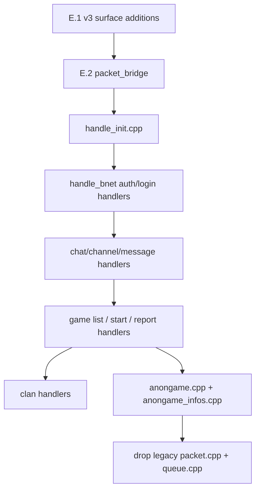

# Step 4 — Packet / Queue audit (v3 migration)

Status: **audit complete; no migration code written yet**.
Owner: legacy-common refactor track (Phase 1).
Predecessor: Step 3 (protocol headers) — DONE (12/12 headers green).

This document captures the current state of the legacy `t_packet` /
`t_queue` surface, the v3 equivalents already in place, the gaps
between them, and a recommended migration shape.

## A. v3 capabilities already present

Under `src/v3/protocol/common/include/protocol/common/`:

| File | Surface |
|---|---|
| `packet.hpp` | `BnetHeader` (4-byte LE: marker / code / size), `parse_bnet_header()`, `write_bnet_header()`, `Packet` (header + non-owning payload view), `FramedPacket`, `parse_packet()`. Value types; no heap; non-throwing `core::Result<T>`. |
| `reader.hpp` | `Reader` over `core::ByteView`: `skip`, `read_le<T>`, `read_be<T>`, `read_bytes`, `read_cstring` (NUL-terminated → `string_view` aliasing the buffer). All bounded; OutOfRange on overflow. |
| `writer.hpp` | `Writer` owning `std::vector<std::byte>`: `write_u8`, `write_le<T>`, `write_be<T>`, `write_bytes`, `write_cstring`, `begin_bnet_packet(code)` + `finalize_bnet_packet()` back-patches size. |
| `replay.hpp` | (out of scope for this audit; used by golden tests) |

What's **NOT** in the v3 surface today:

- No notion of a `packet_class` enum (BNet / init / file / d2cs / udp /
  d2game / d2gs / wolgameres / w3route / raw). Each protocol module
  in `src/v3/protocol/<name>/` owns its own header type instead.
- No reference counting. The v3 model is value/move-only.
- No queue. Outbound traffic uses `infra::net::TcpSession::write()` on
  the io-context (the Asio session manages its own send queue).
- No "raw" packet variant (no header, payload only). Bnproxy uses this.

## B. Legacy API surface (to be retired)

### `src/common/packet.h`

```c
typedef enum { packet_class_none, packet_class_init, packet_class_bnet,
               packet_class_file, packet_class_raw, packet_class_udp,
               packet_class_d2game, packet_class_d2gs, packet_class_d2cs,
               packet_class_d2cs_bnetd, packet_class_w3route,
               packet_class_wolgameres } t_packet_class;

typedef enum { packet_dir_from_client, packet_dir_from_server } t_packet_dir;

struct t_packet {
    unsigned int   ref;            // refcount
    t_packet_class pclass;
    unsigned int   flags;          // user-defined (bnproxy uses PROXY_FLAG_UDP)
    unsigned int   len;            // raw packets only
    union { char data[MAX_PACKET_SIZE]; /* + 100+ t_<msg> aliases */ } u;
};

// Lifecycle
t_packet * packet_create(t_packet_class);
void       packet_destroy(t_packet const *);
t_packet * packet_add_ref(t_packet *);
void       packet_del_ref(t_packet *);
t_packet * packet_duplicate(t_packet const *);

// Class / type / size
t_packet_class packet_get_class(t_packet const *);
char const *   packet_get_class_str(t_packet const *);
int            packet_set_class(t_packet *, t_packet_class);
unsigned int   packet_get_type(t_packet const *);
char const *   packet_get_type_str(t_packet const *, t_packet_dir);
int            packet_set_type(t_packet *, unsigned int);
unsigned int   packet_get_size(t_packet const *);
int            packet_set_size(t_packet *, unsigned int);
unsigned int   packet_get_header_size(t_packet const *);
unsigned int   packet_get_flags(t_packet const *);
int            packet_set_flags(t_packet *, unsigned int);

// Body manipulation
int          packet_append_string  (t_packet *, char const *);
int          packet_append_ntstring(t_packet *, char const *);   // ASCII / NUL guard
int          packet_append_lstr    (t_packet *, t_lstr *);       // i18n string
int          packet_append_data    (t_packet *, void const *, unsigned int);
void *       packet_get_raw_data       (t_packet *,       unsigned int off);
void const * packet_get_raw_data_const (t_packet const *, unsigned int off);
void *       packet_get_raw_data_build (t_packet *,       unsigned int off);
char const * packet_get_str_const      (t_packet const *, unsigned int off, unsigned int maxlen);
void const * packet_get_data_const     (t_packet const *, unsigned int off, unsigned int len);
```

### `src/common/queue.h`

```c
typedef struct queue {
    unsigned ulen, alen;       // used / allocated
    t_packet ** ring;          // ring of refcounted packets
    unsigned head, tail;
} t_queue;

t_packet * queue_pull_packet (t_queue * *);
t_packet * queue_peek_packet (t_queue const * const *);
void       queue_push_packet (t_queue * *, t_packet *);
int        queue_get_length  (t_queue const * const *);
void       queue_clear       (t_queue * *);
```

## C. Gap analysis

| Legacy concept | v3 status | Gap |
|---|---|---|
| Tagged union of every protocol's message structs (`t_packet::u`) | Each protocol has its own typed message in `protocol/<name>/`; codecs return / accept `Packet`. | **No gap by design.** Tagged union goes away; consumers will hold a typed message and frame via `Writer`. |
| `packet_class` enum | Implicit in protocol module choice. | Compatibility shim only needed if mixed dispatch keeps existing during transition. |
| `packet_create / packet_destroy / refcount` | `Writer` for outbound (owns), `Packet`/`FramedPacket` for inbound (views). | **No refcount in v3.** Sessions hold `std::shared_ptr<std::vector<std::byte>>` if multiple sinks need the same buffer; in practice each conn writes from its own `Writer`. |
| `packet_duplicate` | `std::vector<std::byte>` copy. | Trivial. |
| `packet_get_type / set_type` | `BnetHeader::code` (for bnet); `Writer::begin_bnet_packet(code)`. | **Missing for non-bnet classes**: init/file/udp/d2gs/etc. headers are different shapes (e.g. d2cs is `uint16 type; uint16 size`). Need per-class header helpers in their own protocol modules, or generalize `Writer::begin_packet<HeaderT>(code)`. |
| `packet_get_size / set_size` | `Writer::finalize_bnet_packet()` patches size; readers compute from header. | **Missing for raw packets.** Raw (no header) currently uses `len`. Need `Writer::write_bytes` only, with explicit size tracked by caller (or framing layer). |
| `packet_get_header_size` | `BnetHeader::kSize`. | Per-class constant. Add to each protocol module. |
| `packet_get_flags / set_flags` | Used **only** by bnproxy (PROXY_FLAG_UDP marker). | Bnproxy-specific; add a thin tag/variant in bnproxy port. Not a general v3 concept. |
| `packet_append_string` / `append_ntstring` | `Writer::write_cstring` + `write_bytes`. | `append_ntstring` adds an ASCII-only guard (legacy: replaces non-ASCII with `?`). Need a `write_ntstring` helper that mirrors that contract. |
| `packet_append_lstr` (i18n) | `Writer::write_cstring(std::string_view)`. | i18n lookup happens at the call site (already does); no Writer change needed. |
| `packet_append_data` | `Writer::write_bytes`. | Done. |
| `packet_get_raw_data{,_const,_build}` | `Reader::read_bytes` for inbound; for outbound, `Writer` does not expose mutable mid-buffer access. | **Missing**: legacy code writes into the union at fixed offsets (e.g. `bn_int_set(&p->u.foo.bar, x)`). After the protocol modules grow their message-struct definitions (Step 3 follow-up), the v3 idiom is: build a value `Foo f; f.bar = x;` then serialize via `Foo::encode(Writer&)`. **No general "mutable offset" API in v3, and we don't want one.** |
| `packet_get_str_const / get_data_const` | `Reader::read_cstring`, `Reader::read_bytes`. | Done. |
| `packet_get_class_str / get_type_str` | Debug/logging only. | Add a thin `to_string(BnetHeader::code)` + per-protocol stringifier when needed for logs. Low priority. |
| `t_queue` | None. | **Gap.** Strangler-fig path: keep legacy `t_queue` for now; new code uses `infra::net::TcpSession`'s implicit Asio send queue. Bnproxy is the only consumer that actually needs a multi-producer queue (it bridges two sockets). For bnproxy we'll introduce `infra::net::SessionBridge` later. |

## D. Hotspots (call-site counts by module)

| Module | calls to legacy `packet_*` + `queue_*` |
|---|---|
| `src/bnetd/` | **1395** |
| `src/client/` | 440 |
| `src/d2cs/` | 224 |
| `src/common/` | 136 |
| `src/bnproxy/` | 67 |
| (other) | ~33 |

Totals: **260** `packet_create` sites, **28** `queue_*` sites, **1577**
field-access / append / get sites. The bnetd hotspots are concentrated
in `handle_bnet.cpp`, `handle_init.cpp`, `anongame.cpp`, `clan.cpp`,
`channel.cpp`, `command.cpp`, `friends.cpp`.

## E. Recommended migration shape

This is a **strangler-fig** port. Do not delete legacy `packet.cpp/.h` or
`queue.cpp/.h` until all bnetd handlers are converted.

### E.1  Minor additions to v3 surface (low-risk, do first)

1. `protocol/common/writer.hpp`:
   - [x] `void write_string_no_nul(std::string_view)` — parity with
     legacy `packet_append_ntstring` (appends bytes only, no NUL).
   - [x] `std::size_t reserve(std::size_t n)` +
     `patch_u8(off, v)` / `patch_le<T>(off, v)` / `patch_be<T>(off, v)`
     — generic header back-patch primitives. Each protocol module
     composes them to express its own framing without baking the
     header layout into `Writer` itself. Verified by an explicit
     parity test that rebuilds a bnet packet via `reserve` + `patch`
     and byte-for-byte matches `begin_bnet_packet/finalize_bnet_packet`.
   - [ ] (deferred — currently unused) An `ntstring` *ASCII guard*
     variant that replaces non-printable bytes with `?`. Legacy
     `packet_append_ntstring` does NOT actually do this; the parity
     test was the source of truth. Reopen only if a handler needs it.

2. `protocol/common/reader.hpp`:
   - [ ] Optional `read_lstring()` — defer until a protocol needs it.

3. Per-protocol header helpers (one file each, ~30 LOC):
   - [ ] `protocol/d2cs/.../header.hpp`
   - [ ] `protocol/file/.../header.hpp`
   - [ ] `protocol/udp/.../header.hpp`
   - [ ] `protocol/bnet/.../w3route_header.hpp`

### E.2  Compatibility bridge (transition only)  — **DONE (skeleton)**

Landed:

- `src/v3/integration/legacy_bnetd/include/integration/legacy_bnetd/send_packet_bridge.hpp`
- `src/v3/integration/legacy_bnetd/src/send_packet_bridge.cpp` (dispatcher,
  no legacy includes, lives in `integration_legacy_bnetd`)
- `src/v3/integration/legacy_bnetd/src/send_packet_bridge_link.cpp`
  (calls `packet_create` / `packet_set_size` /
  `conn_push_outqueue`, lives in `integration_legacy_bnetd_linked`)
- C ABI: `extern "C" int pvpgn_v3_send_packet_try(void* conn, void
  const* bytes, unsigned int size) noexcept;`
- Returns 1 on enqueue, 0 to fall through. Size capped at
  `kSendPacketMaxSize = MAX_PACKET_SIZE = 3072`.
- 8 Catch2 cases (null guards, zero/oversize rejection, boundary,
  verbatim forward, failure propagation) — green in v3-test.
- Pattern parity: same dispatcher / installer split as
  `change_password_bridge`, so the dispatcher TU compiles in any v3
  build (including WITH_BNETD=OFF / no `bnetd_legacy`).

Remaining for E.2:

- [x] Call `install_legacy_send_packet_handler()` from
      `install_v3_handlers.cpp` so combined builds wire the legacy
      sink automatically. Exposed via
      `install_send_packet_handler()`; called unconditionally from
      `bnetd/server.cpp` under `PVPGN_V3_BNETD_INTEGRATION` (no env
      gate -- install has no observable effect until a ported
      handler invokes the ABI).
- [ ] Add a strangler-fig call site (gated by
      `PVPGN_V3_BNETD_INTEGRATION`) once the first ported handler
      needs it.

### E.3  Per-module migration order



Hot paths first (init, auth) because they're touched by every
connection; cool paths last (clan, anongame) because they're
optional.

### E.4  Acceptance criteria for "Step 4 done"

- [ ] E.1 additions land with paired Catch2 tests (`write_ntstring`
      ASCII guard parity; `begin_packet<HeaderT>` for each header
      shape).
- [ ] E.2 bridge lands, gated by `PVPGN_V3_BNETD_INTEGRATION`.
- [ ] Init + auth handlers reach 100% v3-bytes (legacy `packet_*`
      call sites = 0 in those files).
- [ ] No regression in `docker build -f Dockerfile.v3 --target v3-test`.
- [ ] Legacy `packet.cpp/.h` and `queue.cpp/.h` still build (other
      handlers still use them). Their removal is a Step 4.5 follow-up.

## F. Open questions for the user

1. Should we keep the legacy `packet_class` distinction (init / bnet /
   raw / udp / d2cs / d2gs / w3route / etc.) inside v3, or treat each
   class as a fully separate protocol module with its own typed
   header? **Recommendation: separate modules** (already the v3 shape
   for d2cs / d2gs / file / udp / wolgameres / irc).

2. Bnproxy is the only `packet_class_raw + flags` consumer. Do we
   want to port bnproxy in this phase, or leave it on legacy until a
   later phase? **Recommendation: leave it on legacy.**

3. For the bnetd integration bridge, prefer pushing the v3 bytes
   through the existing `t_queue` (zero-copy `packet_class_raw`) or
   short-circuit to `psock_send` directly? **Recommendation:
   `t_queue` path** so the legacy IO loop / throttling / disconnect
   handling stays in charge during the transition.
